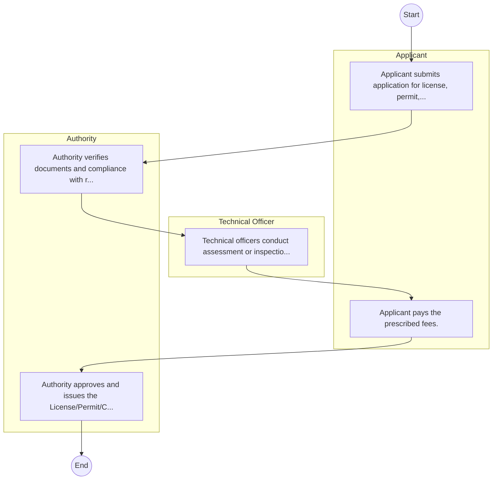
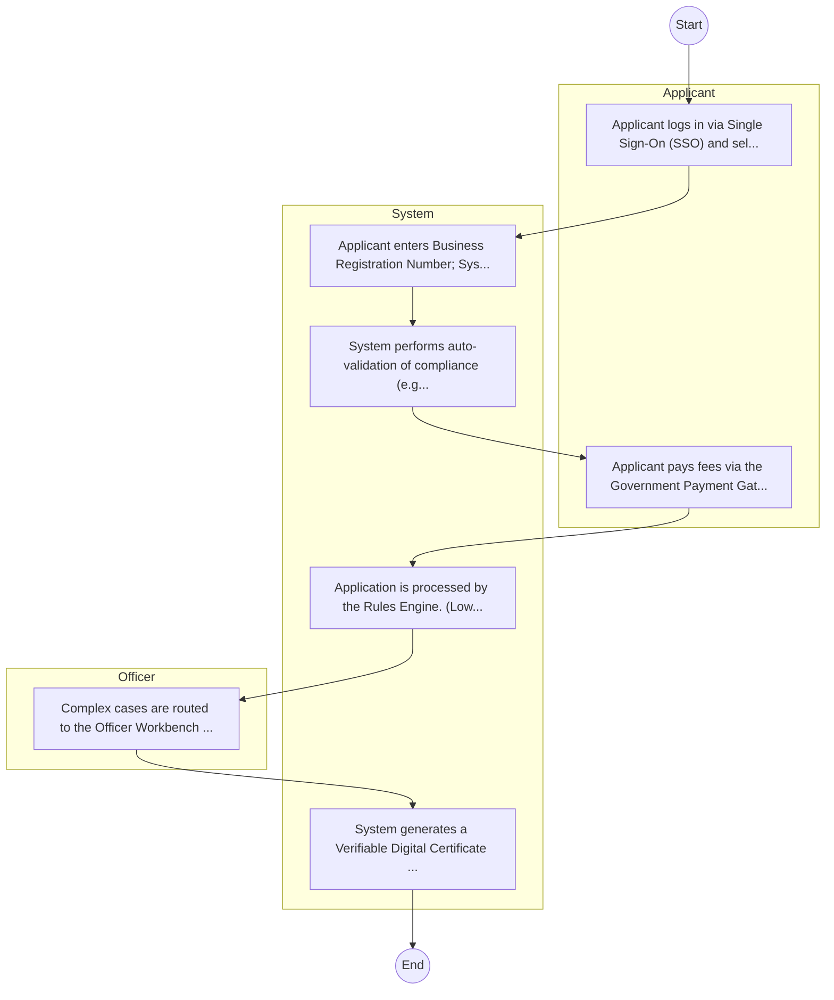

# Board of Registration of Architects and Quantity Surveyors – Service Delivery

## Cover Page
- **Ministry/Department/Agency (MDA):** Board of Registration of Architects and Quantity Surveyors
- **Process Name:** Service Delivery
- **Document Version:** 1.0
- **Date:** 2026-02-14
- **Classification:** Official

---

## Executive Summary
The Board of Registration of Architects and Quantity Surveyors (BORAQS) is the primary regulatory body for the professions of Architecture and Quantity Surveying in Kenya. Established under an Act of Parliament, its core mandate is to regulate training, registration, and enhance ethical and professional practice within these fields. BORAQS plays a crucial role in ensuring high standards for the built environment, protecting public interest, and promoting competence among professionals in the construction industry.

---

## Service Mandate & Legal Basis
### Statutory Mandate
To regulate and oversee the professions of Architecture and Quantity Surveying; to register Architects, Quantity Surveyors, and architectural/quantity surveying firms; to conduct and administer professional examinations for aspiring Architects and Quantity Surveyors; to organize and accredit Continuous Professional Development (CPD) seminars for registered professionals; to define professional conduct and make by-laws to address unprofessional conduct, including inquiry procedures and penalties; to set standards for the development and general practice of architecture and quantity surveying in Kenya; to advise on matters related to the welfare of practicing Architects and Quantity Surveyors, and on research and publication related to the practice; and to collaborate with training institutions (universities and colleges) to ensure quality education and training.

### Legal Context
- Established under the Architects and Quantity Surveyors Act, Cap 525 of the Laws of Kenya (or relevant current legislation), which provides the legal framework for its mandate, functions, and the regulation of the professions. BORAQS operates under the Ministry of Lands, Public Works, Housing and Urban Development (or the relevant government ministry responsible for the built environment) and is crucial for upholding professional standards, ensuring public safety, and contributing to the integrity and quality of construction and infrastructure development in Kenya.

---

## 1. AS-IS Process Flowchart (BPMN 2.0)
*Current State visualization.*

---

## Process Overview
### Service Category
- G2C (Government to Citizen)

### Scope
- **In Scope:** End-to-end processing within Board of Registration of Architects and Quantity Surveyors.

### Triggers
- Submission of application/request by Applicant.

### End States
- **Successful:** License / Permit / Certificate, Compliance Inspection Report, Official Receipt, Gazette Notice

---

## Stakeholders
| Stakeholder | Role | Responsibilities |
|---|---|---|
| Technical Officer | Process Actor | Performs actions as defined in steps. |
| Authority | Process Actor | Performs actions as defined in steps. |
| Applicant | Process Actor | Performs actions as defined in steps. |

---

## Inputs & Outputs
- **Inputs:** Application Form (License/Permit), Compliance Documents (Tax Compliance, CR12), Technical Reports / Site Plans, Proof of Payment
- **Outputs:** License / Permit / Certificate, Compliance Inspection Report, Official Receipt, Gazette Notice

---

## Detailed Process (AS-IS)
| Step | Role | Action | Tool | Notes |
|---|---|---|---|---|
| 1 | Applicant | Applicant submits application for license, permit, or service. | Manual | |
| 2 | Authority | Authority verifies documents and compliance with regulations. | Manual | |
| 3 | Technical Officer | Technical officers conduct assessment or inspection. | Manual | |
| 4 | Applicant | Applicant pays the prescribed fees. | Manual | |
| 5 | Authority | Authority approves and issues the License/Permit/Certificate. | Manual | |

---

## Pain Points & Opportunities
### Pain Points
- Manual document verification takes time.
- High cost and time for physical inspections.
- Risk of counterfeit licenses/certificates.
- Lack of real-time monitoring of licensees.

### Opportunities
- Integration with IPRS/BRS via Service Bus.
- Adoption of Government Payment Gateway.
- Implementation of Automated Rules Engine.
- Issuance of Digital Verifiable Credentials.

---

## 2. TO-BE Process Flowchart (BPMN 2.0)
*Future State visualization (Optimized).*

## Future State Process (TO-BE)
### Narrative
The To-Be process leverages the Government Service Bus to integrate with BRS (Business Registry) and the Payment Gateway. Manual data entry and document uploads are replaced by real-time API validations, enabling a paperless, cashless, and presence-less service experience.

### Optimized Steps (Digital)
| Step | Actor | Action | System |
|---|---|---|---|
| 1 | Applicant | Applicant logs in via Single Sign-On (SSO) and selects the service. | Citizen Portal / SSO |
| 2 | System | Applicant enters Business Registration Number; System auto-populates details from BRS (Business Registry) via the Service Bus. | Service Bus / Registry API |
| 3 | System | System performs auto-validation of compliance (e.g., KRA Tax Status) via Inter-Agency APIs. | Service Bus / Compliance Engine |
| 4 | Applicant | Applicant pays fees via the Government Payment Gateway; System auto-receipts. | Payment Gateway |
| 5 | System | Application is processed by the Rules Engine. (Low-risk cases are Auto-Approved). | Workflow Engine |
| 6 | Officer | Complex cases are routed to the Officer Workbench for digital review and approval. | Officer Workbench |
| 7 | System | System generates a Verifiable Digital Certificate (QR Code) and notifies the applicant. | Output Generator |

---

## References & Evidence
The information in this document was derived from the following official sources:

- [https://www.boraqs.or.ke/](https://www.boraqs.or.ke/)
- [https://investkenya.go.ke/](https://investkenya.go.ke/)
- [https://constructionreviewonline.com/](https://constructionreviewonline.com/)
