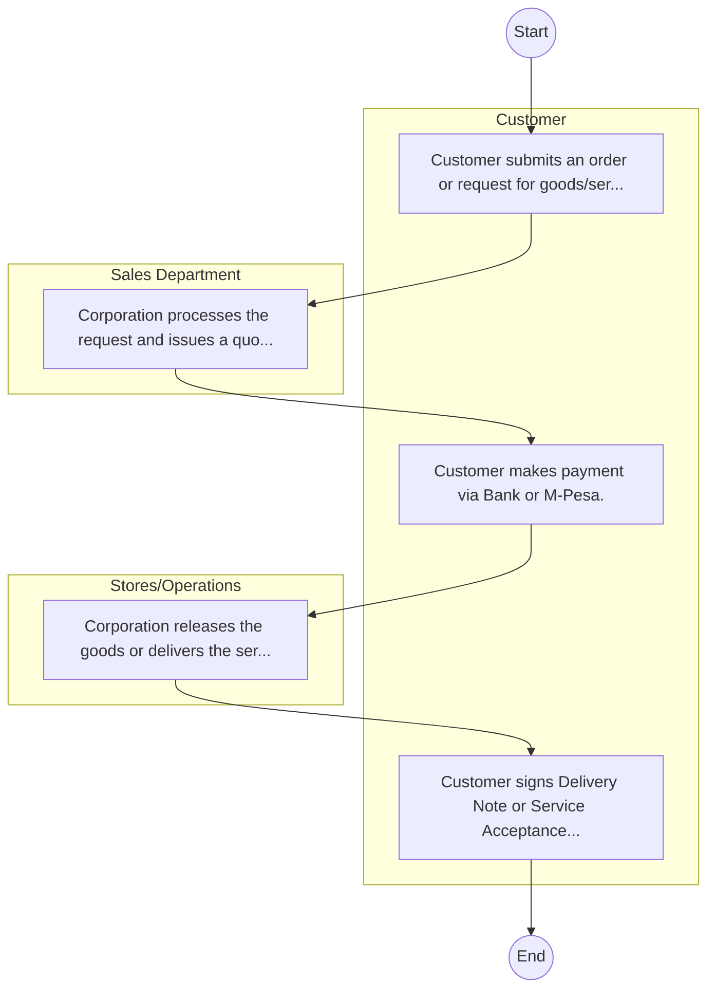
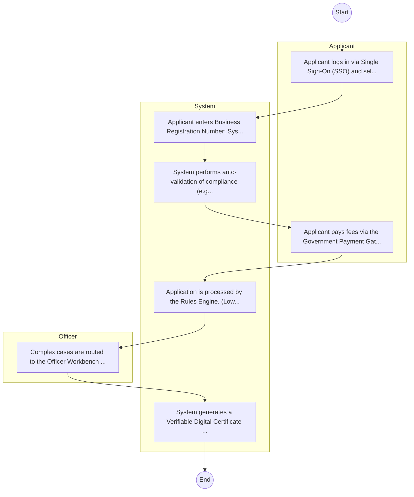

# Chemelil Sugar Company Limited – Service Delivery

## Cover Page
- **Ministry/Department/Agency (MDA):** Chemelil Sugar Company Limited
- **Process Name:** Service Delivery
- **Document Version:** 1.0
- **Date:** 2026-02-14
- **Classification:** Official

---

## Executive Summary
Chemelil Sugar Company Limited is a state-owned sugar milling company in Kenya, established in 1973 under the Companies Act (Cap 486) and becoming a parastatal in 1974. Its principal activity and mission are to manufacture sugar and co-products from sugarcane, and to establish and manage sugarcane plantations. Chemelil Sugar aims to be a preferred choice in sugar production and marketing, as well as in sugarcane development within the region, thereby contributing significantly to national self-sufficiency in sugar production and the economic well-being of sugarcane farmers and local communities.

---

## Service Mandate & Legal Basis
### Statutory Mandate
To mill sugarcane into refined sugar for both domestic and industrial markets; to provide farmers with improved cane varieties, technical support, and agricultural inputs for sustainable sugarcane development; to promote and distribute sugar across local and regional markets; to offer financial assistance, extension services, and input provision to contracted sugarcane farmers; to generate direct and indirect employment opportunities within the factory, farms, and transportation sectors; to conduct research to develop better cane varieties, enhance disease resistance, and improve processing methods; to develop and maintain transport and logistical infrastructure to facilitate efficient cane delivery; to diversify its operations by exploring and producing by-products such as molasses and ethanol; to contribute to the national economy through sugar sales, tax revenue, and reducing sugar imports; to promote sustainable farming practices, waste recycling, and minimizing the environmental impact of its operations; and to implement and maintain quality management systems and adhere to corporate governance principles.

### Legal Context
- Established in 1973 under the Companies Act (Cap 486) of Kenya, with its operations commencing in 1976, and became a parastatal in 1974. Chemelil Sugar operates under the Ministry of Agriculture, Livestock, Fisheries and Cooperatives (or the relevant government ministry responsible for agriculture and industrialization) and is central to implementing national agricultural and industrial policies aimed at achieving sugar self-sufficiency, enhancing farmer livelihoods, and promoting economic development in the sugar belt region. Its operations are also subject to regulatory oversight by the Sugar Directorate and environmental regulations.

---

## 1. AS-IS Process Flowchart (BPMN 2.0)
*Current State visualization.*

---

## Process Overview
### Service Category
- G2B (Government to Business)

### Scope
- **In Scope:** End-to-end processing within Chemelil Sugar Company Limited.

### Triggers
- Submission of application/request by Customer.

### End States
- **Successful:** Loan Disbursement / Service Delivery, Statement of Account, Contract / Agreement, Receipt / Invoice

---

## Stakeholders
| Stakeholder | Role | Responsibilities |
|---|---|---|
| Sales Department | Process Actor | Performs actions as defined in steps. |
| Stores/Operations | Process Actor | Performs actions as defined in steps. |
| Customer | Process Actor | Performs actions as defined in steps. |

---

## Inputs & Outputs
- **Inputs:** Loan/Service Application Form, Business Proposal / Plan, Financial Statements / Bank Records, Collateral / Security Documents
- **Outputs:** Loan Disbursement / Service Delivery, Statement of Account, Contract / Agreement, Receipt / Invoice

---

## Detailed Process (AS-IS)
| Step | Role | Action | Tool | Notes |
|---|---|---|---|---|
| 1 | Customer | Customer submits an order or request for goods/services. | Manual | |
| 2 | Sales Department | Corporation processes the request and issues a quotation/proforma invoice. | Manual | |
| 3 | Customer | Customer makes payment via Bank or M-Pesa. | Manual | |
| 4 | Stores/Operations | Corporation releases the goods or delivers the service. | Manual | |
| 5 | Customer | Customer signs Delivery Note or Service Acceptance Form. | Manual | |

---

## Pain Points & Opportunities
### Pain Points
- Lengthy credit appraisal processes.
- Manual debt collection and reconciliation.
- High paperwork for loan processing.
- Lack of 360-degree customer view.

### Opportunities
- Integration with IPRS/BRS via Service Bus.
- Adoption of Government Payment Gateway.
- Implementation of Automated Rules Engine.
- Issuance of Digital Verifiable Credentials.

---

## 2. TO-BE Process Flowchart (BPMN 2.0)
*Future State visualization (Optimized).*

## Future State Process (TO-BE)
### Narrative
The To-Be process leverages the Government Service Bus to integrate with BRS (Business Registry) and the Payment Gateway. Manual data entry and document uploads are replaced by real-time API validations, enabling a paperless, cashless, and presence-less service experience.

### Optimized Steps (Digital)
| Step | Actor | Action | System |
|---|---|---|---|
| 1 | Applicant | Applicant logs in via Single Sign-On (SSO) and selects the service. | Citizen Portal / SSO |
| 2 | System | Applicant enters Business Registration Number; System auto-populates details from BRS (Business Registry) via the Service Bus. | Service Bus / Registry API |
| 3 | System | System performs auto-validation of compliance (e.g., KRA Tax Status) via Inter-Agency APIs. | Service Bus / Compliance Engine |
| 4 | Applicant | Applicant pays fees via the Government Payment Gateway; System auto-receipts. | Payment Gateway |
| 5 | System | Application is processed by the Rules Engine. (Low-risk cases are Auto-Approved). | Workflow Engine |
| 6 | Officer | Complex cases are routed to the Officer Workbench for digital review and approval. | Officer Workbench |
| 7 | System | System generates a Verifiable Digital Certificate (QR Code) and notifies the applicant. | Output Generator |

---

## References & Evidence
The information in this document was derived from the following official sources:

- [https://www.chemsugar.go.ke/](https://www.chemsugar.go.ke/)
- [https://parliament.go.ke/](https://parliament.go.ke/)
- [https://saraka.info/](https://saraka.info/)
- [https://uonbi.ac.ke/](https://uonbi.ac.ke/)
