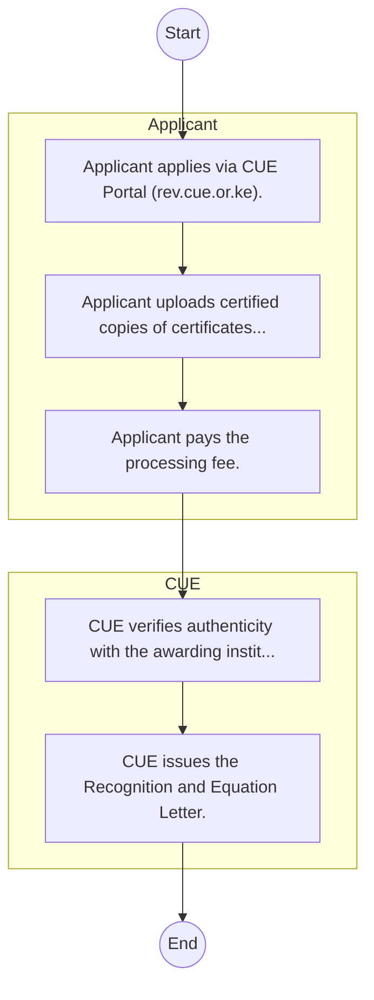
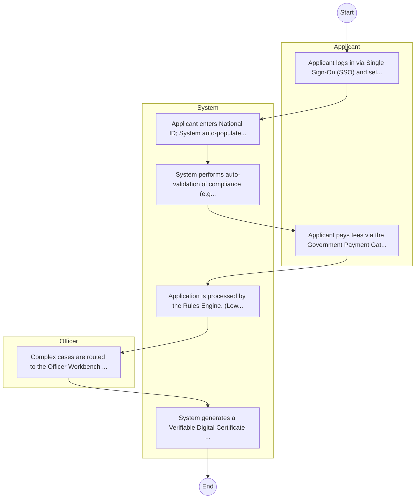

# Commission for University Education – Service Delivery

## Cover Page
- **Ministry/Department/Agency (MDA):** Commission for University Education
- **Process Name:** Service Delivery
- **Document Version:** 1.0
- **Date:** 2026-02-14
- **Classification:** Official

---

## Executive Summary
The Commission for University Education (CUE) Kenya is a statutory body established under the Universities Act No. 42 of 2012, becoming fully operational in 2013 as the successor to the Commission for Higher Education (CHE). CUE's primary mandate is to promote the objectives of university education by regulating and assuring the quality of university education in Kenya, including accreditation of universities and their programs. It plays a crucial role in protecting the interests of students and the public, ensuring that universities provide relevant and high-quality education aligned with national development priorities.

---

## Service Mandate & Legal Basis
### Statutory Mandate
To promote the objectives of university education; to advise the Cabinet Secretary on policy matters related to university education; to promote, advance, publicize, and set standards relevant to the quality of university education, including supporting internationally recognized standards; to regulate university education in Kenya by setting frameworks for governance, curriculum delivery, and academic services; to accredit universities in Kenya by granting Charters or Letters of Interim Authority, and approving and inspecting university programs; to monitor and evaluate the state of university education systems in relation to national development goals, assessing program quality, and teaching methodologies; to license student recruitment agencies operating in Kenya and activities by foreign institutions; to develop policy for criteria and requirements for admission to universities; to recognize and equate degrees, diplomas, and certificates conferred or awarded by foreign universities and institutions according to established standards and guidelines; to undertake regular inspections, monitoring, and evaluation of universities to ensure compliance with the provisions of the Universities Act; to collect, disseminate, and maintain data on university education; and to promote quality research and innovation within universities.

### Legal Context
- Established under the Universities Act No. 42 of 2012 (fully operational in 2013), which provides the comprehensive legal and regulatory framework for university education in Kenya. CUE operates under the Ministry of Education and is crucial for implementing national higher education policies, ensuring quality assurance, and aligning university education with national development priorities (e.g., Vision 2030) and international standards. It plays a central role in the governance and development of the university sector.

---

## 1. AS-IS Process Flowchart (BPMN 2.0)
*Current State visualization.*

---

## Process Overview
### Service Category
- G2C (Government to Citizen)

### Scope
- **In Scope:** End-to-end processing within Commission for University Education.

### Triggers
- Submission of application/request by Applicant.

### End States
- **Successful:** Admission Letter, Student ID Card, Academic Transcripts, Degree/Diploma Certificate

---

## Stakeholders
| Stakeholder | Role | Responsibilities |
|---|---|---|
| CUE | Process Actor | Performs actions as defined in steps. |
| Applicant | Process Actor | Performs actions as defined in steps. |

---

## Inputs & Outputs
- **Inputs:** KCSE/Academic Result Slips, National ID / Birth Certificate, Student Personal Details Form, Fee Payment Receipts
- **Outputs:** Admission Letter, Student ID Card, Academic Transcripts, Degree/Diploma Certificate

---

## Detailed Process (AS-IS)
| Step | Role | Action | Tool | Notes |
|---|---|---|---|---|
| 1 | Applicant | Applicant applies via CUE Portal (rev.cue.or.ke). | Digital | |
| 2 | Applicant | Applicant uploads certified copies of certificates and transcripts. | Manual | |
| 3 | Applicant | Applicant pays the processing fee. | Manual | |
| 4 | CUE | CUE verifies authenticity with the awarding institution/foreign regulator. | Manual | |
| 5 | CUE | CUE issues the Recognition and Equation Letter. | Manual | |

---

## Pain Points & Opportunities
### Pain Points
- Long queues during admission and registration.
- Manual reconciliation of fee payments.
- Delays in processing exam results and transcripts.
- Fragmented student data across departments.

### Opportunities
- Integration with IPRS/BRS via Service Bus.
- Adoption of Government Payment Gateway.
- Implementation of Automated Rules Engine.
- Issuance of Digital Verifiable Credentials.

---

## 2. TO-BE Process Flowchart (BPMN 2.0)
*Future State visualization (Optimized).*

## Future State Process (TO-BE)
### Narrative
The To-Be process leverages the Government Service Bus to integrate with IPRS (Identity Registry) and the Payment Gateway. Manual data entry and document uploads are replaced by real-time API validations, enabling a paperless, cashless, and presence-less service experience.

### Optimized Steps (Digital)
| Step | Actor | Action | System |
|---|---|---|---|
| 1 | Applicant | Applicant logs in via Single Sign-On (SSO) and selects the service. | Citizen Portal / SSO |
| 2 | System | Applicant enters National ID; System auto-populates details from IPRS (Identity Registry) via the Service Bus. | Service Bus / Registry API |
| 3 | System | System performs auto-validation of compliance (e.g., KRA Tax Status) via Inter-Agency APIs. | Service Bus / Compliance Engine |
| 4 | Applicant | Applicant pays fees via the Government Payment Gateway; System auto-receipts. | Payment Gateway |
| 5 | System | Application is processed by the Rules Engine. (Low-risk cases are Auto-Approved). | Workflow Engine |
| 6 | Officer | Complex cases are routed to the Officer Workbench for digital review and approval. | Officer Workbench |
| 7 | System | System generates a Verifiable Digital Certificate (QR Code) and notifies the applicant. | Output Generator |

---

## References & Evidence
The information in this document was derived from the following official sources:

- [https://www.cue.or.ke/](https://www.cue.or.ke/)
- [https://unirank.org/](https://unirank.org/)
- [https://businessradar.co.ke/](https://businessradar.co.ke/)
- [https://wikipedia.org/](https://wikipedia.org/)
- [https://institutiontoday.com/](https://institutiontoday.com/)
