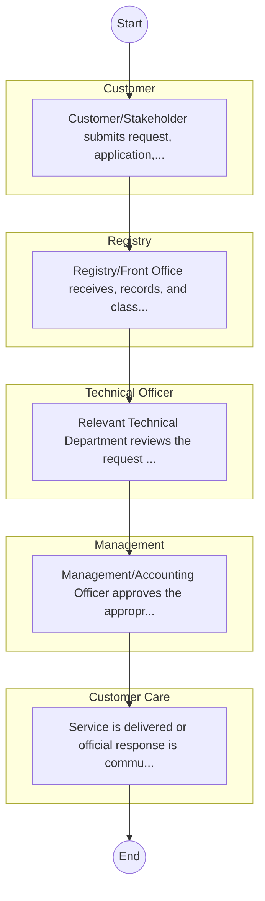
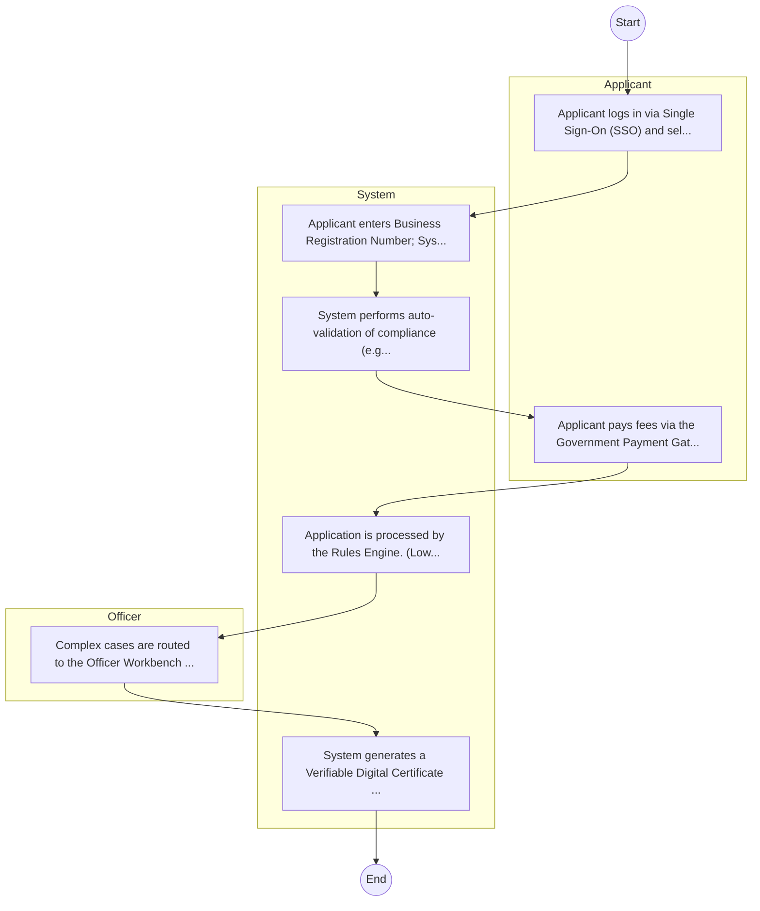

# Cooperatives – Service Delivery

## Cover Page
- **Ministry/Department/Agency (MDA):** Cooperatives
- **Process Name:** Service Delivery
- **Document Version:** 1.0
- **Date:** 2026-02-14
- **Classification:** Official

---

## Executive Summary
The Ministry of Co-operatives And Micro, Small And Medium Enterprises (MSMEs) Development is a key government Ministry in Kenya. Its primary mandate is to formulate, adopt, and implement policy and legal frameworks for the development and growth of all co-operatives, aligning with national development policies and priorities. The Ministry is responsible for the registration, regulation, oversight, promotion, and capacity building of the cooperative sector, aiming to enhance economic growth, financial inclusion, wealth creation, and improved livelihoods for millions of Kenyans through a robust cooperative movement.

---

## Service Mandate & Legal Basis
### Statutory Mandate
To formulate and implement policy and legal frameworks for the development and growth of all co-operatives; to register and liquidate co-operative enterprises, and establish uniform standards for their operations; to recognize county and cross-county co-operative enterprises; to regulate co-operative audit services, including social and value-for-money audits; to carry out inquiries, inspections, and investigations into co-operative affairs; to provide oversight to apex, federations, secondary, and cross-county co-operative enterprises; to promote good governance and ethics within co-operative enterprises; to promote co-operative ventures, production, marketing, and value addition; to carry out capacity building for County Governments and co-operative leaders; to develop policies related to co-operative savings, credit, and other financial services; to promote public-private partnerships and joint ventures for co-operative growth; to facilitate regional and international co-operative relations; to establish and maintain a data and information center for co-operatives and promote research and development in the sector; and to provide accessible online services such as name searches, registration of cooperative societies, cooperative audits, official searches, and registration of amendments of bylaws.

### Legal Context
- Established as the Ministry of Co-operatives And Micro, Small And Medium Enterprises (MSMEs) Development. Its mandate is rooted in the Sessional Paper No. 6 of 1997 on Co-operatives and the Co-operative Societies Act, Cap 490, as well as other relevant legislation like the MSMEs Act. The Ministry aligns its activities with national development policies such as Vision 2030 and the Bottom-Up Economic Transformation Agenda (BETA), aiming for economic empowerment, social transformation, and enhanced financial inclusion through the cooperative model.

---

## 1. AS-IS Process Flowchart (BPMN 2.0)
*Current State visualization.*

---

## Process Overview
### Service Category
- G2C/G2B

### Scope
- **In Scope:** End-to-end processing within Cooperatives.

### Triggers
- Submission of application/request by Customer.

### End States
- **Successful:** License / Permit / Certificate, Compliance Inspection Report, Official Receipt, Gazette Notice

---

## Stakeholders
| Stakeholder | Role | Responsibilities |
|---|---|---|
| Registry | Process Actor | Performs actions as defined in steps. |
| Management | Process Actor | Performs actions as defined in steps. |
| Customer | Process Actor | Performs actions as defined in steps. |
| Customer Care | Process Actor | Performs actions as defined in steps. |
| Technical Officer | Process Actor | Performs actions as defined in steps. |

---

## Inputs & Outputs
- **Inputs:** Application Form (License/Permit), Compliance Documents (Tax Compliance, CR12), Technical Reports / Site Plans, Proof of Payment
- **Outputs:** License / Permit / Certificate, Compliance Inspection Report, Official Receipt, Gazette Notice

---

## Detailed Process (AS-IS)
| Step | Role | Action | Tool | Notes |
|---|---|---|---|---|
| 1 | Customer | Customer/Stakeholder submits request, application, or inquiry via official channels (Email, Letter, or Portal). | Digital | |
| 2 | Registry | Registry/Front Office receives, records, and classifies the request. | Manual | |
| 3 | Technical Officer | Relevant Technical Department reviews the request against internal policies and regulations. | Manual | |
| 4 | Management | Management/Accounting Officer approves the appropriate action or service delivery. | Manual | |
| 5 | Customer Care | Service is delivered or official response is communicated to the customer. | Manual | |

---

## Pain Points & Opportunities
### Pain Points
- Manual document verification takes time.
- High cost and time for physical inspections.
- Risk of counterfeit licenses/certificates.
- Lack of real-time monitoring of licensees.

### Opportunities
- Integration with IPRS/BRS via Service Bus.
- Adoption of Government Payment Gateway.
- Implementation of Automated Rules Engine.
- Issuance of Digital Verifiable Credentials.

---

## 2. TO-BE Process Flowchart (BPMN 2.0)
*Future State visualization (Optimized).*

## Future State Process (TO-BE)
### Narrative
The To-Be process leverages the Government Service Bus to integrate with BRS (Business Registry) and the Payment Gateway. Manual data entry and document uploads are replaced by real-time API validations, enabling a paperless, cashless, and presence-less service experience.

### Optimized Steps (Digital)
| Step | Actor | Action | System |
|---|---|---|---|
| 1 | Applicant | Applicant logs in via Single Sign-On (SSO) and selects the service. | Citizen Portal / SSO |
| 2 | System | Applicant enters Business Registration Number; System auto-populates details from BRS (Business Registry) via the Service Bus. | Service Bus / Registry API |
| 3 | System | System performs auto-validation of compliance (e.g., KRA Tax Status) via Inter-Agency APIs. | Service Bus / Compliance Engine |
| 4 | Applicant | Applicant pays fees via the Government Payment Gateway; System auto-receipts. | Payment Gateway |
| 5 | System | Application is processed by the Rules Engine. (Low-risk cases are Auto-Approved). | Workflow Engine |
| 6 | Officer | Complex cases are routed to the Officer Workbench for digital review and approval. | Officer Workbench |
| 7 | System | System generates a Verifiable Digital Certificate (QR Code) and notifies the applicant. | Output Generator |

---

## References & Evidence
The information in this document was derived from the following official sources:

- [https://www.cooperativesmsme.go.ke/](https://www.cooperativesmsme.go.ke/)
- [https://www.msea.go.ke/](https://www.msea.go.ke/)
- [https://developmentaid.org/](https://developmentaid.org/)
- [https://ushirika.go.ke/](https://ushirika.go.ke/)
- [https://ecitizen.go.ke/](https://ecitizen.go.ke/)
