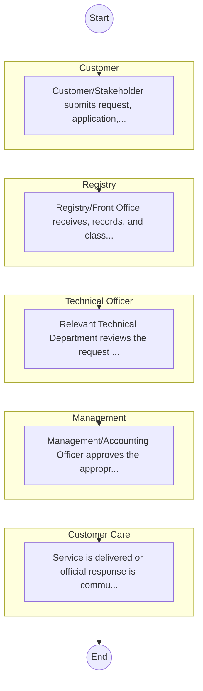
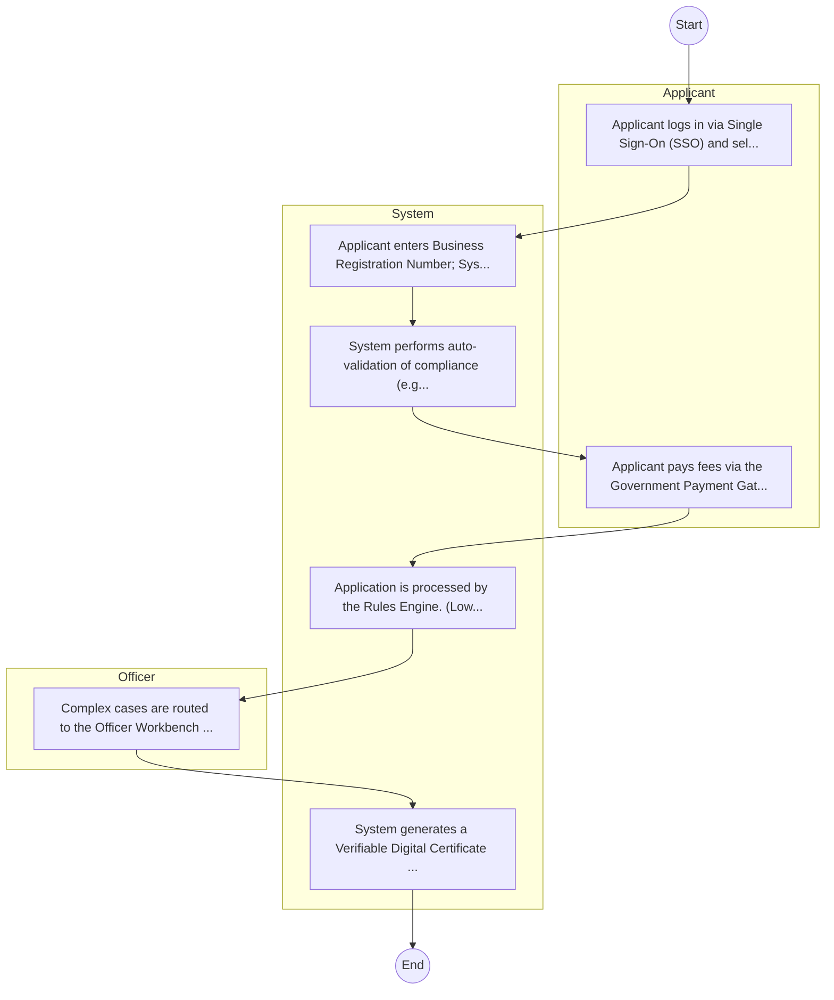

# Culture and Heritage – Research Authorization

## Cover Page
- **Ministry/Department/Agency (MDA):** Culture and Heritage
- **Process Name:** Research Authorization
- **Document Version:** 1.0
- **Date:** 2026-02-14
- **Classification:** Official

---

## Executive Summary
The State Department for Culture and Heritage in Kenya, operating under the Ministry of Sports, Culture and Heritage (or its equivalent), is tasked with the broad mandate of promoting, preserving, and developing Kenya's rich and diverse cultural heritage. Its core responsibilities include advising the government on cultural matters, setting policy standards, fostering national unity through cultural exchange, and supporting cultural industries and infrastructure development, thereby safeguarding national identity and leveraging culture for socio-economic benefit.

---

## Service Mandate & Legal Basis
### Statutory Mandate
To promote, revitalize, and develop all facets of culture, including performing and visual arts, languages, indigenous health, oral traditions, and the creative industries; to engage in education, information dissemination, and research concerning both tangible and intangible cultural heritage; to coordinate the safeguarding of Kenya's intangible cultural heritage and promote the diversity of cultural expressions; to formulate policies for the sports, culture, and arts industries, and develop national cultural infrastructure; to coordinate all cultural activities nationwide, document national cultural inventories, and support cultural events and festivals; to build capacity for county governments and cultural organizations; to disseminate cultural information and knowledge; to promote the use of Kiswahili, sign language, and other indigenous languages in Kenya; to facilitate cultural exchange programs at local, regional, and international levels; to offer technical support for cultural development initiatives; and to register cultural groups, associations, and agencies to foster their growth and regulation.

### Legal Context
- Operating under the Ministry of Sports, Culture and Heritage (or the relevant government ministry responsible for culture, arts, and heritage). Its mandate is rooted in the Constitution of Kenya (Chapter Four, Article 11 on Culture), the Cultural Heritage Act (if applicable, otherwise general heritage acts), and relevant national policies on sports, culture, and arts. The Department plays a crucial role in implementing national cultural development strategies, promoting cultural tourism, and preserving national identity and unity, aligning with national development goals like Vision 2030 for socio-cultural development.

---

## 1. AS-IS Process Flowchart (BPMN 2.0)
*Current State visualization.*

---

## Process Overview
### Service Category
- G2C/G2B

### Scope
- **In Scope:** End-to-end processing within Culture and Heritage.

### Triggers
- Submission of application/request by Customer.

### End States
- **Successful:** License / Permit / Certificate, Compliance Inspection Report, Official Receipt, Gazette Notice

---

## Stakeholders
| Stakeholder | Role | Responsibilities |
|---|---|---|
| Registry | Process Actor | Performs actions as defined in steps. |
| Management | Process Actor | Performs actions as defined in steps. |
| Customer | Process Actor | Performs actions as defined in steps. |
| Customer Care | Process Actor | Performs actions as defined in steps. |
| Technical Officer | Process Actor | Performs actions as defined in steps. |

---

## Inputs & Outputs
- **Inputs:** Application Form (License/Permit), Compliance Documents (Tax Compliance, CR12), Technical Reports / Site Plans, Proof of Payment
- **Outputs:** License / Permit / Certificate, Compliance Inspection Report, Official Receipt, Gazette Notice

---

## Detailed Process (AS-IS)
| Step | Role | Action | Tool | Notes |
|---|---|---|---|---|
| 1 | Customer | Customer/Stakeholder submits request, application, or inquiry via official channels (Email, Letter, or Portal). | Digital | |
| 2 | Registry | Registry/Front Office receives, records, and classifies the request. | Manual | |
| 3 | Technical Officer | Relevant Technical Department reviews the request against internal policies and regulations. | Manual | |
| 4 | Management | Management/Accounting Officer approves the appropriate action or service delivery. | Manual | |
| 5 | Customer Care | Service is delivered or official response is communicated to the customer. | Manual | |

---

## Pain Points & Opportunities
### Pain Points
- Manual document verification takes time.
- High cost and time for physical inspections.
- Risk of counterfeit licenses/certificates.
- Lack of real-time monitoring of licensees.

### Opportunities
- Integration with IPRS/BRS via Service Bus.
- Adoption of Government Payment Gateway.
- Implementation of Automated Rules Engine.
- Issuance of Digital Verifiable Credentials.

---

## 2. TO-BE Process Flowchart (BPMN 2.0)
*Future State visualization (Optimized).*

## Future State Process (TO-BE)
### Narrative
The To-Be process leverages the Government Service Bus to integrate with BRS (Business Registry) and the Payment Gateway. Manual data entry and document uploads are replaced by real-time API validations, enabling a paperless, cashless, and presence-less service experience.

### Optimized Steps (Digital)
| Step | Actor | Action | System |
|---|---|---|---|
| 1 | Applicant | Applicant logs in via Single Sign-On (SSO) and selects the service. | Citizen Portal / SSO |
| 2 | System | Applicant enters Business Registration Number; System auto-populates details from BRS (Business Registry) via the Service Bus. | Service Bus / Registry API |
| 3 | System | System performs auto-validation of compliance (e.g., KRA Tax Status) via Inter-Agency APIs. | Service Bus / Compliance Engine |
| 4 | Applicant | Applicant pays fees via the Government Payment Gateway; System auto-receipts. | Payment Gateway |
| 5 | System | Application is processed by the Rules Engine. (Low-risk cases are Auto-Approved). | Workflow Engine |
| 6 | Officer | Complex cases are routed to the Officer Workbench for digital review and approval. | Officer Workbench |
| 7 | System | System generates a Verifiable Digital Certificate (QR Code) and notifies the applicant. | Output Generator |

---

## References & Evidence
The information in this document was derived from the following official sources:

- [https://www.sportsheritage.go.ke/](https://www.sportsheritage.go.ke/)
- [https://ecitizen.go.ke/](https://ecitizen.go.ke/)
- [https://africa2trust.com/](https://africa2trust.com/)
