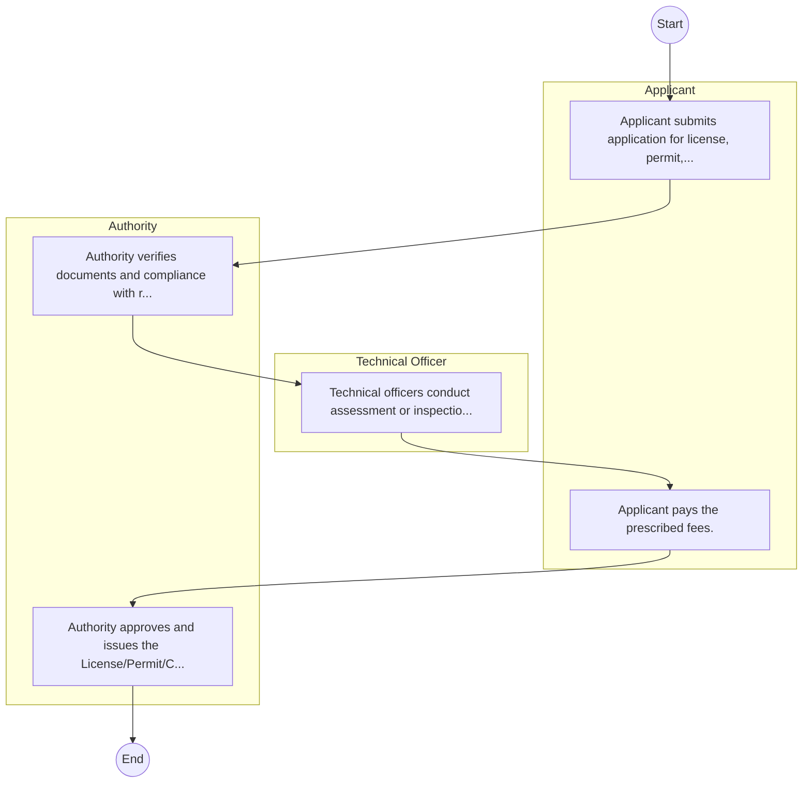

# ENERGY AND PETROLEUM AUTHORITY – Service Delivery

## Cover Page
- **Ministry/Department/Agency (MDA):** ENERGY AND PETROLEUM AUTHORITY
- **Process Name:** Service Delivery
- **Document Version:** 1.0
- **Date:** 2026-02-14
- **Classification:** Official

---

## Executive Summary
The Energy and Petroleum Regulatory Authority (EPRA) is a statutory body in Kenya, established under the Energy Act of 2019. It is responsible for the economic and technical regulation of Kenya's electricity, renewable energy, petroleum, and coal subsectors, ensuring sustainable energy supply, fair pricing, and consumer protection.

---

## Service Mandate & Legal Basis
### Statutory Mandate
To establish and enforce regulations for the electricity, petroleum, and renewable energy sectors; issue licenses to operators; set tariffs; safeguard consumer rights; monitor compliance with energy laws and standards; promote renewable energy development and utilization; and advance energy efficiency initiatives across Kenya for a secure, sustainable, and affordable energy supply.

### Legal Context
- Established under the Energy Act of 2019, which provides the primary legal framework for its regulatory functions. Also responsible for implementing the Petroleum Act (2019). Operates under various regulations including the Energy (Energy Management) Regulations 2012 and the Energy (Appliances' Energy Performance and Labeling) Regulations 2016.
- Established under the Energy Act of 2019, which provides the primary legal framework for its regulatory functions. Also responsible for implementing the Petroleum Act (2019). Operates under various regulations including the Energy (Energy Management) Regulations 2012 and the Energy (Appliances' Energy Performance and Labeling) Regulations 2016.

---

## 1. AS-IS Process Flowchart (BPMN 2.0)
*Current State visualization.*

---

## Process Overview
### Service Category
- G2B (Government to Business)

### Scope
- **In Scope:** End-to-end processing within ENERGY AND PETROLEUM AUTHORITY.

### Triggers
- Submission of application/request by Applicant.

### End States
- **Successful:** License / Permit / Certificate, Compliance Inspection Report, Official Receipt, Gazette Notice

---

## Stakeholders
| Stakeholder | Role | Responsibilities |
|---|---|---|
| Technical Officer | Process Actor | Performs actions as defined in steps. |
| Authority | Process Actor | Performs actions as defined in steps. |
| Applicant | Process Actor | Performs actions as defined in steps. |

---

## Inputs & Outputs
- **Inputs:** Application Form (License/Permit), Compliance Documents (Tax Compliance, CR12), Technical Reports / Site Plans, Proof of Payment
- **Outputs:** License / Permit / Certificate, Compliance Inspection Report, Official Receipt, Gazette Notice

---

## Detailed Process (AS-IS)
| Step | Role | Action | Tool | Notes |
|---|---|---|---|---|
| 1 | Applicant | Applicant submits application for license, permit, or service. | Manual | |
| 2 | Authority | Authority verifies documents and compliance with regulations. | Manual | |
| 3 | Technical Officer | Technical officers conduct assessment or inspection. | Manual | |
| 4 | Applicant | Applicant pays the prescribed fees. | Manual | |
| 5 | Authority | Authority approves and issues the License/Permit/Certificate. | Manual | |

---

## Pain Points & Opportunities
### Pain Points
- Manual document verification takes time.
- High cost and time for physical inspections.
- Risk of counterfeit licenses/certificates.
- Lack of real-time monitoring of licensees.

### Opportunities
- Integration with IPRS/BRS via Service Bus.
- Adoption of Government Payment Gateway.
- Implementation of Automated Rules Engine.
- Issuance of Digital Verifiable Credentials.

---

## 2. TO-BE Process Flowchart (BPMN 2.0)
*Future State visualization (Optimized).*

```mermaid
graph TD
    Start((Start)) --> S1
    subgraph Applicant [Applicant]
        S1["Applicant logs in via Single Sign-On (SSO) and sel..."]
        S4["Applicant pays fees via the Government Payment Gat..."]
    end
    subgraph System [System]
        S2["Applicant enters Business Registration Number; Sys..."]
        S3["System performs auto-validation of compliance (e.g..."]
        S5["Application is processed by the Rules Engine. (Low..."]
        S7["System generates a Verifiable Digital Certificate ..."]
    end
    subgraph Officer [Officer]
        S6["Complex cases are routed to the Officer Workbench ..."]
    end
    S1 --> S2
    S2 --> S3
    S3 --> S4
    S4 --> S5
    S5 --> S6
    S6 --> S7
    S7 --> End((End))
```

## Future State Process (TO-BE)
### Narrative
The To-Be process leverages the Government Service Bus to integrate with BRS (Business Registry) and the Payment Gateway. Manual data entry and document uploads are replaced by real-time API validations, enabling a paperless, cashless, and presence-less service experience.

### Optimized Steps (Digital)
| Step | Actor | Action | System |
|---|---|---|---|
| 1 | Applicant | Applicant logs in via Single Sign-On (SSO) and selects the service. | Citizen Portal / SSO |
| 2 | System | Applicant enters Business Registration Number; System auto-populates details from BRS (Business Registry) via the Service Bus. | Service Bus / Registry API |
| 3 | System | System performs auto-validation of compliance (e.g., KRA Tax Status) via Inter-Agency APIs. | Service Bus / Compliance Engine |
| 4 | Applicant | Applicant pays fees via the Government Payment Gateway; System auto-receipts. | Payment Gateway |
| 5 | System | Application is processed by the Rules Engine. (Low-risk cases are Auto-Approved). | Workflow Engine |
| 6 | Officer | Complex cases are routed to the Officer Workbench for digital review and approval. | Officer Workbench |
| 7 | System | System generates a Verifiable Digital Certificate (QR Code) and notifies the applicant. | Output Generator |

---

## References & Evidence
The information in this document was derived from the following official sources:

- [https://epra.go.ke/](https://epra.go.ke/)
- [https://saraka.info/](https://saraka.info/)
- [https://worldbank.org/](https://worldbank.org/)
- [https://en.wikipedia.org/wiki/Energy_and_Petroleum_Regulatory_Authority](https://en.wikipedia.org/wiki/Energy_and_Petroleum_Regulatory_Authority)
