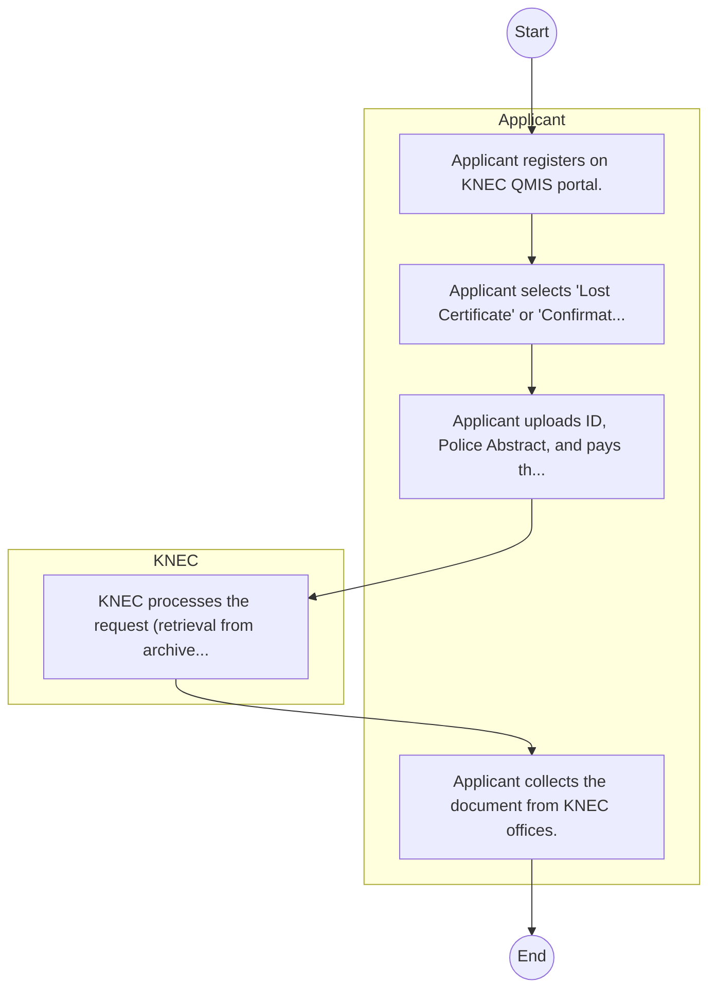
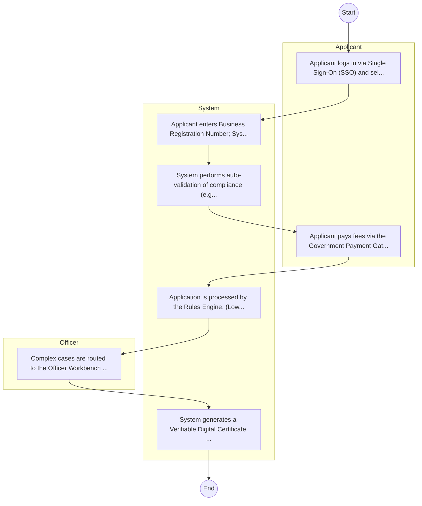

# Kenya National Examinations Council – Service Delivery

## Cover Page
- **Ministry/Department/Agency (MDA):** Kenya National Examinations Council
- **Process Name:** Service Delivery
- **Document Version:** 1.0
- **Date:** 2026-02-14
- **Classification:** Official

---

## Executive Summary
The Kenya National Examinations Council (KNEC) is a statutory body mandated by Section 10 of the KNEC Act No. 29 of 2012. Its core responsibility is to set and maintain examination standards, and to develop and conduct public academic, technical, and other national examinations at basic and tertiary levels within Kenya. KNEC also awards certificates or diplomas to successful candidates, thereby playing a critical role in evaluating educational achievement and facilitating progression in education and employment.

---

## Service Mandate & Legal Basis
### Statutory Mandate
To develop and implement robust examination policies, procedures, and regulations; to effectively conduct national examinations across various educational levels; to register candidates efficiently for all KNEC examinations; to process and disseminate examination results accurately and in a timely manner; to award credible certificates and diplomas to successful candidates; to confirm the authenticity of credentials issued by the Council; to undertake research on educational assessment to inform best practices; to carry out the equation of foreign qualifications; and to advise the Government on matters pertaining to examinations and certification policies.

### Legal Context
- Mandated by Section 10 of the KNEC Act No. 29 of 2012, which establishes its legal framework and functions. Operates under the oversight of the Ministry of Education and collaborates with other educational agencies to ensure the quality and relevance of national examinations and assessment systems.

---

## 1. AS-IS Process Flowchart (BPMN 2.0)
*Current State visualization.*

---

## Process Overview
### Service Category
- G2C/G2B

### Scope
- **In Scope:** End-to-end processing within Kenya National Examinations Council.

### Triggers
- Submission of application/request by Applicant.

### End States
- **Successful:** License / Permit / Certificate, Compliance Inspection Report, Official Receipt, Gazette Notice

---

## Stakeholders
| Stakeholder | Role | Responsibilities |
|---|---|---|
| KNEC | Process Actor | Performs actions as defined in steps. |
| Applicant | Process Actor | Performs actions as defined in steps. |

---

## Inputs & Outputs
- **Inputs:** Application Form (License/Permit), Compliance Documents (Tax Compliance, CR12), Technical Reports / Site Plans, Proof of Payment
- **Outputs:** License / Permit / Certificate, Compliance Inspection Report, Official Receipt, Gazette Notice

---

## Detailed Process (AS-IS)
| Step | Role | Action | Tool | Notes |
|---|---|---|---|---|
| 1 | Applicant | Applicant registers on KNEC QMIS portal. | Digital | |
| 2 | Applicant | Applicant selects 'Lost Certificate' or 'Confirmation' service. | Manual | |
| 3 | Applicant | Applicant uploads ID, Police Abstract, and pays the fee. | Manual | |
| 4 | KNEC | KNEC processes the request (retrieval from archives). | Manual | |
| 5 | Applicant | Applicant collects the document from KNEC offices. | Manual | |

---

## Pain Points & Opportunities
### Pain Points
- Manual document verification takes time.
- High cost and time for physical inspections.
- Risk of counterfeit licenses/certificates.
- Lack of real-time monitoring of licensees.

### Opportunities
- Integration with IPRS/BRS via Service Bus.
- Adoption of Government Payment Gateway.
- Implementation of Automated Rules Engine.
- Issuance of Digital Verifiable Credentials.

---

## 2. TO-BE Process Flowchart (BPMN 2.0)
*Future State visualization (Optimized).*

## Future State Process (TO-BE)
### Narrative
The To-Be process leverages the Government Service Bus to integrate with BRS (Business Registry) and the Payment Gateway. Manual data entry and document uploads are replaced by real-time API validations, enabling a paperless, cashless, and presence-less service experience.

### Optimized Steps (Digital)
| Step | Actor | Action | System |
|---|---|---|---|
| 1 | Applicant | Applicant logs in via Single Sign-On (SSO) and selects the service. | Citizen Portal / SSO |
| 2 | System | Applicant enters Business Registration Number; System auto-populates details from BRS (Business Registry) via the Service Bus. | Service Bus / Registry API |
| 3 | System | System performs auto-validation of compliance (e.g., KRA Tax Status) via Inter-Agency APIs. | Service Bus / Compliance Engine |
| 4 | Applicant | Applicant pays fees via the Government Payment Gateway; System auto-receipts. | Payment Gateway |
| 5 | System | Application is processed by the Rules Engine. (Low-risk cases are Auto-Approved). | Workflow Engine |
| 6 | Officer | Complex cases are routed to the Officer Workbench for digital review and approval. | Officer Workbench |
| 7 | System | System generates a Verifiable Digital Certificate (QR Code) and notifies the applicant. | Output Generator |

---

## References & Evidence
The information in this document was derived from the following official sources:

- [https://www.knec.ac.ke/](https://www.knec.ac.ke/)
- [https://educationnewshub.co.ke/](https://educationnewshub.co.ke/)
- [https://afro.co.ke/](https://afro.co.ke/)
- [https://kenyaplex.com/](https://kenyaplex.com/)
