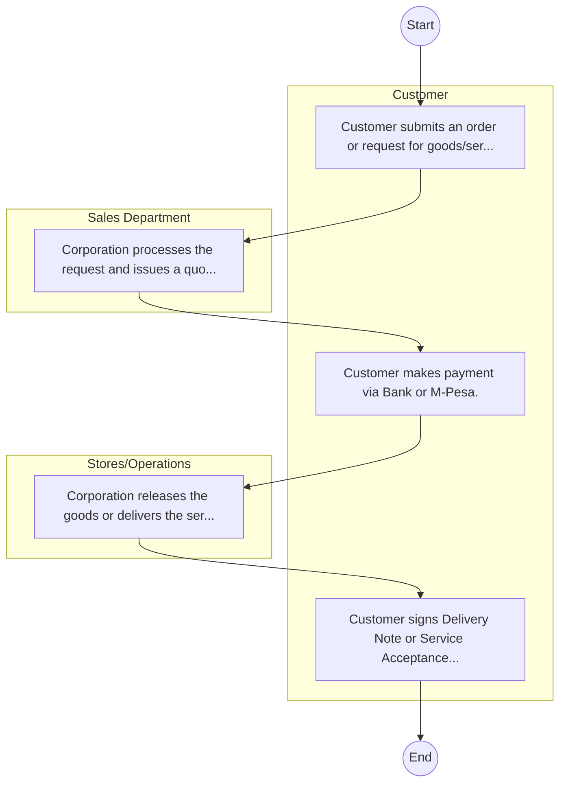
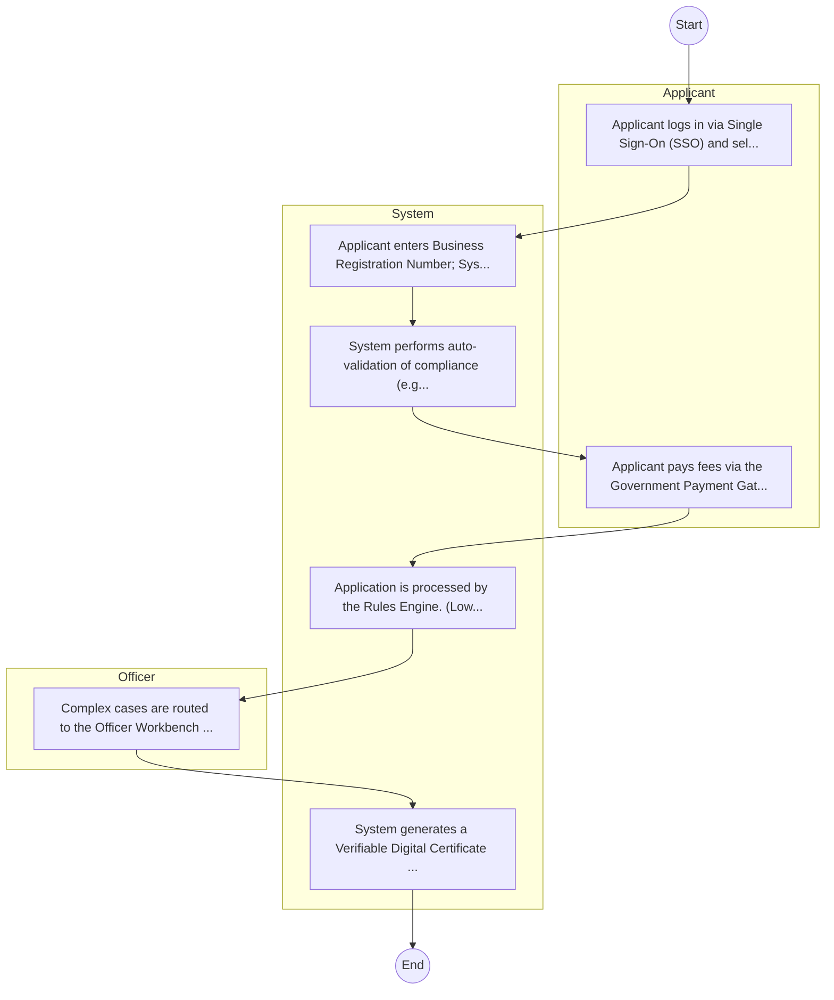

# Kenya Railways Corporation – Service Delivery

## Cover Page
- **Ministry/Department/Agency (MDA):** Kenya Railways Corporation
- **Process Name:** Service Delivery
- **Document Version:** 1.0
- **Date:** 2026-02-14
- **Classification:** Official

---

## Executive Summary
The Kenya Railways Corporation (KRC) is a state corporation established in 1978 under the Kenya Railways Corporation Act (Cap 397) of the Laws of Kenya. KRC is mandated to provide efficient and effective railway and inland waterways transport services. It plays a pivotal role in national and metropolitan railway network development, facilitating the movement of passengers and cargo, connecting Kenya and the East and Central African region to global markets, and significantly contributing to economic growth and regional integration.

---

## Service Mandate & Legal Basis
### Statutory Mandate
To provide efficient, safe, and reliable railway and inland waterways transport services for both passengers and cargo; to promote, facilitate, and actively participate in national and metropolitan railway network development, including the Standard Gauge Railway (SGR) and revitalization of the Meter Gauge Railway (MGR); to offer skills and technology for the railway sector; to leverage its assets for business growth and optimal resource utilization; and to develop an integrated, safe, reliable, and sustainable rail transport system that meets the evolving needs of the country and region.

### Legal Context
- Established in 1978 under the Kenya Railways Corporation Act (Cap 397) of the Laws of Kenya. Its formation followed the dissolution of the East African Community, leading to independent national railway operations. KRC operates under the Ministry of Transport and aligns its operations with national development blueprints like Vision 2030 and regional integration objectives of the East African Community. It is also guided by various international railway safety and operational standards.

---

## 1. AS-IS Process Flowchart (BPMN 2.0)
*Current State visualization.*

---

## Process Overview
### Service Category
- G2B (Government to Business)

### Scope
- **In Scope:** End-to-end processing within Kenya Railways Corporation.

### Triggers
- Submission of application/request by Customer.

### End States
- **Successful:** Loan Disbursement / Service Delivery, Statement of Account, Contract / Agreement, Receipt / Invoice

---

## Stakeholders
| Stakeholder | Role | Responsibilities |
|---|---|---|
| Sales Department | Process Actor | Performs actions as defined in steps. |
| Stores/Operations | Process Actor | Performs actions as defined in steps. |
| Customer | Process Actor | Performs actions as defined in steps. |

---

## Inputs & Outputs
- **Inputs:** Loan/Service Application Form, Business Proposal / Plan, Financial Statements / Bank Records, Collateral / Security Documents
- **Outputs:** Loan Disbursement / Service Delivery, Statement of Account, Contract / Agreement, Receipt / Invoice

---

## Detailed Process (AS-IS)
| Step | Role | Action | Tool | Notes |
|---|---|---|---|---|
| 1 | Customer | Customer submits an order or request for goods/services. | Manual | |
| 2 | Sales Department | Corporation processes the request and issues a quotation/proforma invoice. | Manual | |
| 3 | Customer | Customer makes payment via Bank or M-Pesa. | Manual | |
| 4 | Stores/Operations | Corporation releases the goods or delivers the service. | Manual | |
| 5 | Customer | Customer signs Delivery Note or Service Acceptance Form. | Manual | |

---

## Pain Points & Opportunities
### Pain Points
- Lengthy credit appraisal processes.
- Manual debt collection and reconciliation.
- High paperwork for loan processing.
- Lack of 360-degree customer view.

### Opportunities
- Integration with IPRS/BRS via Service Bus.
- Adoption of Government Payment Gateway.
- Implementation of Automated Rules Engine.
- Issuance of Digital Verifiable Credentials.

---

## 2. TO-BE Process Flowchart (BPMN 2.0)
*Future State visualization (Optimized).*

## Future State Process (TO-BE)
### Narrative
The To-Be process leverages the Government Service Bus to integrate with BRS (Business Registry) and the Payment Gateway. Manual data entry and document uploads are replaced by real-time API validations, enabling a paperless, cashless, and presence-less service experience.

### Optimized Steps (Digital)
| Step | Actor | Action | System |
|---|---|---|---|
| 1 | Applicant | Applicant logs in via Single Sign-On (SSO) and selects the service. | Citizen Portal / SSO |
| 2 | System | Applicant enters Business Registration Number; System auto-populates details from BRS (Business Registry) via the Service Bus. | Service Bus / Registry API |
| 3 | System | System performs auto-validation of compliance (e.g., KRA Tax Status) via Inter-Agency APIs. | Service Bus / Compliance Engine |
| 4 | Applicant | Applicant pays fees via the Government Payment Gateway; System auto-receipts. | Payment Gateway |
| 5 | System | Application is processed by the Rules Engine. (Low-risk cases are Auto-Approved). | Workflow Engine |
| 6 | Officer | Complex cases are routed to the Officer Workbench for digital review and approval. | Officer Workbench |
| 7 | System | System generates a Verifiable Digital Certificate (QR Code) and notifies the applicant. | Output Generator |

---

## References & Evidence
The information in this document was derived from the following official sources:

- [https://www.krc.co.ke/](https://www.krc.co.ke/)
- [https://ecitizen.go.ke/](https://ecitizen.go.ke/)
- [https://wikipedia.org/](https://wikipedia.org/)
- [https://developmentaid.org/](https://developmentaid.org/)
