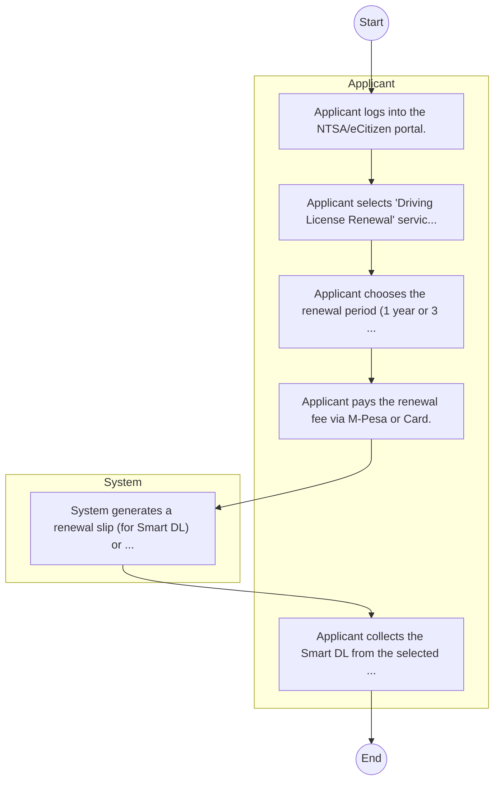
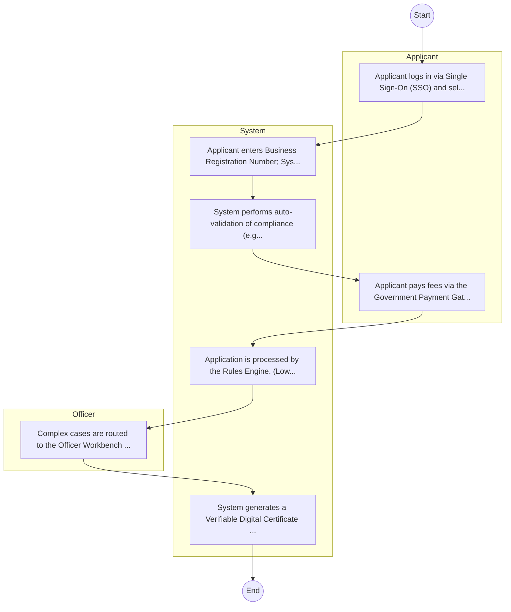

# NATIONAL TRANSPORT AND SAFETY AUTHORITY (NTSA) – Driving License Renewal

## Cover Page
- **Ministry/Department/Agency (MDA):** NATIONAL TRANSPORT AND SAFETY AUTHORITY (NTSA)
- **Process Name:** Driving License Renewal
- **Document Version:** 1.0
- **Date:** 2026-02-14
- **Classification:** Official

---

## Executive Summary
The State Department for Parliamentary Affairs in Kenya is mandated to coordinate the National Government's legislative agenda, strengthen policy coordination across Ministries, Departments, and Agencies (MDAs), and facilitate seamless interaction between the Executive and Parliament. It plays a crucial role in ensuring effective government business and enhancing accountability.

---

## Service Mandate & Legal Basis
### Statutory Mandate
To coordinate the formulation and implementation of the government's legislative agenda, strengthen policy coordination across MDAs and stakeholders, facilitate effective interaction between the Executive and Parliament, and enhance accountability and compliance through legislative oversight and public participation in policy and legislation development.

### Legal Context
- Mandate derived from Executive Order No. 2 of November 2023. Operates within the constitutional framework governing the Executive and Legislature, and relevant national legislation that guides legislative processes and inter-branch relations. (INFERRED: This forms the legal and operational context for its liaison role.)

---

## 1. AS-IS Process Flowchart (BPMN 2.0)
*Current State visualization.*

---

## Process Overview
### Service Category
- G2B (Government to Business)

### Scope
- **In Scope:** End-to-end processing within NATIONAL TRANSPORT AND SAFETY AUTHORITY (NTSA).

### Triggers
- Submission of application/request by Applicant.

### End States
- **Successful:** Smart DL, Number Plate, Inspection Cert

---

## Stakeholders
| Stakeholder | Role | Responsibilities |
|---|---|---|
| System | Process Actor | Performs actions as defined in steps. |
| Applicant | Process Actor | Performs actions as defined in steps. |

---

## Inputs & Outputs
- **Inputs:** Old DL, Police Abstract, Vehicle Logbook
- **Outputs:** Smart DL, Number Plate, Inspection Cert

---

## Detailed Process (AS-IS)
| Step | Role | Action | Tool | Notes |
|---|---|---|---|---|
| 1 | Applicant | Applicant logs into the NTSA/eCitizen portal. | Digital | |
| 2 | Applicant | Applicant selects 'Driving License Renewal' service. | Manual | |
| 3 | Applicant | Applicant chooses the renewal period (1 year or 3 years). | Manual | |
| 4 | Applicant | Applicant pays the renewal fee via M-Pesa or Card. | Manual | |
| 5 | System | System generates a renewal slip (for Smart DL) or updates the record. | Manual | |
| 6 | Applicant | Applicant collects the Smart DL from the selected center (if applying for a card) or prints the renewal slip. | Manual | |

---

## Pain Points & Opportunities
### Pain Points
- Fake licenses
- Road safety data gaps
- Manual inspection

### Opportunities
- Integration with IPRS/BRS via Service Bus.
- Adoption of Government Payment Gateway.
- Implementation of Automated Rules Engine.
- Issuance of Digital Verifiable Credentials.

---

## 2. TO-BE Process Flowchart (BPMN 2.0)
*Future State visualization (Optimized).*

## Future State Process (TO-BE)
### Narrative
The To-Be process leverages the Government Service Bus to integrate with BRS (Business Registry) and the Payment Gateway. Manual data entry and document uploads are replaced by real-time API validations, enabling a paperless, cashless, and presence-less service experience.

### Optimized Steps (Digital)
| Step | Actor | Action | System |
|---|---|---|---|
| 1 | Applicant | Applicant logs in via Single Sign-On (SSO) and selects the service. | Citizen Portal / SSO |
| 2 | System | Applicant enters Business Registration Number; System auto-populates details from BRS (Business Registry) via the Service Bus. | Service Bus / Registry API |
| 3 | System | System performs auto-validation of compliance (e.g., KRA Tax Status) via Inter-Agency APIs. | Service Bus / Compliance Engine |
| 4 | Applicant | Applicant pays fees via the Government Payment Gateway; System auto-receipts. | Payment Gateway |
| 5 | System | Application is processed by the Rules Engine. (Low-risk cases are Auto-Approved). | Workflow Engine |
| 6 | Officer | Complex cases are routed to the Officer Workbench for digital review and approval. | Officer Workbench |
| 7 | System | System generates a Verifiable Digital Certificate (QR Code) and notifies the applicant. | Output Generator |

---

## References & Evidence
The information in this document was derived from the following official sources:

- [https://parliamentaryaffairs.go.ke/](https://parliamentaryaffairs.go.ke/)
