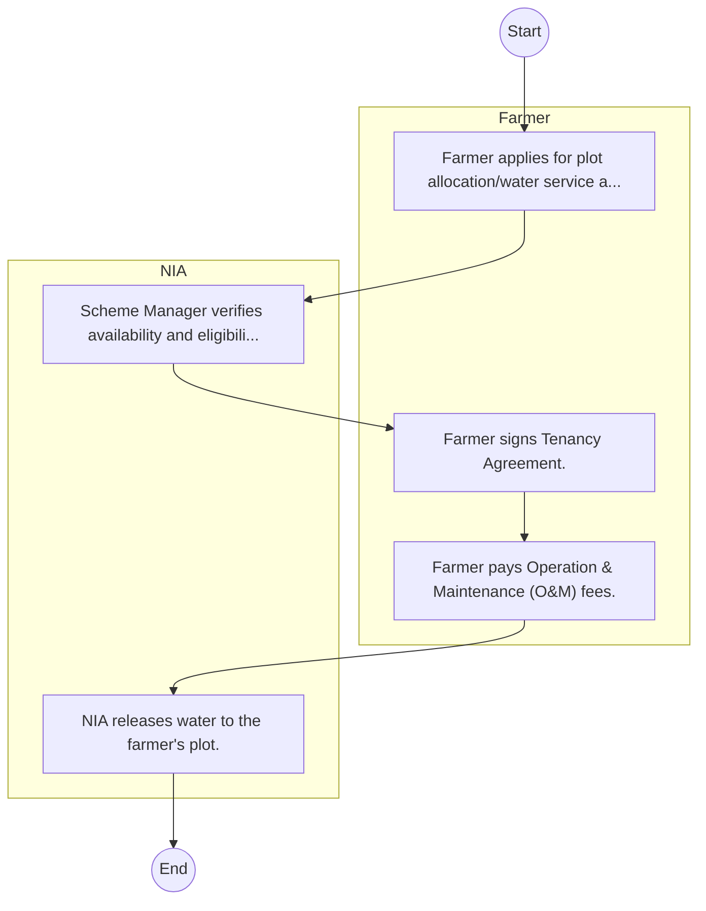
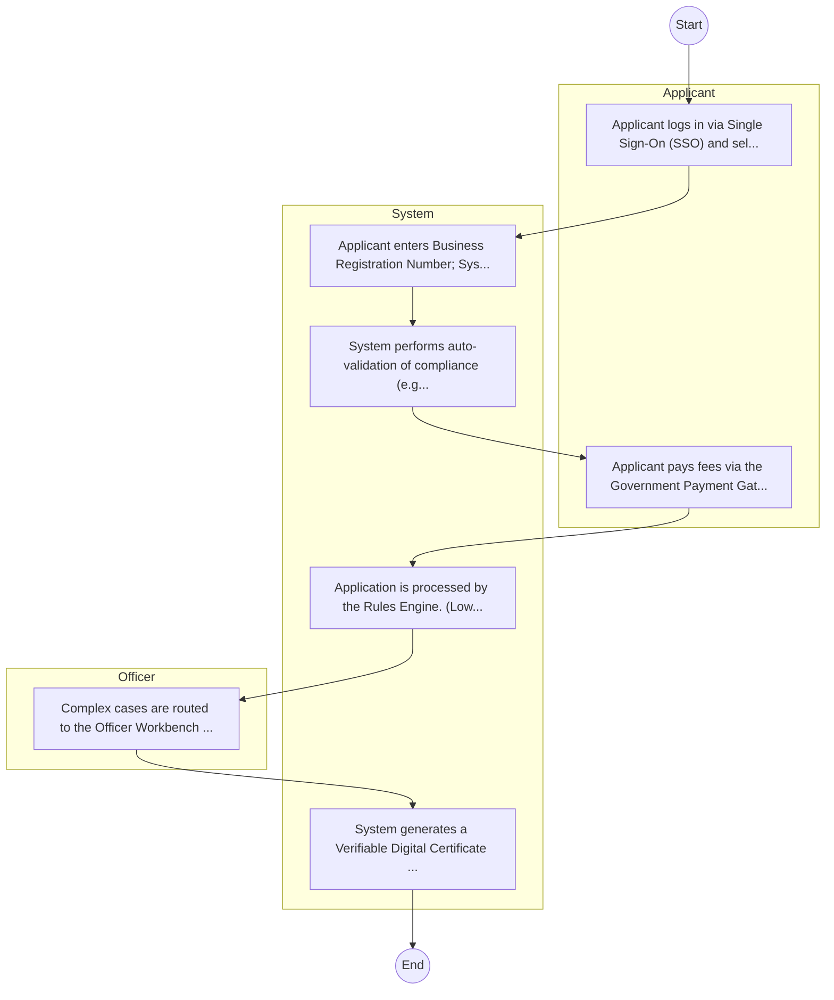

# National Irrigation Authority – Service Delivery

## Cover Page
- **Ministry/Department/Agency (MDA):** National Irrigation Authority
- **Process Name:** Service Delivery
- **Document Version:** 1.0
- **Date:** 2026-02-14
- **Classification:** Official

---

## Executive Summary
The National Irrigation Authority (NIA) is a state corporation in Kenya operating under the Irrigation Act 2019. Its primary mandate is to foster sustainable food security and socio-economic development through the development, expansion, management, oversight, and regulation of irrigation practices and infrastructure across the country. NIA plays a crucial role in increasing agricultural productivity, mitigating the effects of climate change, and improving the livelihoods of farming communities by ensuring efficient and reliable water use for agriculture.

---

## Service Mandate & Legal Basis
### Statutory Mandate
To develop and enhance irrigation infrastructure for both national and public schemes; to offer irrigation support services to private medium and smallholder schemes in collaboration with county governments and other relevant parties; to provide technical advisory services for irrigation schemes covering design, construction supervision, administration, operation, and maintenance; to advise the Cabinet Secretary on matters related to the development, maintenance, expansion, and availability of irrigation support services; to allocate land within national irrigation schemes for public use; to promote the marketing, safe storage, and processing of agricultural products from irrigation schemes in partnership with county governments and other agencies; to conduct research to recommend fair prices for agricultural products from irrigation schemes; to facilitate the establishment and strengthening of irrigation water users' associations and scheme management committees for effective operation and management; to coordinate and plan settlement on national or public irrigation schemes and determine settler numbers; and to offer commercial technical advisory services on irrigation water management, including water harvesting, storage, and wastewater recycling.

### Legal Context
- Established under the Irrigation Act 2019, which provides the legal framework for its mandate and functions. NIA operates under the Ministry of Water, Sanitation and Irrigation (or the relevant government ministry responsible for irrigation and water resources) and is central to achieving Kenya's food security goals, supporting agricultural transformation, and adapting to climate change impacts through improved water management in agriculture.

---

## 1. AS-IS Process Flowchart (BPMN 2.0)
*Current State visualization.*

---

## Process Overview
### Service Category
- G2B (Government to Business)

### Scope
- **In Scope:** End-to-end processing within National Irrigation Authority.

### Triggers
- Submission of application/request by Farmer.

### End States
- **Successful:** License / Permit / Certificate, Compliance Inspection Report, Official Receipt, Gazette Notice

---

## Stakeholders
| Stakeholder | Role | Responsibilities |
|---|---|---|
| NIA | Process Actor | Performs actions as defined in steps. |
| Farmer | Process Actor | Performs actions as defined in steps. |

---

## Inputs & Outputs
- **Inputs:** Application Form (License/Permit), Compliance Documents (Tax Compliance, CR12), Technical Reports / Site Plans, Proof of Payment
- **Outputs:** License / Permit / Certificate, Compliance Inspection Report, Official Receipt, Gazette Notice

---

## Detailed Process (AS-IS)
| Step | Role | Action | Tool | Notes |
|---|---|---|---|---|
| 1 | Farmer | Farmer applies for plot allocation/water service at Scheme Office. | Manual | |
| 2 | NIA | Scheme Manager verifies availability and eligibility. | Manual | |
| 3 | Farmer | Farmer signs Tenancy Agreement. | Manual | |
| 4 | Farmer | Farmer pays Operation & Maintenance (O&M) fees. | Manual | |
| 5 | NIA | NIA releases water to the farmer's plot. | Manual | |

---

## Pain Points & Opportunities
### Pain Points
- Manual document verification takes time.
- High cost and time for physical inspections.
- Risk of counterfeit licenses/certificates.
- Lack of real-time monitoring of licensees.

### Opportunities
- Integration with IPRS/BRS via Service Bus.
- Adoption of Government Payment Gateway.
- Implementation of Automated Rules Engine.
- Issuance of Digital Verifiable Credentials.

---

## 2. TO-BE Process Flowchart (BPMN 2.0)
*Future State visualization (Optimized).*

## Future State Process (TO-BE)
### Narrative
The To-Be process leverages the Government Service Bus to integrate with BRS (Business Registry) and the Payment Gateway. Manual data entry and document uploads are replaced by real-time API validations, enabling a paperless, cashless, and presence-less service experience.

### Optimized Steps (Digital)
| Step | Actor | Action | System |
|---|---|---|---|
| 1 | Applicant | Applicant logs in via Single Sign-On (SSO) and selects the service. | Citizen Portal / SSO |
| 2 | System | Applicant enters Business Registration Number; System auto-populates details from BRS (Business Registry) via the Service Bus. | Service Bus / Registry API |
| 3 | System | System performs auto-validation of compliance (e.g., KRA Tax Status) via Inter-Agency APIs. | Service Bus / Compliance Engine |
| 4 | Applicant | Applicant pays fees via the Government Payment Gateway; System auto-receipts. | Payment Gateway |
| 5 | System | Application is processed by the Rules Engine. (Low-risk cases are Auto-Approved). | Workflow Engine |
| 6 | Officer | Complex cases are routed to the Officer Workbench for digital review and approval. | Officer Workbench |
| 7 | System | System generates a Verifiable Digital Certificate (QR Code) and notifies the applicant. | Output Generator |

---

## References & Evidence
The information in this document was derived from the following official sources:

- [https://www.irrigationauthority.go.ke/](https://www.irrigationauthority.go.ke/)
- [https://devex.com/](https://devex.com/)
- [https://aiap.or.ke/](https://aiap.or.ke/)
