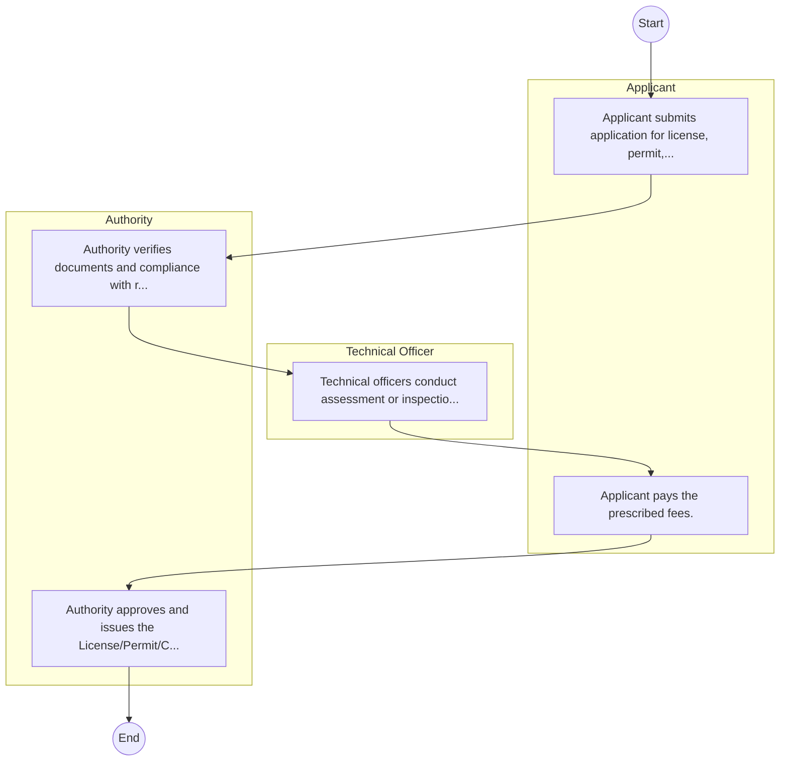
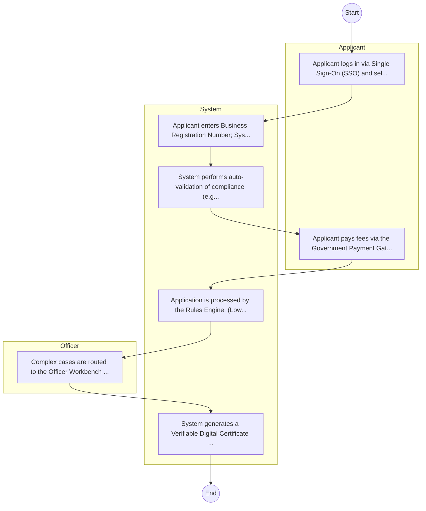

# National Youth Service – Service Delivery

## Cover Page
- **Ministry/Department/Agency (MDA):** National Youth Service
- **Process Name:** Service Delivery
- **Document Version:** 1.0
- **Date:** 2026-02-14
- **Classification:** Official

---

## Executive Summary
The National Youth Service (NYS) is a semi-autonomous state corporation in Kenya, established in 1964 and transformed in 2019 following the enactment of the NYS Act, 2018. Its core mandate is to instill discipline, patriotism, and practical skills in Kenyan youth through rigorous paramilitary training, engagement in national service projects, and provision of Technical and Vocational Education and Training (TVET). NYS aims to develop a disciplined, skilled, and organized human resource pool to support national development programs, foster social cohesion, and enhance youth employability and self-reliance, while also contributing to national security and disaster response.

---

## Service Mandate & Legal Basis
### Statutory Mandate
To train and mentor Kenyan youth, imparting paramilitary and vocational skills (including construction, engineering, hospitality, agriculture, textiles, and security) to enhance their employability, discipline, patriotism, and self-reliance; to engage youth in community service and public projects, such as infrastructure development (roads, housing), environmental conservation (reforestation, waste management), slum upgrading programs, traffic control, and agriculture; to provide rapid deployment for emergency relief and disaster management, and offer support to security agencies during national emergencies; to foster national unity, civic pride, leadership skills, and promote cross-cultural integration among youth; and to undertake viable commercial enterprises to generate revenue and ensure the sustainability of its operations and programs.

### Legal Context
- Established in 1964, the National Youth Service was transformed into a semi-autonomous state corporation in 2019 following the enactment of the NYS Act, 2018, which provides the legal and institutional framework for its operations. NYS operates under the Ministry of Public Service, Youth and Gender Affairs (or the relevant government ministry responsible for youth affairs) and is central to implementing national youth empowerment and development policies, strategies for human resource development, and initiatives aimed at fostering national cohesion and security.

---

## 1. AS-IS Process Flowchart (BPMN 2.0)
*Current State visualization.*

---

## Process Overview
### Service Category
- G2C/G2B

### Scope
- **In Scope:** End-to-end processing within National Youth Service.

### Triggers
- Submission of application/request by Applicant.

### End States
- **Successful:** License / Permit / Certificate, Compliance Inspection Report, Official Receipt, Gazette Notice

---

## Stakeholders
| Stakeholder | Role | Responsibilities |
|---|---|---|
| Technical Officer | Process Actor | Performs actions as defined in steps. |
| Authority | Process Actor | Performs actions as defined in steps. |
| Applicant | Process Actor | Performs actions as defined in steps. |

---

## Inputs & Outputs
- **Inputs:** Application Form (License/Permit), Compliance Documents (Tax Compliance, CR12), Technical Reports / Site Plans, Proof of Payment
- **Outputs:** License / Permit / Certificate, Compliance Inspection Report, Official Receipt, Gazette Notice

---

## Detailed Process (AS-IS)
| Step | Role | Action | Tool | Notes |
|---|---|---|---|---|
| 1 | Applicant | Applicant submits application for license, permit, or service. | Manual | |
| 2 | Authority | Authority verifies documents and compliance with regulations. | Manual | |
| 3 | Technical Officer | Technical officers conduct assessment or inspection. | Manual | |
| 4 | Applicant | Applicant pays the prescribed fees. | Manual | |
| 5 | Authority | Authority approves and issues the License/Permit/Certificate. | Manual | |

---

## Pain Points & Opportunities
### Pain Points
- Manual document verification takes time.
- High cost and time for physical inspections.
- Risk of counterfeit licenses/certificates.
- Lack of real-time monitoring of licensees.

### Opportunities
- Integration with IPRS/BRS via Service Bus.
- Adoption of Government Payment Gateway.
- Implementation of Automated Rules Engine.
- Issuance of Digital Verifiable Credentials.

---

## 2. TO-BE Process Flowchart (BPMN 2.0)
*Future State visualization (Optimized).*

## Future State Process (TO-BE)
### Narrative
The To-Be process leverages the Government Service Bus to integrate with BRS (Business Registry) and the Payment Gateway. Manual data entry and document uploads are replaced by real-time API validations, enabling a paperless, cashless, and presence-less service experience.

### Optimized Steps (Digital)
| Step | Actor | Action | System |
|---|---|---|---|
| 1 | Applicant | Applicant logs in via Single Sign-On (SSO) and selects the service. | Citizen Portal / SSO |
| 2 | System | Applicant enters Business Registration Number; System auto-populates details from BRS (Business Registry) via the Service Bus. | Service Bus / Registry API |
| 3 | System | System performs auto-validation of compliance (e.g., KRA Tax Status) via Inter-Agency APIs. | Service Bus / Compliance Engine |
| 4 | Applicant | Applicant pays fees via the Government Payment Gateway; System auto-receipts. | Payment Gateway |
| 5 | System | Application is processed by the Rules Engine. (Low-risk cases are Auto-Approved). | Workflow Engine |
| 6 | Officer | Complex cases are routed to the Officer Workbench for digital review and approval. | Officer Workbench |
| 7 | System | System generates a Verifiable Digital Certificate (QR Code) and notifies the applicant. | Output Generator |

---

## References & Evidence
The information in this document was derived from the following official sources:

- [https://www.nys.go.ke/](https://www.nys.go.ke/)
- [https://ecitizen.go.ke/](https://ecitizen.go.ke/)
- [https://scribd.com/](https://scribd.com/)
- [https://saraka.info/](https://saraka.info/)
- [https://lawguide.co.ke/](https://lawguide.co.ke/)
- [https://youtube.com/](https://youtube.com/)
- [https://advance-africa.com/](https://advance-africa.com/)
