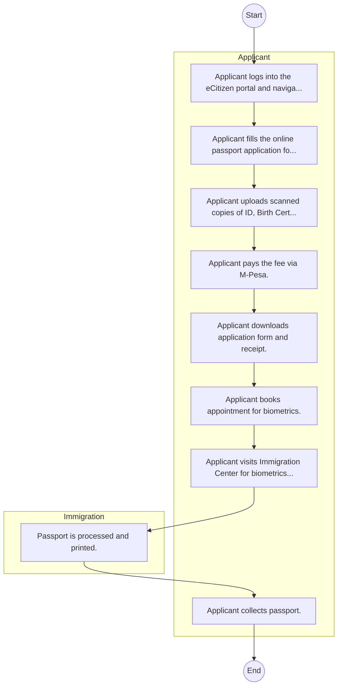
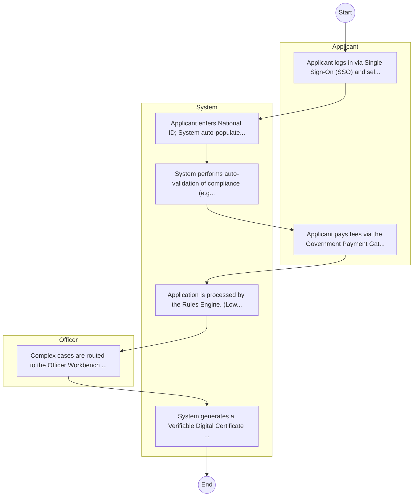

# STATE DEPARTMENT FOR IMMIGRATION AND CITIZEN SERVICES – Passport Application

## Cover Page
- **Ministry/Department/Agency (MDA):** STATE DEPARTMENT FOR IMMIGRATION AND CITIZEN SERVICES
- **Process Name:** Passport Application
- **Document Version:** 1.0
- **Date:** 2026-02-14
- **Classification:** Official

---

## Executive Summary
The State Department for Immigration and Citizen Services in Kenya controls and regulates the entry, exit, and residency of individuals, manages citizenship, and provides related services. It is responsible for issuing passports and other travel documents, as well as maintaining population registers for citizens and foreign nationals.

---

## Service Mandate & Legal Basis
### Statutory Mandate
To control and regulate immigration, manage citizenship applications, issue travel and identification documents, and ensure secure and efficient citizen services in accordance with national laws and policies.

### Legal Context
- Mandate derived from Chapter 3 of the Constitution of Kenya 2010, the Kenya Citizenship and Immigration Act, 2011, and the Kenya Citizenship and Immigration Regulations, 2012. Other relevant laws and policies also apply.

---

## 1. AS-IS Process Flowchart (BPMN 2.0)
*Current State visualization.*

---

## Process Overview
### Service Category
- G2C (Government to Citizen)

### Scope
- **In Scope:** End-to-end processing within STATE DEPARTMENT FOR IMMIGRATION AND CITIZEN SERVICES.

### Triggers
- Submission of application/request by Applicant.

### End States
- **Successful:** e-Passport, Visa, Work Permit

---

## Stakeholders
| Stakeholder | Role | Responsibilities |
|---|---|---|
| Immigration | Process Actor | Performs actions as defined in steps. |
| Applicant | Process Actor | Performs actions as defined in steps. |

---

## Inputs & Outputs
- **Inputs:** Old Passport/ID, Birth Certificate, Biometrics (Fingerprints, Face)
- **Outputs:** e-Passport, Visa, Work Permit

---

## Detailed Process (AS-IS)
| Step | Role | Action | Tool | Notes |
|---|---|---|---|---|
| 1 | Applicant | Applicant logs into the eCitizen portal and navigates to Immigration Services. | Digital | |
| 2 | Applicant | Applicant fills the online passport application form. | Manual | |
| 3 | Applicant | Applicant uploads scanned copies of ID, Birth Certificate, etc. | Manual | |
| 4 | Applicant | Applicant pays the fee via M-Pesa. | Manual | |
| 5 | Applicant | Applicant downloads application form and receipt. | Manual | |
| 6 | Applicant | Applicant books appointment for biometrics. | Manual | |
| 7 | Applicant | Applicant visits Immigration Center for biometrics. | Manual | |
| 8 | Immigration | Passport is processed and printed. | Manual | |
| 9 | Applicant | Applicant collects passport. | Manual | |

---

## Pain Points & Opportunities
### Pain Points
- Crowding at Nyayo House
- Delay in printing
- Manual file retrieval

### Opportunities
- Integration with IPRS/BRS via Service Bus.
- Adoption of Government Payment Gateway.
- Implementation of Automated Rules Engine.
- Issuance of Digital Verifiable Credentials.

---

## 2. TO-BE Process Flowchart (BPMN 2.0)
*Future State visualization (Optimized).*

## Future State Process (TO-BE)
### Narrative
The To-Be process leverages the Government Service Bus to integrate with IPRS (Identity Registry) and the Payment Gateway. Manual data entry and document uploads are replaced by real-time API validations, enabling a paperless, cashless, and presence-less service experience.

### Optimized Steps (Digital)
| Step | Actor | Action | System |
|---|---|---|---|
| 1 | Applicant | Applicant logs in via Single Sign-On (SSO) and selects the service. | Citizen Portal / SSO |
| 2 | System | Applicant enters National ID; System auto-populates details from IPRS (Identity Registry) via the Service Bus. | Service Bus / Registry API |
| 3 | System | System performs auto-validation of compliance (e.g., KRA Tax Status) via Inter-Agency APIs. | Service Bus / Compliance Engine |
| 4 | Applicant | Applicant pays fees via the Government Payment Gateway; System auto-receipts. | Payment Gateway |
| 5 | System | Application is processed by the Rules Engine. (Low-risk cases are Auto-Approved). | Workflow Engine |
| 6 | Officer | Complex cases are routed to the Officer Workbench for digital review and approval. | Officer Workbench |
| 7 | System | System generates a Verifiable Digital Certificate (QR Code) and notifies the applicant. | Output Generator |

---

## References & Evidence
The information in this document was derived from the following official sources:

- [https://immigration.go.ke/](https://immigration.go.ke/)
- [https://ecitizen.go.ke/](https://ecitizen.go.ke/)
