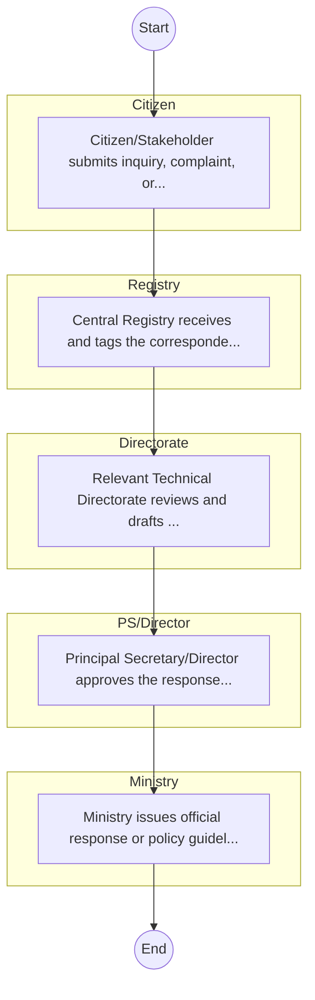
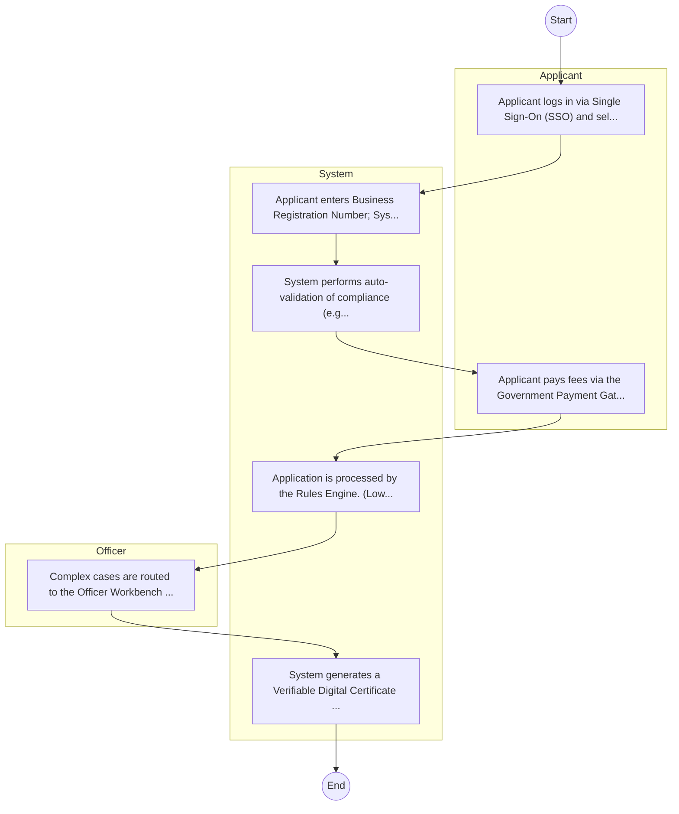

# STATE DEPARTMENT FOR PARLIAMENTARY AFFAIRS – Service Delivery

## Cover Page
- **Ministry/Department/Agency (MDA):** STATE DEPARTMENT FOR PARLIAMENTARY AFFAIRS
- **Process Name:** Service Delivery
- **Document Version:** 1.0
- **Date:** 2026-02-14
- **Classification:** Official

---

## Executive Summary
The State Department for Parliamentary Affairs in Kenya is mandated to coordinate the National Government's legislative agenda, facilitate seamless interaction between the Executive and Parliament, and strengthen policy coordination across Ministries, Departments, and Agencies (MDAs). It ensures effective government business and enhances accountability.

---

## Service Mandate & Legal Basis
### Statutory Mandate
To coordinate the formulation and implementation of the government's legislative agenda, strengthen policy coordination across MDAs and stakeholders, facilitate effective interaction between the Executive and Parliament, and enhance accountability and compliance through legislative oversight and public participation in policy and legislation development.

### Legal Context
- Mandate derived from Executive Order No. 2 of November 2023. Operates within the constitutional framework governing the Executive and Legislature, and relevant national legislation that guides legislative processes and inter-branch relations. (INFERRED: This forms the legal and operational context for its liaison role.)
- Mandate derived from Executive Order No. 2 of November 2023 and Executive Order No. 1 of January 2023. Operates within the constitutional framework governing the Executive and Legislature, and relevant national legislation that guides legislative processes and inter-branch relations. (INFERRED: This forms the legal and operational context for its liaison role.)

---

## 1. AS-IS Process Flowchart (BPMN 2.0)
*Current State visualization.*

---

## Process Overview
### Service Category
- G2C/G2B

### Scope
- **In Scope:** End-to-end processing within STATE DEPARTMENT FOR PARLIAMENTARY AFFAIRS.

### Triggers
- Submission of application/request by Citizen.

### End States
- **Successful:** Policy Guidelines / Circulars, Official Response Letters, Cabinet Resolutions, Public Service Reports

---

## Stakeholders
| Stakeholder | Role | Responsibilities |
|---|---|---|
| Registry | Process Actor | Performs actions as defined in steps. |
| Ministry | Process Actor | Performs actions as defined in steps. |
| Citizen | Process Actor | Performs actions as defined in steps. |
| PS/Director | Process Actor | Performs actions as defined in steps. |
| Directorate | Process Actor | Performs actions as defined in steps. |

---

## Inputs & Outputs
- **Inputs:** Public Inquiries / Petitions, Policy Proposals / Memos, Inter-agency Correspondence, Cabinet Memos
- **Outputs:** Policy Guidelines / Circulars, Official Response Letters, Cabinet Resolutions, Public Service Reports

---

## Detailed Process (AS-IS)
| Step | Role | Action | Tool | Notes |
|---|---|---|---|---|
| 1 | Citizen | Citizen/Stakeholder submits inquiry, complaint, or policy proposal via email or office. | Manual | |
| 2 | Registry | Central Registry receives and tags the correspondence. | Manual | |
| 3 | Directorate | Relevant Technical Directorate reviews and drafts response/action. | Manual | |
| 4 | PS/Director | Principal Secretary/Director approves the response. | Manual | |
| 5 | Ministry | Ministry issues official response or policy guideline. | Manual | |

---

## Pain Points & Opportunities
### Pain Points
- Slow movement of physical files (Bureaucracy).
- Loss of institutional memory (Manual registries).
- Difficulty in tracking correspondence status.
- Siloed operations between departments.

### Opportunities
- Integration with IPRS/BRS via Service Bus.
- Adoption of Government Payment Gateway.
- Implementation of Automated Rules Engine.
- Issuance of Digital Verifiable Credentials.

---

## 2. TO-BE Process Flowchart (BPMN 2.0)
*Future State visualization (Optimized).*

## Future State Process (TO-BE)
### Narrative
The To-Be process leverages the Government Service Bus to integrate with BRS (Business Registry) and the Payment Gateway. Manual data entry and document uploads are replaced by real-time API validations, enabling a paperless, cashless, and presence-less service experience.

### Optimized Steps (Digital)
| Step | Actor | Action | System |
|---|---|---|---|
| 1 | Applicant | Applicant logs in via Single Sign-On (SSO) and selects the service. | Citizen Portal / SSO |
| 2 | System | Applicant enters Business Registration Number; System auto-populates details from BRS (Business Registry) via the Service Bus. | Service Bus / Registry API |
| 3 | System | System performs auto-validation of compliance (e.g., KRA Tax Status) via Inter-Agency APIs. | Service Bus / Compliance Engine |
| 4 | Applicant | Applicant pays fees via the Government Payment Gateway; System auto-receipts. | Payment Gateway |
| 5 | System | Application is processed by the Rules Engine. (Low-risk cases are Auto-Approved). | Workflow Engine |
| 6 | Officer | Complex cases are routed to the Officer Workbench for digital review and approval. | Officer Workbench |
| 7 | System | System generates a Verifiable Digital Certificate (QR Code) and notifies the applicant. | Output Generator |

---

## References & Evidence
The information in this document was derived from the following official sources:

- [https://parliamentaryaffairs.go.ke/](https://parliamentaryaffairs.go.ke/)
