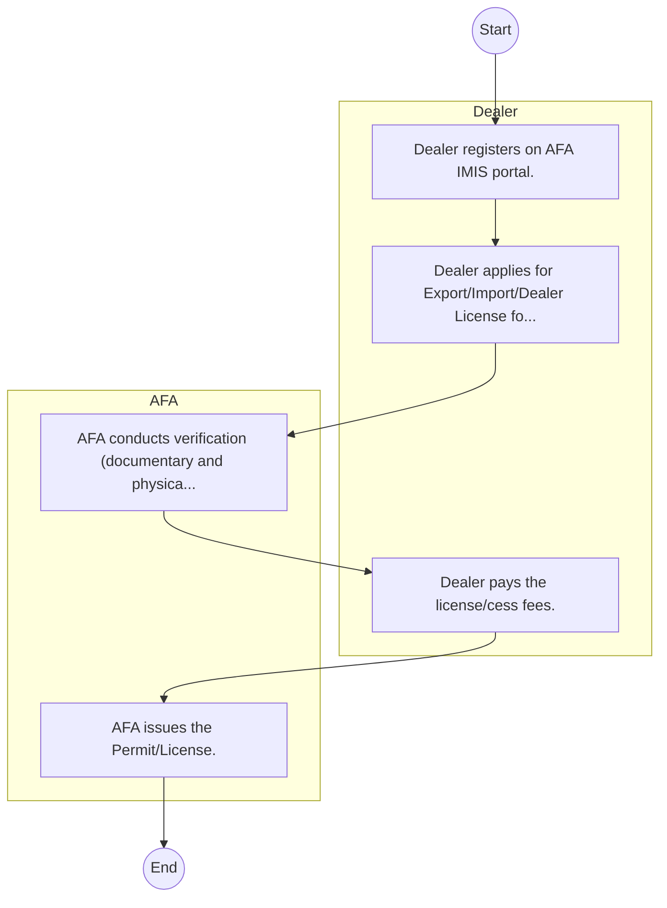
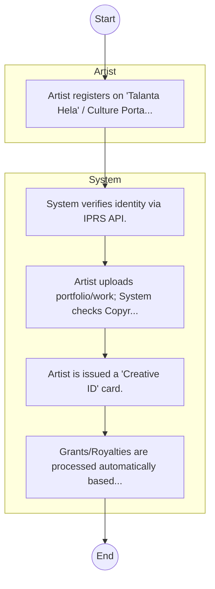

# Agriculture and Food Authority – Service Delivery

## Cover Page
- **Ministry/Department/Agency (MDA):** Agriculture and Food Authority
- **Process Name:** Service Delivery
- **Document Version:** 1.0
- **Date:** 2026-02-14
- **Classification:** Official
- **Status:** High Priority (POC List)

---

## Executive Summary
The Anti-Counterfeit Authority (ACA) Kenya is a State Corporation established under the Anti-Counterfeit Act 2008. Its primary mandate is to protect intellectual property rights and consumer rights by actively combating trade in counterfeit goods, raising public awareness, and coordinating with other organizations involved in anti-counterfeiting efforts in Kenya.

---

## Service Mandate & Legal Basis
### Statutory Mandate
To enlighten the public on counterfeiting, combat trade in counterfeit goods, promote training programs for stakeholders, and coordinate with other organizations involved in combating counterfeiting to safeguard intellectual property rights, protect consumers, and foster a fair trading environment in Kenya.

### Legal Context
- Established under the Agriculture and Food Authority Act No. 13 of 2013. Administers the Crops Act (2013) and consolidates various crop regulatory institutions into a unified framework. (INFERRED: This legislative framework provides its authority for comprehensive agricultural regulation.)
- Established under the Anti-Counterfeit Act 2008, which provides the legal framework for its mandate. Operates under the Ministry of Industry, Investment and Trade.

---

## 1. AS-IS Process Flowchart (BPMN 2.0)
*Current State visualization.*

---

## Process Overview
### Service Category
- G2B (Government to Business)

### Scope
- **In Scope:** End-to-end processing within Agriculture and Food Authority.

### Triggers
- Submission of application/request by Dealer.

### End States
- **Successful:** License / Permit / Certificate, Compliance Inspection Report, Official Receipt, Gazette Notice

---

## Stakeholders
| Stakeholder | Role | Responsibilities |
|---|---|---|
| Dealer | Process Actor | Performs actions as defined in steps. |
| AFA | Process Actor | Performs actions as defined in steps. |

---

## Inputs & Outputs
- **Inputs:** Application Form (License/Permit), Compliance Documents (Tax Compliance, CR12), Technical Reports / Site Plans, Proof of Payment
- **Outputs:** License / Permit / Certificate, Compliance Inspection Report, Official Receipt, Gazette Notice

---

## Detailed Process (AS-IS)
| Step | Role | Action | Tool | Notes |
|---|---|---|---|---|
| 1 | Dealer | Dealer registers on AFA IMIS portal. | Digital | |
| 2 | Dealer | Dealer applies for Export/Import/Dealer License for specific crop (e.g., Coffee, Tea, Horticulture). | Manual | |
| 3 | AFA | AFA conducts verification (documentary and physical if needed). | Manual | |
| 4 | Dealer | Dealer pays the license/cess fees. | Manual | |
| 5 | AFA | AFA issues the Permit/License. | Manual | |

---

## Pain Points & Opportunities
### Pain Points
- Manual document verification takes time.
- High cost and time for physical inspections.
- Risk of counterfeit licenses/certificates.
- Lack of real-time monitoring of licensees.

### Opportunities
- Integration with Government Service Bus.
- Real-time API validation with Authoritative Registries.
- Automated Rules Engine for decision making.
- Adoption of 'Once-Only' data principle.

---

## 2. TO-BE Process Flowchart (BPMN 2.0)
*Future State visualization (Optimized with Service Bus & Registries).*

## Future State Process (TO-BE)
### Narrative
The To-Be process establishes a National Creative Registry. Artists register once, and their work is authenticated against the Copyright Board, enabling access to royalties and government grants.

### Optimized Steps (Digital)
| Step | Actor | Action | System |
|---|---|---|---|
| 1 | Artist | Artist registers on 'Talanta Hela' / Culture Portal. | Culture Portal |
| 2 | System | System verifies identity via IPRS API. | Service Bus / IPRS |
| 3 | System | Artist uploads portfolio/work; System checks Copyright Board database for IP ownership. | Service Bus / KECOBO |
| 4 | System | Artist is issued a 'Creative ID' card. | Registry |
| 5 | System | Grants/Royalties are processed automatically based on registered works. | Payment Engine |

---

## References & Evidence
The information in this document was derived from the following official sources:

- [https://aca.go.ke/](https://aca.go.ke/)
- [https://devex.com/](https://devex.com/)
