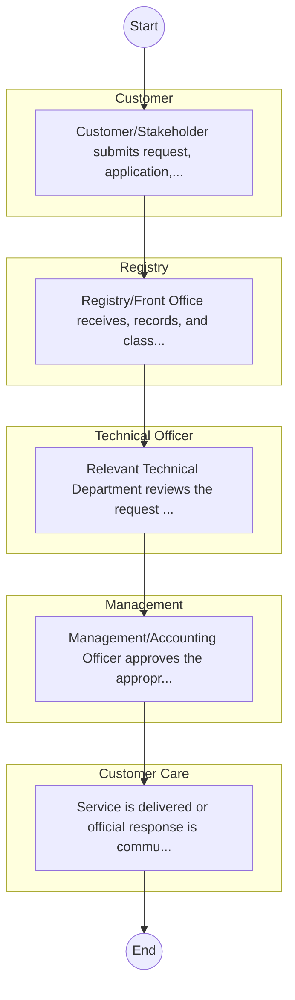
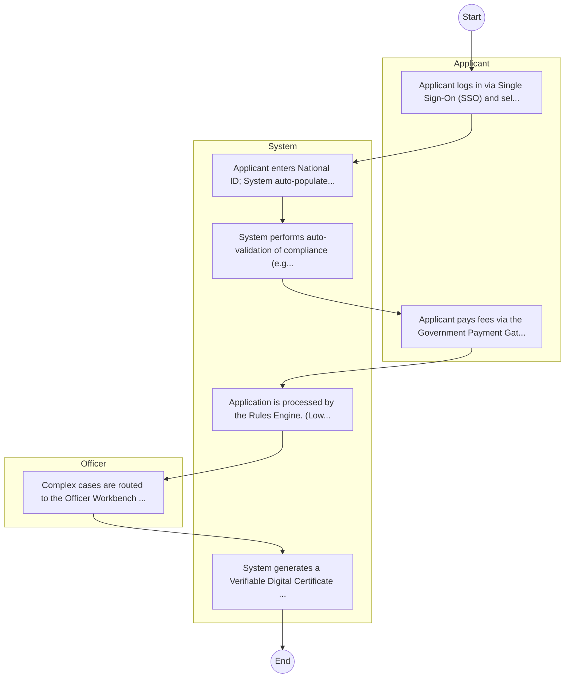

# Centre for Mathematics, Science and Technology Education in Africa – Service Delivery

## Cover Page
- **Ministry/Department/Agency (MDA):** Centre for Mathematics, Science and Technology Education in Africa
- **Process Name:** Service Delivery
- **Document Version:** 1.0
- **Date:** 2026-02-14
- **Classification:** Official

---

## Executive Summary
The Centre for Mathematics, Science and Technology Education in Africa (CEMASTEA) is a State Corporation under the Ministry of Education in Kenya, transformed in 2022. Its principal mandate is to provide continuous professional development for teachers in Science, Technology, Engineering, and Mathematics (STEM) education, not only in Kenya but across Africa. CEMASTEA aims to enhance the quality of STEM education, conduct research to inform pedagogical practices and policy, and foster local and international collaborations to promote national and regional development through a skilled human resource base.

---

## Service Mandate & Legal Basis
### Statutory Mandate
To provide continuous professional development (CPD) for teachers in Science, Technology, Engineering, and Mathematics (STEM) education, aligning with policies set by the Ministry of Education, the Teachers Service Commission (TSC), and other relevant stakeholders; to conduct research to inform Teacher Professional Development programs, internal quality assurance processes, and policy development; to organize and host seminars, workshops, conferences, and symposia related to STEM education and teacher capacity development; to publish and distribute information and research findings concerning STEM education and teacher capacity development; to offer advisory and consultancy services in the field of STEM education and teacher capacity development; to foster local and international partnerships and collaborations with government agencies, institutions, and organizations interested in STEM education; to serve as the Secretariat for the Strengthening of Mathematics and Science Education in Africa (SMASE-Africa) Network and ADEA's Inter-Country Quality Node on Mathematics and Science Education (ICQN-MSE); to support the implementation of STEM initiatives across Africa; to contribute to the development and review of mathematics, science, and technology curricula; to build the capacity of educators and administrators in STEM subjects; and to advocate for the significance of STEM education to promote national and regional development.

### Legal Context
- CEMASTEA was transformed into a State Corporation under the Ministry of Education in 2022, with its specific mandate focusing on training and research in STEM education. It operates under the Ministry of Education and aligns its activities with national education policies, curriculum reforms (e.g., the Competency-Based Curriculum - CBC), and regional educational development goals. Its functions are guided by the Kenya Education Act and other relevant statutes concerning teacher professional development and educational research.

---

## 1. AS-IS Process Flowchart (BPMN 2.0)
*Current State visualization.*

---

## Process Overview
### Service Category
- G2C/G2B

### Scope
- **In Scope:** End-to-end processing within Centre for Mathematics, Science and Technology Education in Africa.

### Triggers
- Submission of application/request by Customer.

### End States
- **Successful:** License / Permit / Certificate, Compliance Inspection Report, Official Receipt, Gazette Notice

---

## Stakeholders
| Stakeholder | Role | Responsibilities |
|---|---|---|
| Technical Officer | Process Actor | Performs actions as defined in steps. |
| Registry | Process Actor | Performs actions as defined in steps. |
| Customer Care | Process Actor | Performs actions as defined in steps. |
| Management | Process Actor | Performs actions as defined in steps. |
| Customer | Process Actor | Performs actions as defined in steps. |

---

## Inputs & Outputs
- **Inputs:** Application Form (License/Permit), Compliance Documents (Tax Compliance, CR12), Technical Reports / Site Plans, Proof of Payment
- **Outputs:** License / Permit / Certificate, Compliance Inspection Report, Official Receipt, Gazette Notice

---

## Detailed Process (AS-IS)
| Step | Role | Action | Tool | Notes |
|---|---|---|---|---|
| 1 | Customer | Customer/Stakeholder submits request, application, or inquiry via official channels (Email, Letter, or Portal). | Digital | |
| 2 | Registry | Registry/Front Office receives, records, and classifies the request. | Manual | |
| 3 | Technical Officer | Relevant Technical Department reviews the request against internal policies and regulations. | Manual | |
| 4 | Management | Management/Accounting Officer approves the appropriate action or service delivery. | Manual | |
| 5 | Customer Care | Service is delivered or official response is communicated to the customer. | Manual | |

---

## Pain Points & Opportunities
### Pain Points
- Manual document verification takes time.
- High cost and time for physical inspections.
- Risk of counterfeit licenses/certificates.
- Lack of real-time monitoring of licensees.

### Opportunities
- Integration with IPRS/BRS via Service Bus.
- Adoption of Government Payment Gateway.
- Implementation of Automated Rules Engine.
- Issuance of Digital Verifiable Credentials.

---

## 2. TO-BE Process Flowchart (BPMN 2.0)
*Future State visualization (Optimized with Service Bus & Registries).*

## Future State Process (TO-BE)
### Narrative
The To-Be process leverages the Government Service Bus to integrate with IPRS (Identity Registry) and the Payment Gateway. Manual data entry and document uploads are replaced by real-time API validations, enabling a paperless, cashless, and presence-less service experience.

### Optimized Steps (Digital)
| Step | Actor | Action | System |
|---|---|---|---|
| 1 | Applicant | Applicant logs in via Single Sign-On (SSO) and selects the service. | Citizen Portal / SSO |
| 2 | System | Applicant enters National ID; System auto-populates details from IPRS (Identity Registry) via the Service Bus. | Service Bus / Registry API |
| 3 | System | System performs auto-validation of compliance (e.g., KRA Tax Status) via Inter-Agency APIs. | Service Bus / Compliance Engine |
| 4 | Applicant | Applicant pays fees via the Government Payment Gateway; System auto-receipts. | Payment Gateway |
| 5 | System | Application is processed by the Rules Engine. (Low-risk cases are Auto-Approved). | Workflow Engine |
| 6 | Officer | Complex cases are routed to the Officer Workbench for digital review and approval. | Officer Workbench |
| 7 | System | System generates a Verifiable Digital Certificate (QR Code) and notifies the applicant. | Output Generator |

---

## References & Evidence
The information in this document was derived from the following official sources:

- [https://www.cemastea.ac.ke/](https://www.cemastea.ac.ke/)
- [https://treasury.go.ke/](https://treasury.go.ke/)
- [https://saraka.info/](https://saraka.info/)
