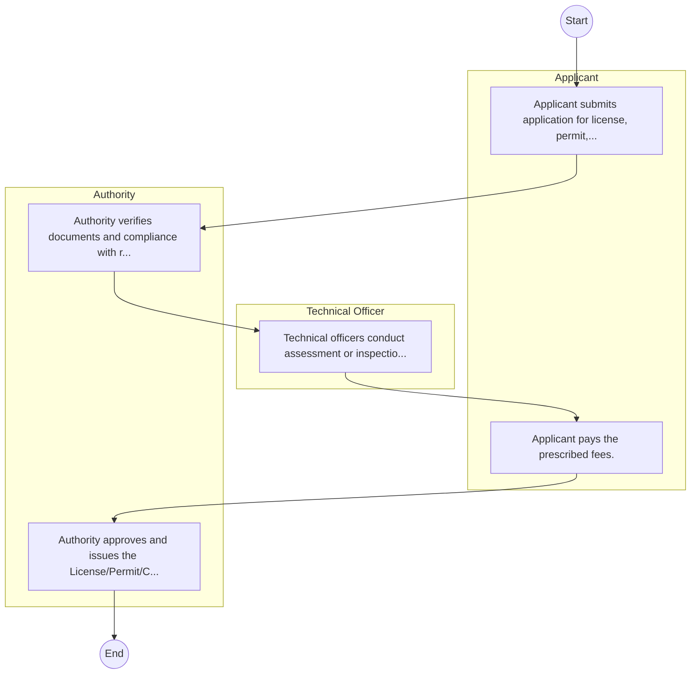
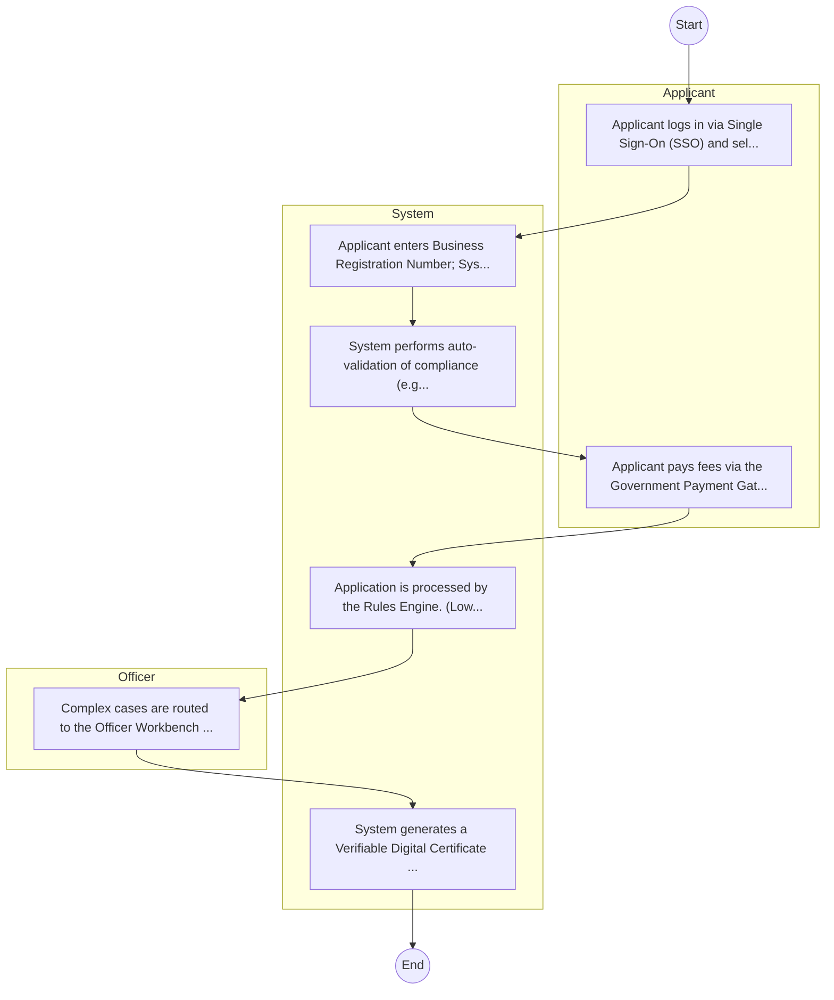

# Citizen Services – Service Delivery

## Cover Page
- **Ministry/Department/Agency (MDA):** Citizen Services
- **Process Name:** Service Delivery
- **Document Version:** 1.0
- **Date:** 2026-02-14
- **Classification:** Official

---

## Executive Summary
The Department of Citizen Services operates under the State Department for Immigration and Citizen Services within the Ministry of Interior and National Administration in Kenya. Its mandate, rooted in the Constitution of Kenya and relevant legislation, is to provide comprehensive citizen services, including population registration, identification and documentation, immigration control, issuance of travel documents, residency management, civil registration, and refugee affairs. Largely facilitated by digital platforms like eCitizen, the Department aims to enhance national security, socio-economic development, and efficient service delivery to both Kenyan citizens and foreign nationals.

---

## Service Mandate & Legal Basis
### Statutory Mandate
To manage the Integrated Population Registration System (IPRS) and operate/maintain a national population register for all Kenyan citizens and foreign residents; to identify and register all Kenyan citizens aged 18 and above, issuing secure identification documents (National Identity Cards), and maintaining a comprehensive database of registered individuals; to regulate and control the entry and exit of all individuals, including the removal of prohibited immigrants, and managing border points (airports, seaports, and land borders); to issue Kenyan passports and other necessary travel documents; to oversee residency through the issuance and renewal of entry and work permits, various passes, and entry visas, and managing citizenship applications for eligible foreign nationals; to register births and deaths, ensuring the preservation and security of related certificates, and processing vital statistics; to handle the registration and status determination of refugees, coordinating service provision, issuing identification and movement passes, and managing refugee camps; to enforce relevant laws and regulations pertaining to immigration and citizenship; and to develop national migration policies and review existing immigration laws and regulations.

### Legal Context
- The Department's mandate is rooted in the Constitution of Kenya, 2010 (particularly Articles 43, 53, 54, 55, 56, 57, and 59 concerning rights to services), and relevant legislation such as the Kenya Citizenship and Immigration Act, 2011, and the National Registration Act. It operates under the Ministry of Interior and National Administration and is guided by national policies on security, immigration, citizen registration, and digital service delivery, aiming to enhance service accessibility, national data integrity, and socio-economic planning.

---

## 1. AS-IS Process Flowchart (BPMN 2.0)
*Current State visualization.*

---

## Process Overview
### Service Category
- G2C/G2B

### Scope
- **In Scope:** End-to-end processing within Citizen Services.

### Triggers
- Submission of application/request by Applicant.

### End States
- **Successful:** License / Permit / Certificate, Compliance Inspection Report, Official Receipt, Gazette Notice

---

## Stakeholders
| Stakeholder | Role | Responsibilities |
|---|---|---|
| Authority | Process Actor | Performs actions as defined in steps. |
| Applicant | Process Actor | Performs actions as defined in steps. |
| Technical Officer | Process Actor | Performs actions as defined in steps. |

---

## Inputs & Outputs
- **Inputs:** Application Form (License/Permit), Compliance Documents (Tax Compliance, CR12), Technical Reports / Site Plans, Proof of Payment
- **Outputs:** License / Permit / Certificate, Compliance Inspection Report, Official Receipt, Gazette Notice

---

## Detailed Process (AS-IS)
| Step | Role | Action | Tool | Notes |
|---|---|---|---|---|
| 1 | Applicant | Applicant submits application for license, permit, or service. | Manual | |
| 2 | Authority | Authority verifies documents and compliance with regulations. | Manual | |
| 3 | Technical Officer | Technical officers conduct assessment or inspection. | Manual | |
| 4 | Applicant | Applicant pays the prescribed fees. | Manual | |
| 5 | Authority | Authority approves and issues the License/Permit/Certificate. | Manual | |

---

## Pain Points & Opportunities
### Pain Points
- Manual document verification takes time.
- High cost and time for physical inspections.
- Risk of counterfeit licenses/certificates.
- Lack of real-time monitoring of licensees.

### Opportunities
- Integration with IPRS/BRS via Service Bus.
- Adoption of Government Payment Gateway.
- Implementation of Automated Rules Engine.
- Issuance of Digital Verifiable Credentials.

---

## 2. TO-BE Process Flowchart (BPMN 2.0)
*Future State visualization (Optimized with Service Bus & Registries).*

## Future State Process (TO-BE)
### Narrative
The To-Be process leverages the Government Service Bus to integrate with BRS (Business Registry) and the Payment Gateway. Manual data entry and document uploads are replaced by real-time API validations, enabling a paperless, cashless, and presence-less service experience.

### Optimized Steps (Digital)
| Step | Actor | Action | System |
|---|---|---|---|
| 1 | Applicant | Applicant logs in via Single Sign-On (SSO) and selects the service. | Citizen Portal / SSO |
| 2 | System | Applicant enters Business Registration Number; System auto-populates details from BRS (Business Registry) via the Service Bus. | Service Bus / Registry API |
| 3 | System | System performs auto-validation of compliance (e.g., KRA Tax Status) via Inter-Agency APIs. | Service Bus / Compliance Engine |
| 4 | Applicant | Applicant pays fees via the Government Payment Gateway; System auto-receipts. | Payment Gateway |
| 5 | System | Application is processed by the Rules Engine. (Low-risk cases are Auto-Approved). | Workflow Engine |
| 6 | Officer | Complex cases are routed to the Officer Workbench for digital review and approval. | Officer Workbench |
| 7 | System | System generates a Verifiable Digital Certificate (QR Code) and notifies the applicant. | Output Generator |

---

## References & Evidence
The information in this document was derived from the following official sources:

- [https://www.ecitizen.go.ke/](https://www.ecitizen.go.ke/)
- [https://www.immigration.go.ke/](https://www.immigration.go.ke/)
