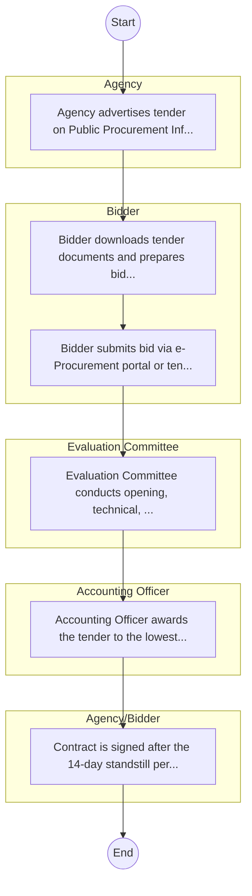
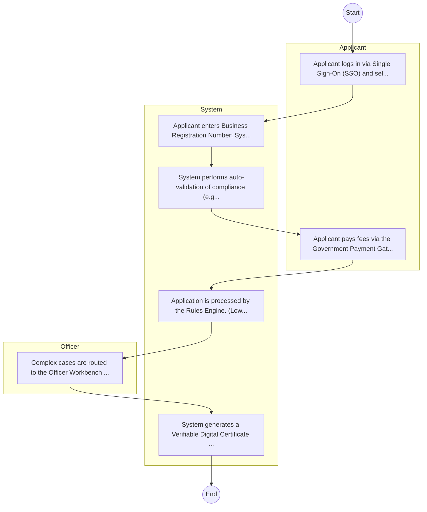

# Coast Development Authority – Procurement Process

## Cover Page
- **Ministry/Department/Agency (MDA):** Coast Development Authority
- **Process Name:** Procurement Process
- **Document Version:** 1.0
- **Date:** 2026-02-14
- **Classification:** Official

---

## Executive Summary
The Coast Development Authority (CDA) is a State Corporation in Kenya, established by an Act of Parliament (No. 20 of 1990, Cap 449). Its primary mandate is to provide integrated development planning, coordination, and implementation of projects and programs throughout the entire Coast Region of Kenya, including the exclusive economic zone. CDA focuses on sustainable utilization and conservation of natural resources, promoting economic growth, and empowering local communities, thereby contributing to national development strategies, particularly those related to the Blue Economy.

---

## Service Mandate & Legal Basis
### Statutory Mandate
To oversee the sustainable utilization and conservation of natural resources in Kenya's coastal region; to promote agricultural productivity through initiatives like irrigation schemes, modern farming practices, and value addition; to implement projects to enhance water supply for domestic, agricultural, and industrial use, including promoting alternative sources of freshwater like rainwater harvesting; to protect coastal ecosystems, combat soil erosion, and promote reforestation efforts, and increase resilience to climate change in shoreline and mangrove ecosystems; to plan and develop infrastructure such as roads, bridges, and water systems to support regional growth; to engage and empower local communities through capacity-building programs and development initiatives; to foster industrial and commercial ventures, especially those leveraging the region's natural resources; to support the development of eco-tourism and sustainable tourism activities in the coastal region; to conduct research and studies on natural resources, climate change, and development challenges to inform decision-making; and to align and implement national policies related to regional planning, environmental protection, and resource management.

### Legal Context
- Established by an Act of Parliament (No. 20 of 1990, Cap 449), revised in 1992, which provides the legal framework for its mandate and functions. CDA operates under the Ministry of East African Community, Arid and Semi-Arid Lands (ASALs) and Regional Development (or the relevant government ministry responsible for regional development) and is guided by national development policies, environmental conservation acts, and regional development strategies, particularly those related to the Blue Economy and sustainable development of coastal resources.

---

## 1. AS-IS Process Flowchart (BPMN 2.0)
*Current State visualization.*

---

## Process Overview
### Service Category
- G2B (Government to Business)

### Scope
- **In Scope:** End-to-end processing within Coast Development Authority.

### Triggers
- Submission of application/request by Agency.

### End States
- **Successful:** License / Permit / Certificate, Compliance Inspection Report, Official Receipt, Gazette Notice

---

## Stakeholders
| Stakeholder | Role | Responsibilities |
|---|---|---|
| Accounting Officer | Process Actor | Performs actions as defined in steps. |
| Agency/Bidder | Process Actor | Performs actions as defined in steps. |
| Bidder | Process Actor | Performs actions as defined in steps. |
| Evaluation Committee | Process Actor | Performs actions as defined in steps. |
| Agency | Process Actor | Performs actions as defined in steps. |

---

## Inputs & Outputs
- **Inputs:** Application Form (License/Permit), Compliance Documents (Tax Compliance, CR12), Technical Reports / Site Plans, Proof of Payment
- **Outputs:** License / Permit / Certificate, Compliance Inspection Report, Official Receipt, Gazette Notice

---

## Detailed Process (AS-IS)
| Step | Role | Action | Tool | Notes |
|---|---|---|---|---|
| 1 | Agency | Agency advertises tender on Public Procurement Information Portal (PPIP) and website. | Digital | |
| 2 | Bidder | Bidder downloads tender documents and prepares bid (Technical & Financial). | Manual | |
| 3 | Bidder | Bidder submits bid via e-Procurement portal or tender box. | Digital | |
| 4 | Evaluation Committee | Evaluation Committee conducts opening, technical, and financial evaluation. | Manual | |
| 5 | Accounting Officer | Accounting Officer awards the tender to the lowest responsive bidder. | Manual | |
| 6 | Agency/Bidder | Contract is signed after the 14-day standstill period. | Manual | |

---

## Pain Points & Opportunities
### Pain Points
- Manual document verification takes time.
- High cost and time for physical inspections.
- Risk of counterfeit licenses/certificates.
- Lack of real-time monitoring of licensees.

### Opportunities
- Integration with IPRS/BRS via Service Bus.
- Adoption of Government Payment Gateway.
- Implementation of Automated Rules Engine.
- Issuance of Digital Verifiable Credentials.

---

## 2. TO-BE Process Flowchart (BPMN 2.0)
*Future State visualization (Optimized with Service Bus & Registries).*

## Future State Process (TO-BE)
### Narrative
The To-Be process leverages the Government Service Bus to integrate with BRS (Business Registry) and the Payment Gateway. Manual data entry and document uploads are replaced by real-time API validations, enabling a paperless, cashless, and presence-less service experience.

### Optimized Steps (Digital)
| Step | Actor | Action | System |
|---|---|---|---|
| 1 | Applicant | Applicant logs in via Single Sign-On (SSO) and selects the service. | Citizen Portal / SSO |
| 2 | System | Applicant enters Business Registration Number; System auto-populates details from BRS (Business Registry) via the Service Bus. | Service Bus / Registry API |
| 3 | System | System performs auto-validation of compliance (e.g., KRA Tax Status) via Inter-Agency APIs. | Service Bus / Compliance Engine |
| 4 | Applicant | Applicant pays fees via the Government Payment Gateway; System auto-receipts. | Payment Gateway |
| 5 | System | Application is processed by the Rules Engine. (Low-risk cases are Auto-Approved). | Workflow Engine |
| 6 | Officer | Complex cases are routed to the Officer Workbench for digital review and approval. | Officer Workbench |
| 7 | System | System generates a Verifiable Digital Certificate (QR Code) and notifies the applicant. | Output Generator |

---

## References & Evidence
The information in this document was derived from the following official sources:

- [https://developmentaid.org/](https://developmentaid.org/)
- [https://saraka.info/](https://saraka.info/)
- [https://fao.org/](https://fao.org/)
- [https://policyvault.africa/](https://policyvault.africa/)
- [https://nema.go.ke/](https://nema.go.ke/)
