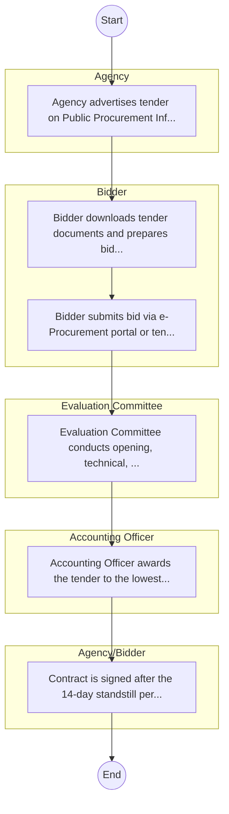
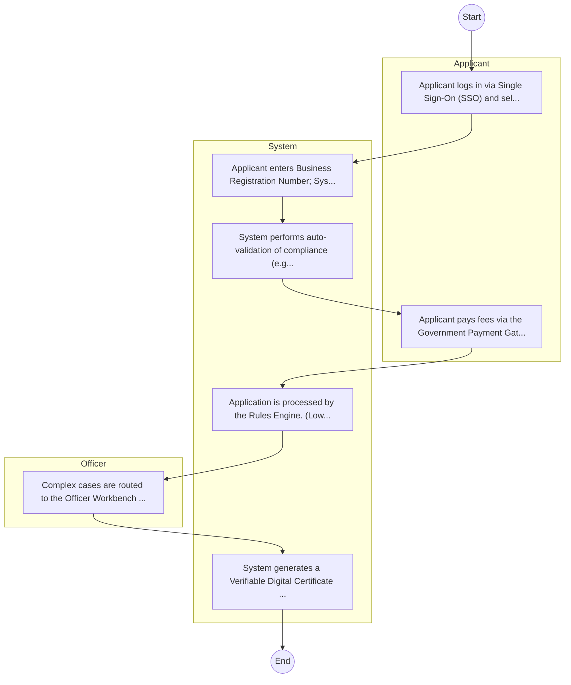

# Coast Water Works Development Agency – Procurement Process

## Cover Page
- **Ministry/Department/Agency (MDA):** Coast Water Works Development Agency
- **Process Name:** Procurement Process
- **Document Version:** 1.0
- **Date:** 2026-02-14
- **Classification:** Official

---

## Executive Summary
The Coast Water Works Development Agency (CWWDA) is a state corporation in Kenya, established under the Water Act of 2016 and transitioning from the Coast Water Services Board (CWSB) in May 2019. Its primary mandate is to develop and maintain sustainable water and sanitation infrastructure within the Coast region of Kenya. This includes undertaking the development, maintenance, and management of national public water works, with the aim of delivering efficient and reliable water and sanitation services to the residents of Mombasa, Kilifi, Kwale, Tana River, Lamu, and Taita Taveta counties.

---

## Service Mandate & Legal Basis
### Statutory Mandate
To undertake the development, maintenance, and management of water works in the Coast Region; to operate water works and provide water services until such a time these responsibilities are handed over to respective counties or water service providers; to provide technical services and capacity building to County Governments; to offer reserve capacity for water services when the Water Services Regulatory Board (WASREB) orders the transfer of functions from a defaulting water services provider to another licensee; to provide technical support to the Cabinet Secretary in fulfilling their duties under the Constitution and the Water Act 2016; to own and hold water and sewerage assets and infrastructure on behalf of the National Government; to plan, develop, and expand water and sewerage infrastructure for the National Government; to assist County Governments within its jurisdiction during the transition period in contracting out water and sewerage services provision to Water Services Providers (WSPs) and monitoring these services; to ensure compliance with licensing requirements by WSPs; to assume responsibility as a Water Service Provider as a last resort; and to manage bulk water supply from various sources, including Mzima Springs, Baricho well fields, Marere Springs, Tiwi boreholes, the Hola Water supply project, and Shella wells.

### Legal Context
- Established under the Water Act of 2016 and Legal Notice Number 27 of April 26, 2019, which provides the comprehensive legal framework for its establishment and functions, transitioning from the Coast Water Services Board (CWSB). CWWDA operates under the Ministry of Water & Sanitation and Irrigation and aligns its activities with national water sector reforms, policies, and the constitutional right to clean and safe water, aiming to enhance access to water and sanitation services in the coastal region in line with national development goals.

---

## 1. AS-IS Process Flowchart (BPMN 2.0)
*Current State visualization.*

---

## Process Overview
### Service Category
- G2C/G2B

### Scope
- **In Scope:** End-to-end processing within Coast Water Works Development Agency.

### Triggers
- Submission of application/request by Agency.

### End States
- **Successful:** License / Permit / Certificate, Compliance Inspection Report, Official Receipt, Gazette Notice

---

## Stakeholders
| Stakeholder | Role | Responsibilities |
|---|---|---|
| Accounting Officer | Process Actor | Performs actions as defined in steps. |
| Agency/Bidder | Process Actor | Performs actions as defined in steps. |
| Bidder | Process Actor | Performs actions as defined in steps. |
| Evaluation Committee | Process Actor | Performs actions as defined in steps. |
| Agency | Process Actor | Performs actions as defined in steps. |

---

## Inputs & Outputs
- **Inputs:** Application Form (License/Permit), Compliance Documents (Tax Compliance, CR12), Technical Reports / Site Plans, Proof of Payment
- **Outputs:** License / Permit / Certificate, Compliance Inspection Report, Official Receipt, Gazette Notice

---

## Detailed Process (AS-IS)
| Step | Role | Action | Tool | Notes |
|---|---|---|---|---|
| 1 | Agency | Agency advertises tender on Public Procurement Information Portal (PPIP) and website. | Digital | |
| 2 | Bidder | Bidder downloads tender documents and prepares bid (Technical & Financial). | Manual | |
| 3 | Bidder | Bidder submits bid via e-Procurement portal or tender box. | Digital | |
| 4 | Evaluation Committee | Evaluation Committee conducts opening, technical, and financial evaluation. | Manual | |
| 5 | Accounting Officer | Accounting Officer awards the tender to the lowest responsive bidder. | Manual | |
| 6 | Agency/Bidder | Contract is signed after the 14-day standstill period. | Manual | |

---

## Pain Points & Opportunities
### Pain Points
- Manual document verification takes time.
- High cost and time for physical inspections.
- Risk of counterfeit licenses/certificates.
- Lack of real-time monitoring of licensees.

### Opportunities
- Integration with IPRS/BRS via Service Bus.
- Adoption of Government Payment Gateway.
- Implementation of Automated Rules Engine.
- Issuance of Digital Verifiable Credentials.

---

## 2. TO-BE Process Flowchart (BPMN 2.0)
*Future State visualization (Optimized with Service Bus & Registries).*

## Future State Process (TO-BE)
### Narrative
The To-Be process leverages the Government Service Bus to integrate with BRS (Business Registry) and the Payment Gateway. Manual data entry and document uploads are replaced by real-time API validations, enabling a paperless, cashless, and presence-less service experience.

### Optimized Steps (Digital)
| Step | Actor | Action | System |
|---|---|---|---|
| 1 | Applicant | Applicant logs in via Single Sign-On (SSO) and selects the service. | Citizen Portal / SSO |
| 2 | System | Applicant enters Business Registration Number; System auto-populates details from BRS (Business Registry) via the Service Bus. | Service Bus / Registry API |
| 3 | System | System performs auto-validation of compliance (e.g., KRA Tax Status) via Inter-Agency APIs. | Service Bus / Compliance Engine |
| 4 | Applicant | Applicant pays fees via the Government Payment Gateway; System auto-receipts. | Payment Gateway |
| 5 | System | Application is processed by the Rules Engine. (Low-risk cases are Auto-Approved). | Workflow Engine |
| 6 | Officer | Complex cases are routed to the Officer Workbench for digital review and approval. | Officer Workbench |
| 7 | System | System generates a Verifiable Digital Certificate (QR Code) and notifies the applicant. | Output Generator |

---

## References & Evidence
The information in this document was derived from the following official sources:

- [https://www.cwwda.go.ke/](https://www.cwwda.go.ke/)
- [https://www.treasury.go.ke/](https://www.treasury.go.ke/)
