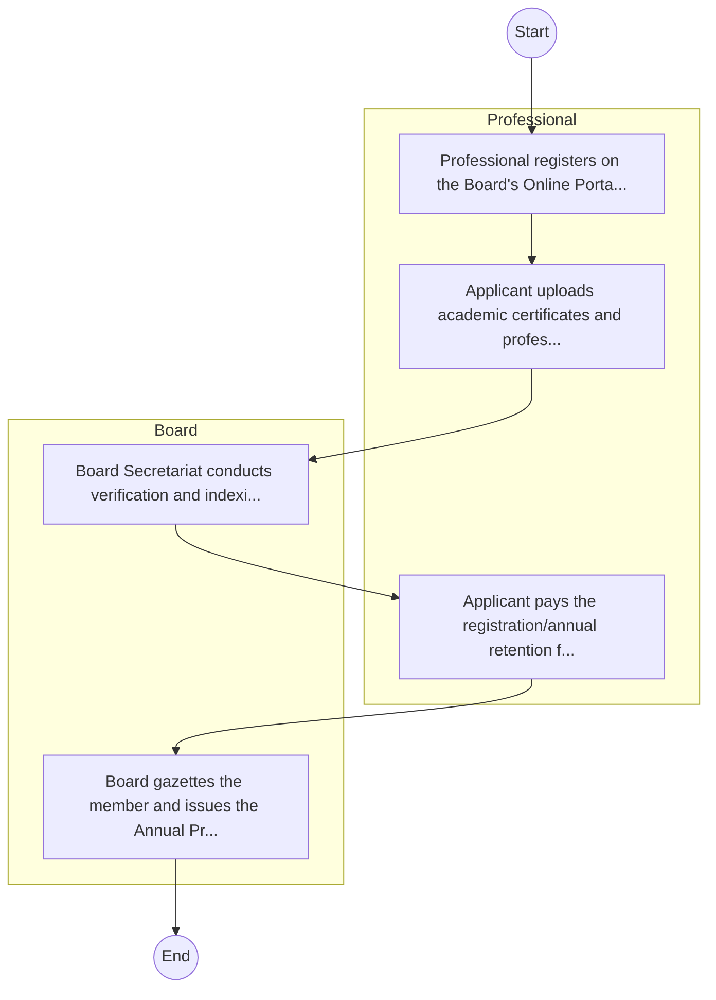
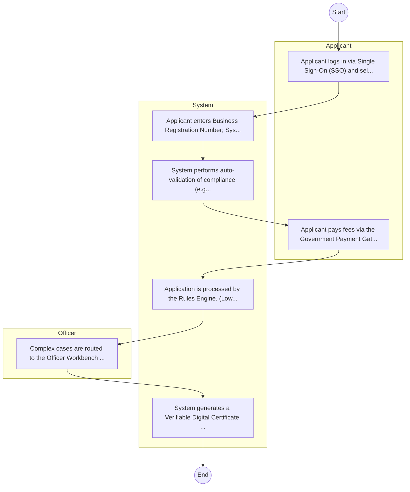

# Counsellors and Psychologists Board – Licensing and Permitting

## Cover Page
- **Ministry/Department/Agency (MDA):** Counsellors and Psychologists Board
- **Process Name:** Licensing and Permitting
- **Document Version:** 1.0
- **Date:** 2026-02-14
- **Classification:** Official

---

## Executive Summary
The Counsellors and Psychologists Board in Kenya was established on August 5, 2022, under Section 3 of the Counsellors and Psychologists Act No. 14 of 2014. Its core mission is to regulate and streamline the counselling and psychology professions in Kenya, ensuring they adhere to the highest standards of professional practice and ethical conduct. The Board plays a crucial role in protecting consumers, building client trust, fostering the growth and development of these vital mental health professions, and promoting mental well-being in the country.

---

## Service Mandate & Legal Basis
### Statutory Mandate
To regulate the education and professional standards of practice for counsellors and psychologists in Kenya; to register and license qualified counsellors and psychologists; to set benchmarks for excellence within the professions; to ensure consumer protection by safeguarding clients from unethical or incompetent practice; to promote professional conduct and ethical practice among all practitioners; to support continuous professional growth and provide ethical guidance to members; to offer online services for registration, Continuing Professional Development (CPD) training, practicing licenses, and the registration and licensing of counselling/psychological facilities; and to handle administrative matters, assurance services, public entities oversight, audit, legal & regulatory compliance, and steer reforms in governance and public service within the mental health sector.

### Legal Context
- Established on August 5, 2022, under Section 3 of the Counsellors and Psychologists Act No. 14 of 2014, which provides the comprehensive legal and regulatory framework for the counselling and psychology professions in Kenya. The Board operates under the Ministry of Health (or the relevant government ministry responsible for mental health services) and is crucial for implementing national mental health policies, ensuring quality mental health services, and safeguarding public well-being through professional regulation and oversight.

---

## 1. AS-IS Process Flowchart (BPMN 2.0)
*Current State visualization.*

---

## Process Overview
### Service Category
- G2B (Government to Business)

### Scope
- **In Scope:** End-to-end processing within Counsellors and Psychologists Board.

### Triggers
- Submission of application/request by Professional.

### End States
- **Successful:** License / Permit / Certificate, Compliance Inspection Report, Official Receipt, Gazette Notice

---

## Stakeholders
| Stakeholder | Role | Responsibilities |
|---|---|---|
| Professional | Process Actor | Performs actions as defined in steps. |
| Board | Process Actor | Performs actions as defined in steps. |

---

## Inputs & Outputs
- **Inputs:** Application Form (License/Permit), Compliance Documents (Tax Compliance, CR12), Technical Reports / Site Plans, Proof of Payment
- **Outputs:** License / Permit / Certificate, Compliance Inspection Report, Official Receipt, Gazette Notice

---

## Detailed Process (AS-IS)
| Step | Role | Action | Tool | Notes |
|---|---|---|---|---|
| 1 | Professional | Professional registers on the Board's Online Portal. | Digital | |
| 2 | Professional | Applicant uploads academic certificates and professional testimonials. | Manual | |
| 3 | Board | Board Secretariat conducts verification and indexing. | Manual | |
| 4 | Professional | Applicant pays the registration/annual retention fee. | Manual | |
| 5 | Board | Board gazettes the member and issues the Annual Practicing Certificate. | Manual | |

---

## Pain Points & Opportunities
### Pain Points
- Manual document verification takes time.
- High cost and time for physical inspections.
- Risk of counterfeit licenses/certificates.
- Lack of real-time monitoring of licensees.

### Opportunities
- Integration with IPRS/BRS via Service Bus.
- Adoption of Government Payment Gateway.
- Implementation of Automated Rules Engine.
- Issuance of Digital Verifiable Credentials.

---

## 2. TO-BE Process Flowchart (BPMN 2.0)
*Future State visualization (Optimized with Service Bus & Registries).*

## Future State Process (TO-BE)
### Narrative
The To-Be process leverages the Government Service Bus to integrate with BRS (Business Registry) and the Payment Gateway. Manual data entry and document uploads are replaced by real-time API validations, enabling a paperless, cashless, and presence-less service experience.

### Optimized Steps (Digital)
| Step | Actor | Action | System |
|---|---|---|---|
| 1 | Applicant | Applicant logs in via Single Sign-On (SSO) and selects the service. | Citizen Portal / SSO |
| 2 | System | Applicant enters Business Registration Number; System auto-populates details from BRS (Business Registry) via the Service Bus. | Service Bus / Registry API |
| 3 | System | System performs auto-validation of compliance (e.g., KRA Tax Status) via Inter-Agency APIs. | Service Bus / Compliance Engine |
| 4 | Applicant | Applicant pays fees via the Government Payment Gateway; System auto-receipts. | Payment Gateway |
| 5 | System | Application is processed by the Rules Engine. (Low-risk cases are Auto-Approved). | Workflow Engine |
| 6 | Officer | Complex cases are routed to the Officer Workbench for digital review and approval. | Officer Workbench |
| 7 | System | System generates a Verifiable Digital Certificate (QR Code) and notifies the applicant. | Output Generator |

---

## References & Evidence
The information in this document was derived from the following official sources:

- [https://cpb.health.go.ke/](https://cpb.health.go.ke/)
- [https://health.go.ke/](https://health.go.ke/)
- [https://ecitizen.go.ke/](https://ecitizen.go.ke/)
- [https://therapyroute.com/](https://therapyroute.com/)
- [https://wordpress.com/](https://wordpress.com/)
