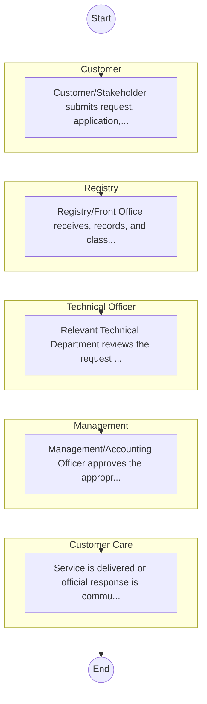
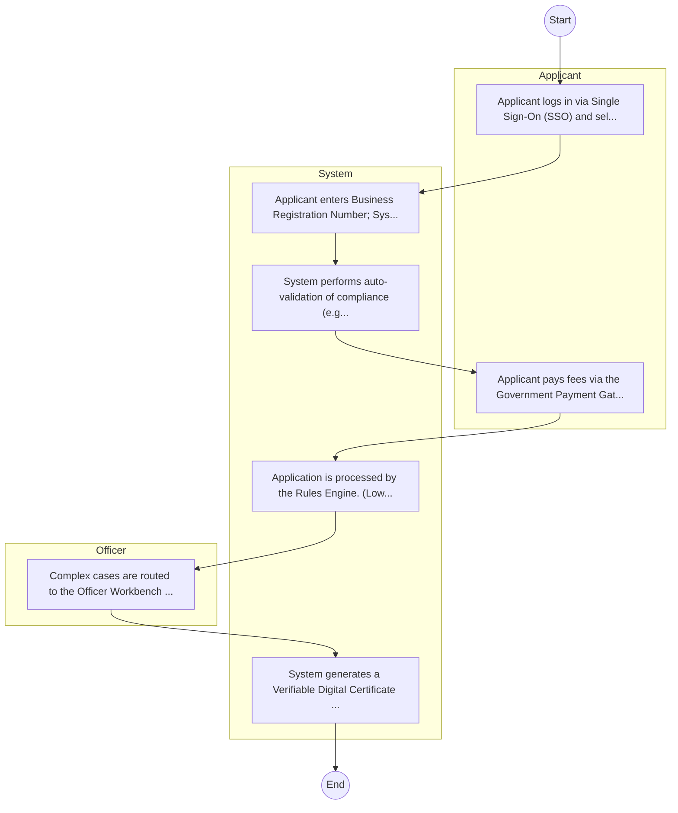

# Defence – Service Delivery

## Cover Page
- **Ministry/Department/Agency (MDA):** Defence
- **Process Name:** Service Delivery
- **Document Version:** 1.0
- **Date:** 2026-02-14
- **Classification:** Official

---

## Executive Summary
The Ministry of Defence (MoD) of Kenya is a cabinet-level office responsible for defence-related matters and the oversight of the Kenya Defence Forces (KDF). Its primary mandate, guided by the Constitution of the Republic of Kenya, is to defend and protect the sovereignty and territorial integrity of the Republic of Kenya, ensure national security, and provide support during emergencies or disasters. The MoD aims to maintain a premier, credible, and mission-capable force deeply rooted in professionalism, contributing to regional peace and stability and supporting national development.

---

## Service Mandate & Legal Basis
### Statutory Mandate
To defend and protect the sovereignty and territorial integrity of the Republic of Kenya from external aggression; to facilitate and support the Kenya Defence Forces (KDF) in fulfilling their constitutional mandate under Article 241 (3) (a), (b) & (c), which includes defending Kenya from external aggression, assisting civilian authority in emergencies or disasters, and restoring peace in areas of Kenya affected by unrest or instability when assigned; to provide essential civilian services such as policy development, administration, financial management, public communications, human resource management, medical, and technical support to the Defence Forces; and to contribute to regional and international peace and security through participation in peacekeeping missions and collaborative defence initiatives.

### Legal Context
- The Ministry of Defence operates under the Constitution of the Republic of Kenya, 2010 (specifically Article 241 for the Kenya Defence Forces, outlining its establishment, mandate, and command), and Executive Order No. 2 of May 2013 (Revised May 2020), which defines the functions of ministries and state departments. The Ministry is led by the Cabinet Secretary, who is accountable to the President (Commander-in-Chief) and Parliament, and chairs the Defence Council, which is responsible for the overall control and direction of the Kenya Defence Forces. Its legal framework is further defined by the Kenya Defence Forces Act and various international conventions on defence and security.

---

## 1. AS-IS Process Flowchart (BPMN 2.0)
*Current State visualization.*

---

## Process Overview
### Service Category
- G2C/G2B

### Scope
- **In Scope:** End-to-end processing within Defence.

### Triggers
- Submission of application/request by Customer.

### End States
- **Successful:** License / Permit / Certificate, Compliance Inspection Report, Official Receipt, Gazette Notice

---

## Stakeholders
| Stakeholder | Role | Responsibilities |
|---|---|---|
| Technical Officer | Process Actor | Performs actions as defined in steps. |
| Registry | Process Actor | Performs actions as defined in steps. |
| Customer Care | Process Actor | Performs actions as defined in steps. |
| Management | Process Actor | Performs actions as defined in steps. |
| Customer | Process Actor | Performs actions as defined in steps. |

---

## Inputs & Outputs
- **Inputs:** Application Form (License/Permit), Compliance Documents (Tax Compliance, CR12), Technical Reports / Site Plans, Proof of Payment
- **Outputs:** License / Permit / Certificate, Compliance Inspection Report, Official Receipt, Gazette Notice

---

## Detailed Process (AS-IS)
| Step | Role | Action | Tool | Notes |
|---|---|---|---|---|
| 1 | Customer | Customer/Stakeholder submits request, application, or inquiry via official channels (Email, Letter, or Portal). | Digital | |
| 2 | Registry | Registry/Front Office receives, records, and classifies the request. | Manual | |
| 3 | Technical Officer | Relevant Technical Department reviews the request against internal policies and regulations. | Manual | |
| 4 | Management | Management/Accounting Officer approves the appropriate action or service delivery. | Manual | |
| 5 | Customer Care | Service is delivered or official response is communicated to the customer. | Manual | |

---

## Pain Points & Opportunities
### Pain Points
- Manual document verification takes time.
- High cost and time for physical inspections.
- Risk of counterfeit licenses/certificates.
- Lack of real-time monitoring of licensees.

### Opportunities
- Integration with IPRS/BRS via Service Bus.
- Adoption of Government Payment Gateway.
- Implementation of Automated Rules Engine.
- Issuance of Digital Verifiable Credentials.

---

## 2. TO-BE Process Flowchart (BPMN 2.0)
*Future State visualization (Optimized with Service Bus & Registries).*

## Future State Process (TO-BE)
### Narrative
The To-Be process leverages the Government Service Bus to integrate with BRS (Business Registry) and the Payment Gateway. Manual data entry and document uploads are replaced by real-time API validations, enabling a paperless, cashless, and presence-less service experience.

### Optimized Steps (Digital)
| Step | Actor | Action | System |
|---|---|---|---|
| 1 | Applicant | Applicant logs in via Single Sign-On (SSO) and selects the service. | Citizen Portal / SSO |
| 2 | System | Applicant enters Business Registration Number; System auto-populates details from BRS (Business Registry) via the Service Bus. | Service Bus / Registry API |
| 3 | System | System performs auto-validation of compliance (e.g., KRA Tax Status) via Inter-Agency APIs. | Service Bus / Compliance Engine |
| 4 | Applicant | Applicant pays fees via the Government Payment Gateway; System auto-receipts. | Payment Gateway |
| 5 | System | Application is processed by the Rules Engine. (Low-risk cases are Auto-Approved). | Workflow Engine |
| 6 | Officer | Complex cases are routed to the Officer Workbench for digital review and approval. | Officer Workbench |
| 7 | System | System generates a Verifiable Digital Certificate (QR Code) and notifies the applicant. | Output Generator |

---

## References & Evidence
The information in this document was derived from the following official sources:

- [https://www.mod.go.ke/](https://www.mod.go.ke/)
- [https://wikipedia.org/](https://wikipedia.org/)
- [https://ecitizen.go.ke/](https://ecitizen.go.ke/)
