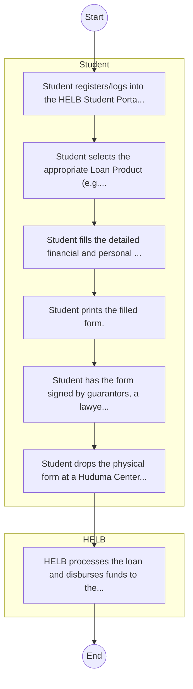
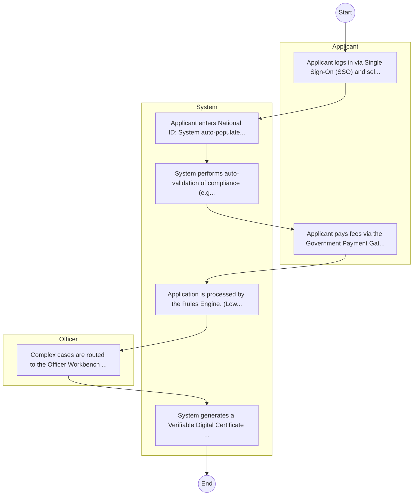

# Higher Education Loans Board – Loan Processing

## Cover Page
- **Ministry/Department/Agency (MDA):** Higher Education Loans Board
- **Process Name:** Loan Processing
- **Document Version:** 1.0
- **Date:** 2026-02-14
- **Classification:** Official

---

## Executive Summary
The Higher Education Loans Board (HELB) is a statutory body in Kenya, established in July 1995 by an Act of Parliament (Cap 213A) as a state corporation under the Ministry of Education. Its core mandate is to provide affordable loans, bursaries, and scholarships to Kenyan students pursuing higher education in recognized institutions, both within and outside Kenya, to ensure access to tertiary education.

---

## Service Mandate & Legal Basis
### Statutory Mandate
To provide affordable and sustainable financing for tertiary education by mobilizing and managing funds; establishing, managing, and awarding loans, bursaries, and scholarships to needy Kenyan students; and efficiently recovering previously disbursed funds to ensure the revolving nature of the scheme and its long-term sustainability.

### Legal Context
- Established in July 1995 by an Act of Parliament (Cap 213A), which provides the legal framework for its mandate of providing financing for higher education. Operates as a state corporation under the Ministry of Education.

---

## 1. AS-IS Process Flowchart (BPMN 2.0)
*Current State visualization.*

---

## Process Overview
### Service Category
- G2B (Government to Business)

### Scope
- **In Scope:** End-to-end processing within Higher Education Loans Board.

### Triggers
- Submission of application/request by Student.

### End States
- **Successful:** License / Permit / Certificate, Compliance Inspection Report, Official Receipt, Gazette Notice

---

## Stakeholders
| Stakeholder | Role | Responsibilities |
|---|---|---|
| Student | Process Actor | Performs actions as defined in steps. |
| HELB | Process Actor | Performs actions as defined in steps. |

---

## Inputs & Outputs
- **Inputs:** Application Form (License/Permit), Compliance Documents (Tax Compliance, CR12), Technical Reports / Site Plans, Proof of Payment
- **Outputs:** License / Permit / Certificate, Compliance Inspection Report, Official Receipt, Gazette Notice

---

## Detailed Process (AS-IS)
| Step | Role | Action | Tool | Notes |
|---|---|---|---|---|
| 1 | Student | Student registers/logs into the HELB Student Portal. | Digital | |
| 2 | Student | Student selects the appropriate Loan Product (e.g., Undergraduate First Time). | Manual | |
| 3 | Student | Student fills the detailed financial and personal background form online. | Manual | |
| 4 | Student | Student prints the filled form. | Manual | |
| 5 | Student | Student has the form signed by guarantors, a lawyer/magistrate, and the local Chief. | Manual | |
| 6 | Student | Student drops the physical form at a Huduma Center or Bank. | Manual | |
| 7 | HELB | HELB processes the loan and disburses funds to the university/student. | Manual | |

---

## Pain Points & Opportunities
### Pain Points
- Manual document verification takes time.
- High cost and time for physical inspections.
- Risk of counterfeit licenses/certificates.
- Lack of real-time monitoring of licensees.

### Opportunities
- Integration with IPRS/BRS via Service Bus.
- Adoption of Government Payment Gateway.
- Implementation of Automated Rules Engine.
- Issuance of Digital Verifiable Credentials.

---

## 2. TO-BE Process Flowchart (BPMN 2.0)
*Future State visualization (Optimized with Service Bus & Registries).*

## Future State Process (TO-BE)
### Narrative
The To-Be process leverages the Government Service Bus to integrate with IPRS (Identity Registry) and the Payment Gateway. Manual data entry and document uploads are replaced by real-time API validations, enabling a paperless, cashless, and presence-less service experience.

### Optimized Steps (Digital)
| Step | Actor | Action | System |
|---|---|---|---|
| 1 | Applicant | Applicant logs in via Single Sign-On (SSO) and selects the service. | Citizen Portal / SSO |
| 2 | System | Applicant enters National ID; System auto-populates details from IPRS (Identity Registry) via the Service Bus. | Service Bus / Registry API |
| 3 | System | System performs auto-validation of compliance (e.g., KRA Tax Status) via Inter-Agency APIs. | Service Bus / Compliance Engine |
| 4 | Applicant | Applicant pays fees via the Government Payment Gateway; System auto-receipts. | Payment Gateway |
| 5 | System | Application is processed by the Rules Engine. (Low-risk cases are Auto-Approved). | Workflow Engine |
| 6 | Officer | Complex cases are routed to the Officer Workbench for digital review and approval. | Officer Workbench |
| 7 | System | System generates a Verifiable Digital Certificate (QR Code) and notifies the applicant. | Output Generator |

---

## References & Evidence
The information in this document was derived from the following official sources:

- [https://helb.co.ke/](https://helb.co.ke/)
- [https://devex.com/](https://devex.com/)
- [https://afro.co.ke/](https://afro.co.ke/)
