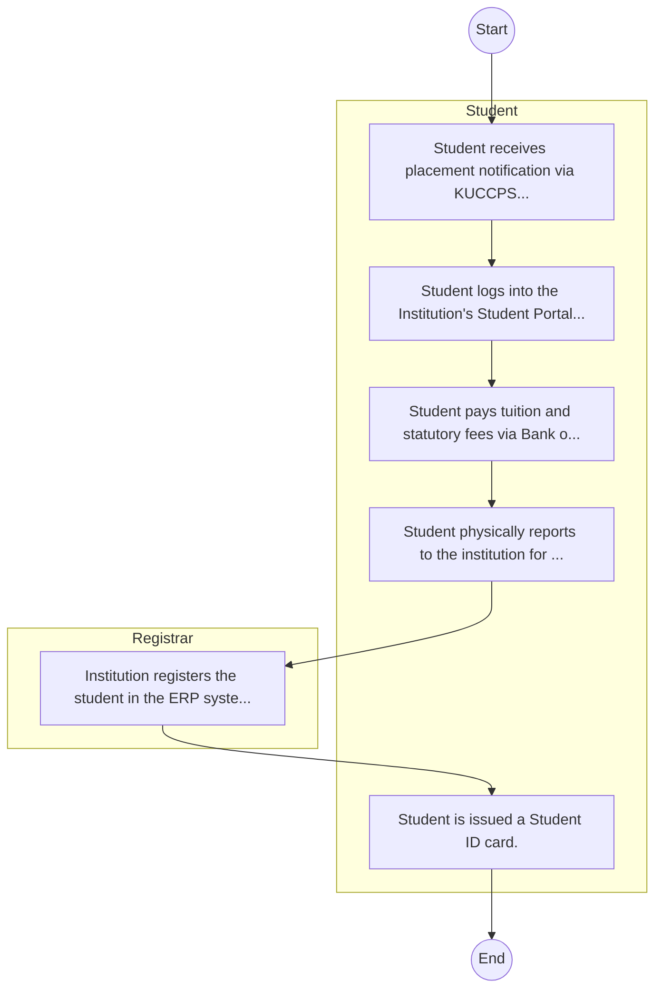
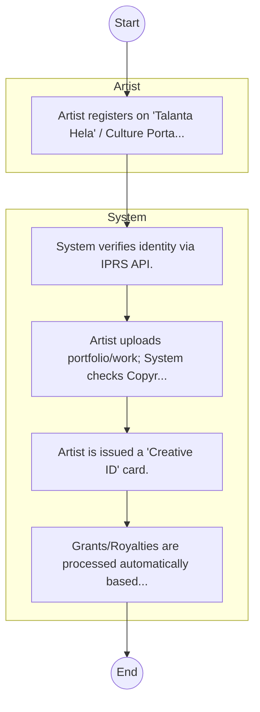

# Jomo Kenyatta University of Agriculture and Technology Industrial Park (Subsidiary of JKUAT) – Student Admission

## Cover Page
- **Ministry/Department/Agency (MDA):** Jomo Kenyatta University of Agriculture and Technology Industrial Park (Subsidiary of JKUAT)
- **Process Name:** Student Admission
- **Document Version:** 1.0
- **Date:** 2026-02-14
- **Classification:** Official
- **Status:** High Priority (POC List)

---

## Executive Summary
Represents 'Education' cluster for balanced coverage; entity type: Agency. Included as Tier 3 for light‑touch desk review/survey.

---

## Service Mandate & Legal Basis
### Statutory Mandate
Represents 'Education' cluster for balanced coverage; entity type: Agency. Included as Tier 3 for light‑touch desk review/survey.

### Legal Context
- The Jomo Kenyatta University of Agriculture and Technology Industrial Park (Subsidiary of JKUAT) Act (Inferred).

---

## 1. AS-IS Process Flowchart (BPMN 2.0)
*Current State visualization.*

---

## Process Overview
### Service Category
- G2C (Government to Citizen)

### Scope
- **In Scope:** End-to-end processing within Jomo Kenyatta University of Agriculture and Technology Industrial Park (Subsidiary of JKUAT).

### Triggers
- Submission of application/request by Student.

### End States
- **Successful:** Admission Letter, Student ID Card, Academic Transcripts, Degree/Diploma Certificate

---

## Stakeholders
| Stakeholder | Role | Responsibilities |
|---|---|---|
| Student | Process Actor | Performs actions as defined in steps. |
| Registrar | Process Actor | Performs actions as defined in steps. |

---

## Inputs & Outputs
- **Inputs:** KCSE/Academic Result Slips, National ID / Birth Certificate, Student Personal Details Form, Fee Payment Receipts
- **Outputs:** Admission Letter, Student ID Card, Academic Transcripts, Degree/Diploma Certificate

---

## Detailed Process (AS-IS)
| Step | Role | Action | Tool | Notes |
|---|---|---|---|---|
| 1 | Student | Student receives placement notification via KUCCPS or applies directly as Self-Sponsored. | Manual | |
| 2 | Student | Student logs into the Institution's Student Portal to accept admission and download Admission Letter. | Digital | |
| 3 | Student | Student pays tuition and statutory fees via Bank or eCitizen. | Manual | |
| 4 | Student | Student physically reports to the institution for document verification (original slips, certs). | Manual | |
| 5 | Registrar | Institution registers the student in the ERP system. | Manual | |
| 6 | Student | Student is issued a Student ID card. | Manual | |

---

## Pain Points & Opportunities
### Pain Points
- Long queues during admission and registration.
- Manual reconciliation of fee payments.
- Delays in processing exam results and transcripts.
- Fragmented student data across departments.

### Opportunities
- Integration with Government Service Bus.
- Real-time API validation with Authoritative Registries.
- Automated Rules Engine for decision making.
- Adoption of 'Once-Only' data principle.

---

## 2. TO-BE Process Flowchart (BPMN 2.0)
*Future State visualization (Optimized with Service Bus & Registries).*

## Future State Process (TO-BE)
### Narrative
The To-Be process establishes a National Creative Registry. Artists register once, and their work is authenticated against the Copyright Board, enabling access to royalties and government grants.

### Optimized Steps (Digital)
| Step | Actor | Action | System |
|---|---|---|---|
| 1 | Artist | Artist registers on 'Talanta Hela' / Culture Portal. | Culture Portal |
| 2 | System | System verifies identity via IPRS API. | Service Bus / IPRS |
| 3 | System | Artist uploads portfolio/work; System checks Copyright Board database for IP ownership. | Service Bus / KECOBO |
| 4 | System | Artist is issued a 'Creative ID' card. | Registry |
| 5 | System | Grants/Royalties are processed automatically based on registered works. | Payment Engine |

---

## References & Evidence
The information in this document was derived from the following official sources:

- Official Mandate and Service Charter (Inferred from Statutory Acts).
