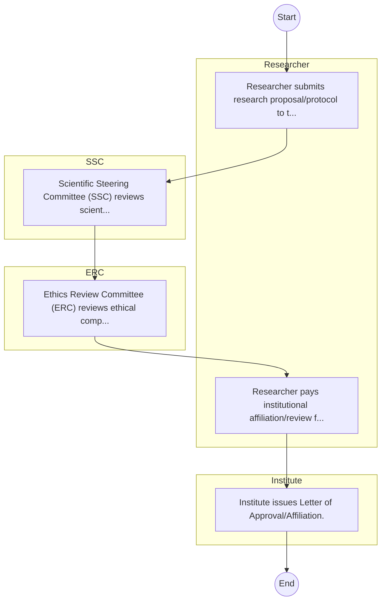
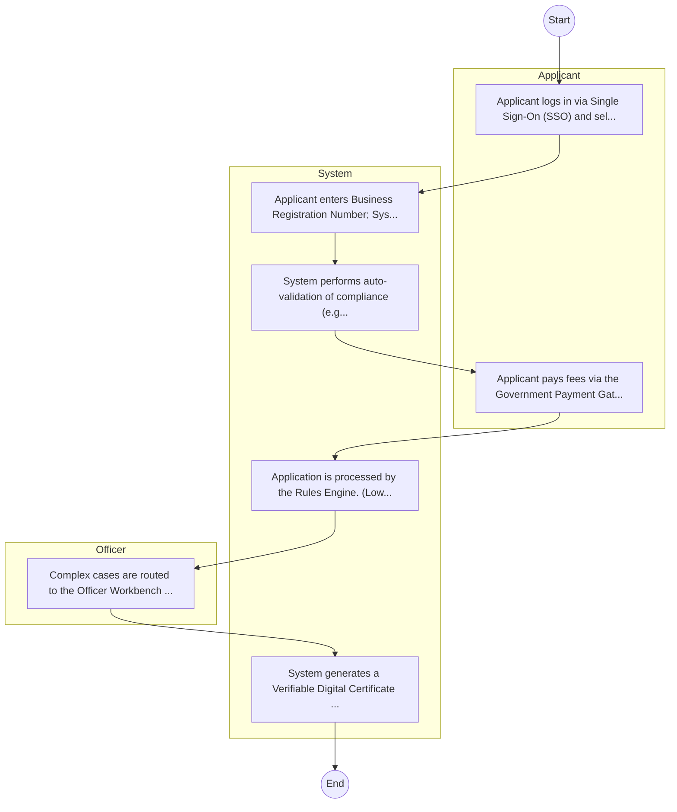

# Kenya Agricultural and Livestock Research Organization – Research Authorization

## Cover Page
- **Ministry/Department/Agency (MDA):** Kenya Agricultural and Livestock Research Organization
- **Process Name:** Research Authorization
- **Document Version:** 1.0
- **Date:** 2026-02-14
- **Classification:** Official

---

## Executive Summary
The Kenya Agricultural and Livestock Research Organization (KALRO) is mandated to conduct agricultural and livestock research of strategic national importance. It produces and promotes improved technologies, information, knowledge, and approaches to support the agricultural and livestock sector, contributing significantly to food security, poverty reduction, and overall economic development in Kenya.

---

## Service Mandate & Legal Basis
### Statutory Mandate
To generate and promote knowledge and appropriate technologies to enhance agricultural and livestock productivity, value addition, and sustainable resource management; to undertake, streamline, coordinate, and regulate all aspects of research in agriculture and livestock development; and to promote the application of research findings, technologies, and innovations to improve livelihoods and ensure food security in Kenya.

### Legal Context
- Established under the Kenya Agricultural and Livestock Research Organization Act (likely CAP 340 as a successor to previous agricultural research bodies), which provides the legal framework for its mandate of conducting and coordinating agricultural research in Kenya.

---

## 1. AS-IS Process Flowchart (BPMN 2.0)
*Current State visualization.*

---

## Process Overview
### Service Category
- G2C/G2B

### Scope
- **In Scope:** End-to-end processing within Kenya Agricultural and Livestock Research Organization.

### Triggers
- Submission of application/request by Researcher.

### End States
- **Successful:** License / Permit / Certificate, Compliance Inspection Report, Official Receipt, Gazette Notice

---

## Stakeholders
| Stakeholder | Role | Responsibilities |
|---|---|---|
| Institute | Process Actor | Performs actions as defined in steps. |
| Researcher | Process Actor | Performs actions as defined in steps. |
| ERC | Process Actor | Performs actions as defined in steps. |
| SSC | Process Actor | Performs actions as defined in steps. |

---

## Inputs & Outputs
- **Inputs:** Application Form (License/Permit), Compliance Documents (Tax Compliance, CR12), Technical Reports / Site Plans, Proof of Payment
- **Outputs:** License / Permit / Certificate, Compliance Inspection Report, Official Receipt, Gazette Notice

---

## Detailed Process (AS-IS)
| Step | Role | Action | Tool | Notes |
|---|---|---|---|---|
| 1 | Researcher | Researcher submits research proposal/protocol to the Institute. | Manual | |
| 2 | SSC | Scientific Steering Committee (SSC) reviews scientific merit. | Manual | |
| 3 | ERC | Ethics Review Committee (ERC) reviews ethical compliance. | Manual | |
| 4 | Researcher | Researcher pays institutional affiliation/review fees. | Manual | |
| 5 | Institute | Institute issues Letter of Approval/Affiliation. | Manual | |

---

## Pain Points & Opportunities
### Pain Points
- Manual document verification takes time.
- High cost and time for physical inspections.
- Risk of counterfeit licenses/certificates.
- Lack of real-time monitoring of licensees.

### Opportunities
- Integration with IPRS/BRS via Service Bus.
- Adoption of Government Payment Gateway.
- Implementation of Automated Rules Engine.
- Issuance of Digital Verifiable Credentials.

---

## 2. TO-BE Process Flowchart (BPMN 2.0)
*Future State visualization (Optimized with Service Bus & Registries).*

## Future State Process (TO-BE)
### Narrative
The To-Be process leverages the Government Service Bus to integrate with BRS (Business Registry) and the Payment Gateway. Manual data entry and document uploads are replaced by real-time API validations, enabling a paperless, cashless, and presence-less service experience.

### Optimized Steps (Digital)
| Step | Actor | Action | System |
|---|---|---|---|
| 1 | Applicant | Applicant logs in via Single Sign-On (SSO) and selects the service. | Citizen Portal / SSO |
| 2 | System | Applicant enters Business Registration Number; System auto-populates details from BRS (Business Registry) via the Service Bus. | Service Bus / Registry API |
| 3 | System | System performs auto-validation of compliance (e.g., KRA Tax Status) via Inter-Agency APIs. | Service Bus / Compliance Engine |
| 4 | Applicant | Applicant pays fees via the Government Payment Gateway; System auto-receipts. | Payment Gateway |
| 5 | System | Application is processed by the Rules Engine. (Low-risk cases are Auto-Approved). | Workflow Engine |
| 6 | Officer | Complex cases are routed to the Officer Workbench for digital review and approval. | Officer Workbench |
| 7 | System | System generates a Verifiable Digital Certificate (QR Code) and notifies the applicant. | Output Generator |

---

## References & Evidence
The information in this document was derived from the following official sources:

- [https://www.kalro.org/](https://www.kalro.org/)
- [https://chm-cbd.net/](https://chm-cbd.net/)
- [https://cimmyt.org/](https://cimmyt.org/)
