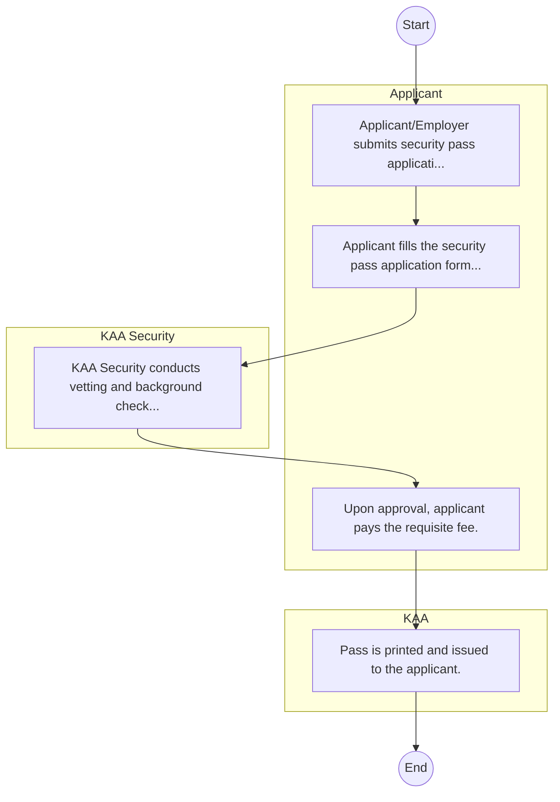
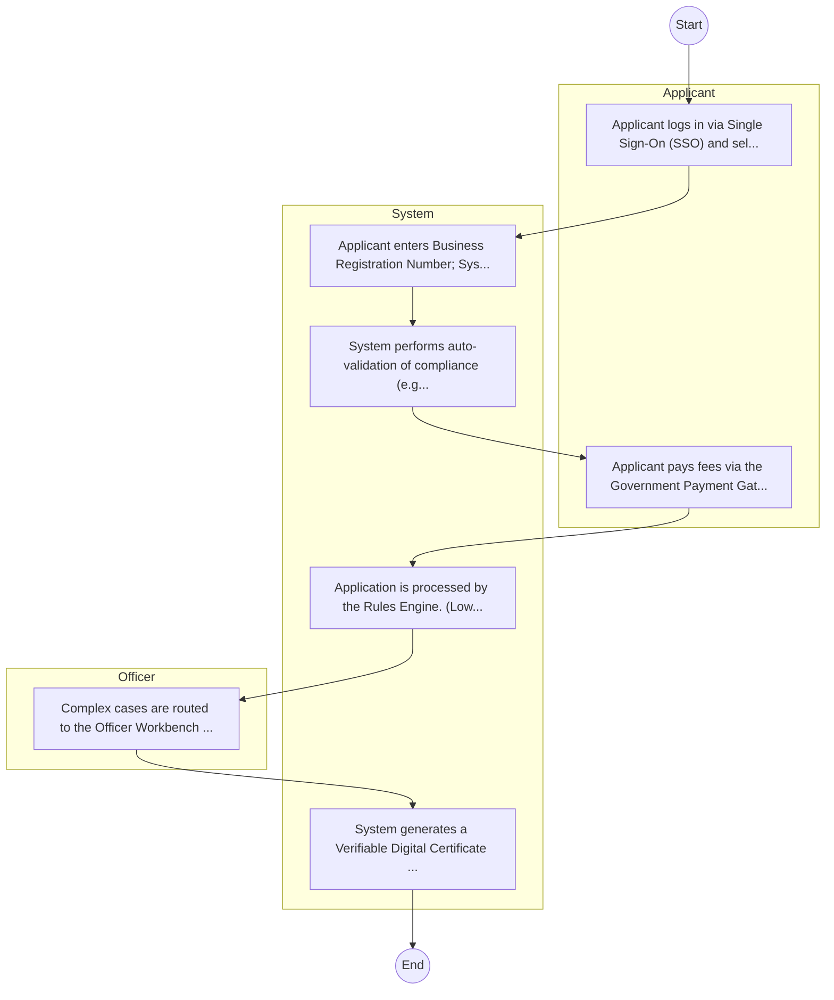

# Kenya Airports Authority – Service Delivery

## Cover Page
- **Ministry/Department/Agency (MDA):** Kenya Airports Authority
- **Process Name:** Service Delivery
- **Document Version:** 1.0
- **Date:** 2026-02-14
- **Classification:** Official

---

## Executive Summary
The Kenya Airports Authority (KAA) is an autonomous government-owned enterprise established in 1991 under the KAA Act, Chapter 395 of the Laws of Kenya. Its primary mandate is to provide facilitative infrastructure for aviation services, administering, controlling, and managing aerodromes, and undertaking the development and maintenance of airports and airstrips throughout Kenya.

---

## Service Mandate & Legal Basis
### Statutory Mandate
To administer, control, and manage aerodromes throughout Kenya; provide and maintain essential facilities for the efficient operation of aircraft; offer rescue and firefighting equipment and services; undertake the construction, operation, and maintenance of aerodromes; and ensure the safety, sustainability, and efficiency of civil aviation operations in compliance with relevant acts.

### Legal Context
- Established in 1991 under the Kenya Airports Authority Act, Chapter 395 of the Laws of Kenya. Operates in compliance with the Civil Aviation Act and other international aviation standards and regulations.

---

## 1. AS-IS Process Flowchart (BPMN 2.0)
*Current State visualization.*

---

## Process Overview
### Service Category
- G2B (Government to Business)

### Scope
- **In Scope:** End-to-end processing within Kenya Airports Authority.

### Triggers
- Submission of application/request by Applicant.

### End States
- **Successful:** License / Permit / Certificate, Compliance Inspection Report, Official Receipt, Gazette Notice

---

## Stakeholders
| Stakeholder | Role | Responsibilities |
|---|---|---|
| Applicant | Process Actor | Performs actions as defined in steps. |
| KAA | Process Actor | Performs actions as defined in steps. |
| KAA Security | Process Actor | Performs actions as defined in steps. |

---

## Inputs & Outputs
- **Inputs:** Application Form (License/Permit), Compliance Documents (Tax Compliance, CR12), Technical Reports / Site Plans, Proof of Payment
- **Outputs:** License / Permit / Certificate, Compliance Inspection Report, Official Receipt, Gazette Notice

---

## Detailed Process (AS-IS)
| Step | Role | Action | Tool | Notes |
|---|---|---|---|---|
| 1 | Applicant | Applicant/Employer submits security pass application letter to Airport Manager. | Manual | |
| 2 | Applicant | Applicant fills the security pass application form and attaches ID/Good Conduct Cert. | Manual | |
| 3 | KAA Security | KAA Security conducts vetting and background checks. | Manual | |
| 4 | Applicant | Upon approval, applicant pays the requisite fee. | Manual | |
| 5 | KAA | Pass is printed and issued to the applicant. | Manual | |

---

## Pain Points & Opportunities
### Pain Points
- Manual document verification takes time.
- High cost and time for physical inspections.
- Risk of counterfeit licenses/certificates.
- Lack of real-time monitoring of licensees.

### Opportunities
- Integration with IPRS/BRS via Service Bus.
- Adoption of Government Payment Gateway.
- Implementation of Automated Rules Engine.
- Issuance of Digital Verifiable Credentials.

---

## 2. TO-BE Process Flowchart (BPMN 2.0)
*Future State visualization (Optimized with Service Bus & Registries).*

## Future State Process (TO-BE)
### Narrative
The To-Be process leverages the Government Service Bus to integrate with BRS (Business Registry) and the Payment Gateway. Manual data entry and document uploads are replaced by real-time API validations, enabling a paperless, cashless, and presence-less service experience.

### Optimized Steps (Digital)
| Step | Actor | Action | System |
|---|---|---|---|
| 1 | Applicant | Applicant logs in via Single Sign-On (SSO) and selects the service. | Citizen Portal / SSO |
| 2 | System | Applicant enters Business Registration Number; System auto-populates details from BRS (Business Registry) via the Service Bus. | Service Bus / Registry API |
| 3 | System | System performs auto-validation of compliance (e.g., KRA Tax Status) via Inter-Agency APIs. | Service Bus / Compliance Engine |
| 4 | Applicant | Applicant pays fees via the Government Payment Gateway; System auto-receipts. | Payment Gateway |
| 5 | System | Application is processed by the Rules Engine. (Low-risk cases are Auto-Approved). | Workflow Engine |
| 6 | Officer | Complex cases are routed to the Officer Workbench for digital review and approval. | Officer Workbench |
| 7 | System | System generates a Verifiable Digital Certificate (QR Code) and notifies the applicant. | Output Generator |

---

## References & Evidence
The information in this document was derived from the following official sources:

- [https://devex.com/](https://devex.com/)
- [https://wikipedia.org/](https://wikipedia.org/)
- [https://centreforaviation.com/](https://centreforaviation.com/)
- [https://issuu.com/](https://issuu.com/)
- [https://prezi.com/](https://prezi.com/)
