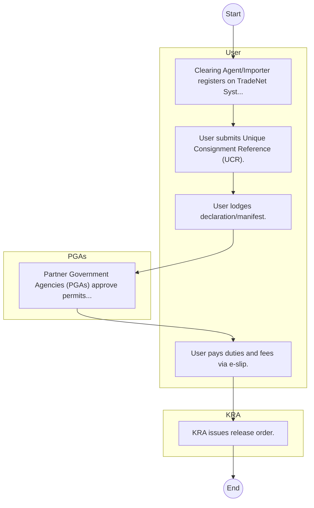
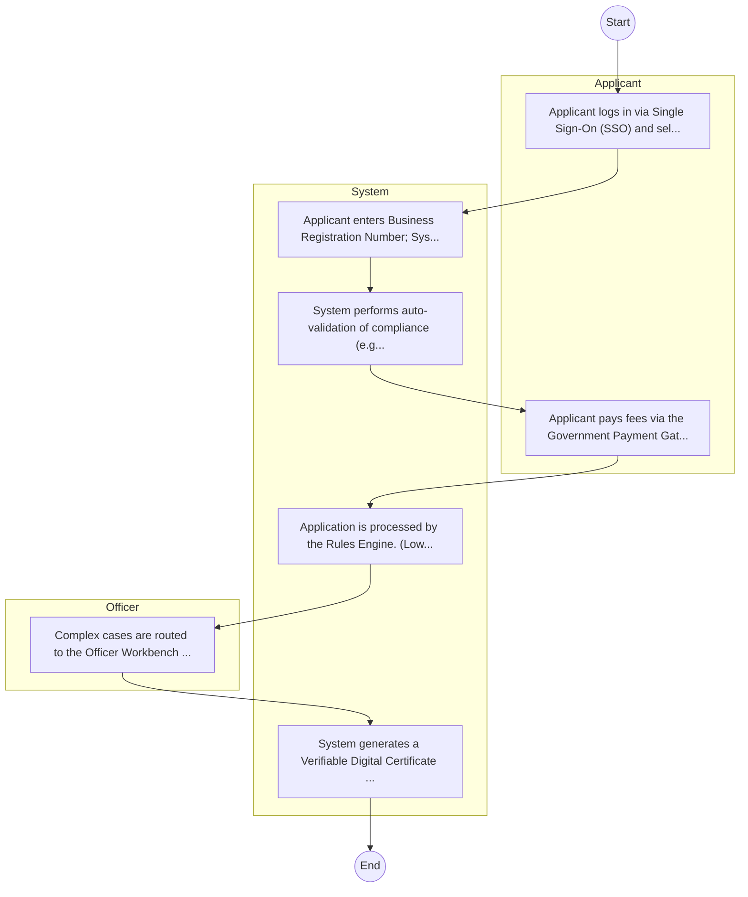

# Kenya Trade Network Agency – Service Delivery

## Cover Page
- **Ministry/Department/Agency (MDA):** Kenya Trade Network Agency
- **Process Name:** Service Delivery
- **Document Version:** 1.0
- **Date:** 2026-02-14
- **Classification:** Official

---

## Executive Summary
The Kenya Trade Network Agency (KenTrade) is a state corporation operating under Kenya's National Treasury, established in January 2011. Its core mandate is to establish, implement, and manage the National Electronic Single Window System (NESWS), commonly known as the Kenya TradeNet System. This system is designed to streamline cross-border trade, simplify import and export procedures, and significantly reduce associated paperwork and processing times, thereby enhancing Kenya's efficiency and competitiveness in international trade.

---

## Service Mandate & Legal Basis
### Statutory Mandate
To establish, implement, and manage the National Electronic Single Window System (NESWS) to facilitate international trade; to integrate the electronic systems of public and private entities involved in international trade transactions; to develop, manage, and promote the efficient exchange of electronic data to facilitate trade; to conduct and coordinate research in e-commerce to simplify and standardize trade documentation; to maintain an electronic database of all imported and exported goods and services; to provide training programs to ensure adherence to international trade norms; and to offer services such as the Trade Facilitation Platform and the InfoTrade Kenya Portal for procedural guidance and stakeholder education.

### Legal Context
- Established in January 2011 and its core mandate is outlined in the National Electronic Single Window System Act of 2022. KenTrade operates under the oversight of the National Treasury and is crucial for implementing national trade facilitation policies and international commitments related to trade efficiency and ease of doing business.

---

## 1. AS-IS Process Flowchart (BPMN 2.0)
*Current State visualization.*

---

## Process Overview
### Service Category
- G2C/G2B

### Scope
- **In Scope:** End-to-end processing within Kenya Trade Network Agency.

### Triggers
- Submission of application/request by User.

### End States
- **Successful:** License / Permit / Certificate, Compliance Inspection Report, Official Receipt, Gazette Notice

---

## Stakeholders
| Stakeholder | Role | Responsibilities |
|---|---|---|
| KRA | Process Actor | Performs actions as defined in steps. |
| User | Process Actor | Performs actions as defined in steps. |
| PGAs | Process Actor | Performs actions as defined in steps. |

---

## Inputs & Outputs
- **Inputs:** Application Form (License/Permit), Compliance Documents (Tax Compliance, CR12), Technical Reports / Site Plans, Proof of Payment
- **Outputs:** License / Permit / Certificate, Compliance Inspection Report, Official Receipt, Gazette Notice

---

## Detailed Process (AS-IS)
| Step | Role | Action | Tool | Notes |
|---|---|---|---|---|
| 1 | User | Clearing Agent/Importer registers on TradeNet System. | Manual | |
| 2 | User | User submits Unique Consignment Reference (UCR). | Manual | |
| 3 | User | User lodges declaration/manifest. | Manual | |
| 4 | PGAs | Partner Government Agencies (PGAs) approve permits online. | Manual | |
| 5 | User | User pays duties and fees via e-slip. | Manual | |
| 6 | KRA | KRA issues release order. | Manual | |

---

## Pain Points & Opportunities
### Pain Points
- Manual document verification takes time.
- High cost and time for physical inspections.
- Risk of counterfeit licenses/certificates.
- Lack of real-time monitoring of licensees.

### Opportunities
- Integration with IPRS/BRS via Service Bus.
- Adoption of Government Payment Gateway.
- Implementation of Automated Rules Engine.
- Issuance of Digital Verifiable Credentials.

---

## 2. TO-BE Process Flowchart (BPMN 2.0)
*Future State visualization (Optimized with Service Bus & Registries).*

## Future State Process (TO-BE)
### Narrative
The To-Be process leverages the Government Service Bus to integrate with BRS (Business Registry) and the Payment Gateway. Manual data entry and document uploads are replaced by real-time API validations, enabling a paperless, cashless, and presence-less service experience.

### Optimized Steps (Digital)
| Step | Actor | Action | System |
|---|---|---|---|
| 1 | Applicant | Applicant logs in via Single Sign-On (SSO) and selects the service. | Citizen Portal / SSO |
| 2 | System | Applicant enters Business Registration Number; System auto-populates details from BRS (Business Registry) via the Service Bus. | Service Bus / Registry API |
| 3 | System | System performs auto-validation of compliance (e.g., KRA Tax Status) via Inter-Agency APIs. | Service Bus / Compliance Engine |
| 4 | Applicant | Applicant pays fees via the Government Payment Gateway; System auto-receipts. | Payment Gateway |
| 5 | System | Application is processed by the Rules Engine. (Low-risk cases are Auto-Approved). | Workflow Engine |
| 6 | Officer | Complex cases are routed to the Officer Workbench for digital review and approval. | Officer Workbench |
| 7 | System | System generates a Verifiable Digital Certificate (QR Code) and notifies the applicant. | Output Generator |

---

## References & Evidence
The information in this document was derived from the following official sources:

- [https://www.kentrade.go.ke/](https://www.kentrade.go.ke/)
- [https://grokipedia.com/](https://grokipedia.com/)
- [https://wikipedia.org/](https://wikipedia.org/)
