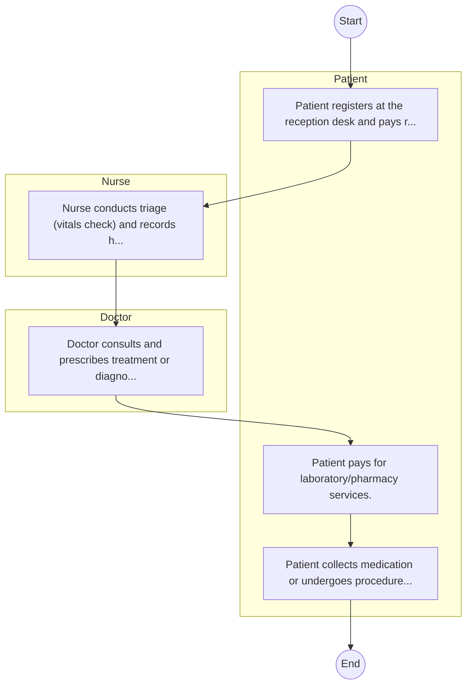
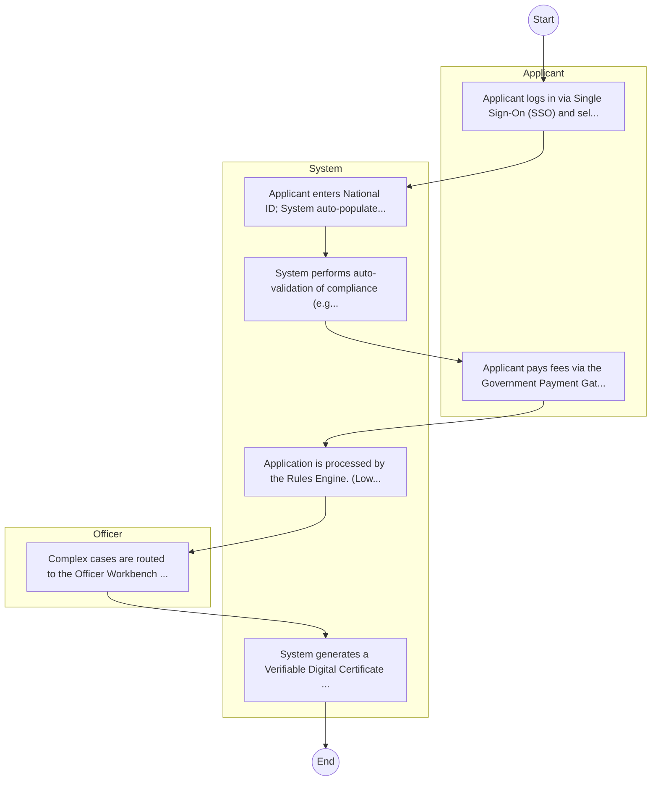

# Kenyatta National Hospital – Patient Management

## Cover Page
- **Ministry/Department/Agency (MDA):** Kenyatta National Hospital
- **Process Name:** Patient Management
- **Document Version:** 1.0
- **Date:** 2026-02-14
- **Classification:** Official

---

## Executive Summary
Represents 'Health' cluster for balanced coverage; entity type: Agency. Included as Tier 3 for light‑touch desk review/survey.

---

## Service Mandate & Legal Basis
### Statutory Mandate
Represents 'Health' cluster for balanced coverage; entity type: Agency. Included as Tier 3 for light‑touch desk review/survey.

### Legal Context
- The Kenyatta National Hospital Act (Inferred).

---

## 1. AS-IS Process Flowchart (BPMN 2.0)
*Current State visualization.*

---

## Process Overview
### Service Category
- G2C (Government to Citizen)

### Scope
- **In Scope:** End-to-end processing within Kenyatta National Hospital.

### Triggers
- Submission of application/request by Patient.

### End States
- **Successful:** Patient File / EMR Record, Diagnostic Lab Reports, Prescription / Medication, Discharge Summary

---

## Stakeholders
| Stakeholder | Role | Responsibilities |
|---|---|---|
| Doctor | Process Actor | Performs actions as defined in steps. |
| Patient | Process Actor | Performs actions as defined in steps. |
| Nurse | Process Actor | Performs actions as defined in steps. |

---

## Inputs & Outputs
- **Inputs:** Patient Personal/Bio-data, Insurance Card / NHIF Number, Medical History Records, Triage Vitals (BP, Temp, etc.)
- **Outputs:** Patient File / EMR Record, Diagnostic Lab Reports, Prescription / Medication, Discharge Summary

---

## Detailed Process (AS-IS)
| Step | Role | Action | Tool | Notes |
|---|---|---|---|---|
| 1 | Patient | Patient registers at the reception desk and pays registration fee. | Manual | |
| 2 | Nurse | Nurse conducts triage (vitals check) and records history. | Manual | |
| 3 | Doctor | Doctor consults and prescribes treatment or diagnostic tests. | Manual | |
| 4 | Patient | Patient pays for laboratory/pharmacy services. | Manual | |
| 5 | Patient | Patient collects medication or undergoes procedures. | Manual | |

---

## Pain Points & Opportunities
### Pain Points
- Loss of physical patient files.
- Long patient wait times at triage and pharmacy.
- Lack of interoperability between departments (Lab, Pharmacy, Billing).
- Revenue leakage in cash collections.

### Opportunities
- Integration with IPRS/BRS via Service Bus.
- Adoption of Government Payment Gateway.
- Implementation of Automated Rules Engine.
- Issuance of Digital Verifiable Credentials.

---

## 2. TO-BE Process Flowchart (BPMN 2.0)
*Future State visualization (Optimized with Service Bus & Registries).*

## Future State Process (TO-BE)
### Narrative
The To-Be process leverages the Government Service Bus to integrate with IPRS (Identity Registry) and the Payment Gateway. Manual data entry and document uploads are replaced by real-time API validations, enabling a paperless, cashless, and presence-less service experience.

### Optimized Steps (Digital)
| Step | Actor | Action | System |
|---|---|---|---|
| 1 | Applicant | Applicant logs in via Single Sign-On (SSO) and selects the service. | Citizen Portal / SSO |
| 2 | System | Applicant enters National ID; System auto-populates details from IPRS (Identity Registry) via the Service Bus. | Service Bus / Registry API |
| 3 | System | System performs auto-validation of compliance (e.g., KRA Tax Status) via Inter-Agency APIs. | Service Bus / Compliance Engine |
| 4 | Applicant | Applicant pays fees via the Government Payment Gateway; System auto-receipts. | Payment Gateway |
| 5 | System | Application is processed by the Rules Engine. (Low-risk cases are Auto-Approved). | Workflow Engine |
| 6 | Officer | Complex cases are routed to the Officer Workbench for digital review and approval. | Officer Workbench |
| 7 | System | System generates a Verifiable Digital Certificate (QR Code) and notifies the applicant. | Output Generator |

---

## References & Evidence
The information in this document was derived from the following official sources:

- Official Mandate and Service Charter (Inferred from Statutory Acts).
