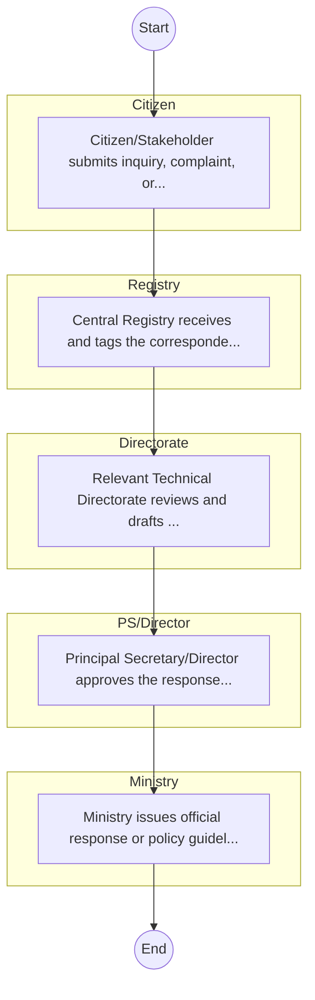
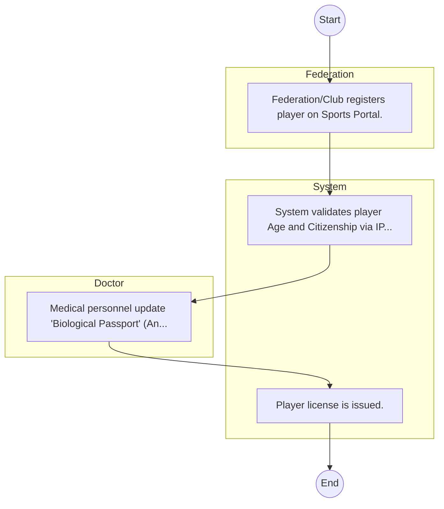

# Ministry of Youth, Sports and The Arts – Service Delivery

## Cover Page
- **Ministry/Department/Agency (MDA):** Ministry of Youth, Sports and The Arts
- **Process Name:** Service Delivery
- **Document Version:** 1.0
- **Date:** 2026-02-14
- **Classification:** Official
- **Status:** High Priority (POC List)

---

## Executive Summary
Represents 'Social Protection Culture and Recreation' cluster for balanced coverage; entity type: Ministry. Included as Tier 3 for light‑touch desk review/survey.

---

## Service Mandate & Legal Basis
### Statutory Mandate
Represents 'Social Protection Culture and Recreation' cluster for balanced coverage; entity type: Ministry. Included as Tier 3 for light‑touch desk review/survey.

### Legal Context
- The Ministry of Youth, Sports and The Arts Act (Inferred).

---

## 1. AS-IS Process Flowchart (BPMN 2.0)
*Current State visualization.*

---

## Process Overview
### Service Category
- G2C/G2B

### Scope
- **In Scope:** End-to-end processing within Ministry of Youth, Sports and The Arts.

### Triggers
- Submission of application/request by Citizen.

### End States
- **Successful:** Policy Guidelines / Circulars, Official Response Letters, Cabinet Resolutions, Public Service Reports

---

## Stakeholders
| Stakeholder | Role | Responsibilities |
|---|---|---|
| Citizen | Process Actor | Performs actions as defined in steps. |
| Registry | Process Actor | Performs actions as defined in steps. |
| PS/Director | Process Actor | Performs actions as defined in steps. |
| Directorate | Process Actor | Performs actions as defined in steps. |
| Ministry | Process Actor | Performs actions as defined in steps. |

---

## Inputs & Outputs
- **Inputs:** Public Inquiries / Petitions, Policy Proposals / Memos, Inter-agency Correspondence, Cabinet Memos
- **Outputs:** Policy Guidelines / Circulars, Official Response Letters, Cabinet Resolutions, Public Service Reports

---

## Detailed Process (AS-IS)
| Step | Role | Action | Tool | Notes |
|---|---|---|---|---|
| 1 | Citizen | Citizen/Stakeholder submits inquiry, complaint, or policy proposal via email or office. | Manual | |
| 2 | Registry | Central Registry receives and tags the correspondence. | Manual | |
| 3 | Directorate | Relevant Technical Directorate reviews and drafts response/action. | Manual | |
| 4 | PS/Director | Principal Secretary/Director approves the response. | Manual | |
| 5 | Ministry | Ministry issues official response or policy guideline. | Manual | |

---

## Pain Points & Opportunities
### Pain Points
- Slow movement of physical files (Bureaucracy).
- Loss of institutional memory (Manual registries).
- Difficulty in tracking correspondence status.
- Siloed operations between departments.

### Opportunities
- Integration with Government Service Bus.
- Real-time API validation with Authoritative Registries.
- Automated Rules Engine for decision making.
- Adoption of 'Once-Only' data principle.

---

## 2. TO-BE Process Flowchart (BPMN 2.0)
*Future State visualization (Optimized with Service Bus & Registries).*

## Future State Process (TO-BE)
### Narrative
The To-Be process creates a 'Digital Athlete Passport' tracking performance, medical history, and federation status, centralized in the Sports Registry.

### Optimized Steps (Digital)
| Step | Actor | Action | System |
|---|---|---|---|
| 1 | Federation | Federation/Club registers player on Sports Portal. | Sports Registry |
| 2 | System | System validates player Age and Citizenship via IPRS. | Service Bus / IPRS |
| 3 | Doctor | Medical personnel update 'Biological Passport' (Anti-Doping) data. | Anti-Doping System |
| 4 | System | Player license is issued. | Registry |

---

## References & Evidence
The information in this document was derived from the following official sources:

- Official Mandate and Service Charter (Inferred from Statutory Acts).
