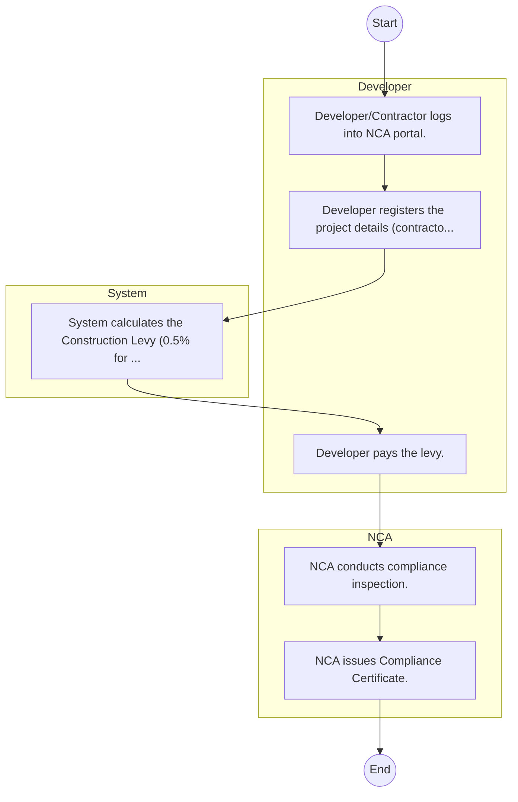
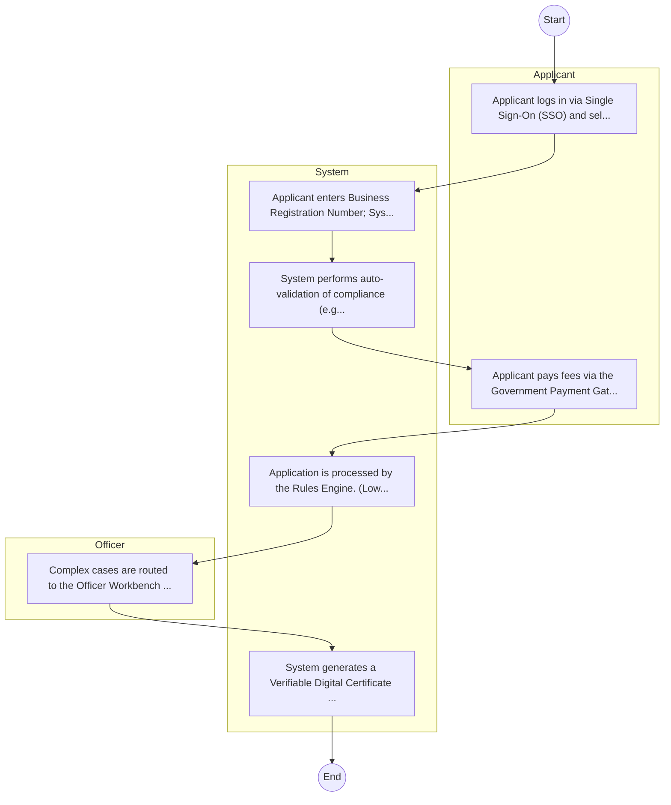

# National Construction Authority – Service Delivery

## Cover Page
- **Ministry/Department/Agency (MDA):** National Construction Authority
- **Process Name:** Service Delivery
- **Document Version:** 1.0
- **Date:** 2026-02-14
- **Classification:** Official

---

## Executive Summary
The National Construction Authority (NCA) is a state corporation established under Section 3 of the NCA Act No. 41 of 2011. Its primary mandate is to oversee, coordinate, regulate, and promote the development of a sustainable and vibrant construction industry in Kenya. NCA ensures quality, safety, and adherence to standards within Kenya's built environment, while also protecting consumers from substandard workmanship and fostering capacity building within the sector for both contractors and skilled labor.

---

## Service Mandate & Legal Basis
### Statutory Mandate
To regulate the construction industry through the registration and certification of contractors, accreditation of skilled construction workers and site supervisors, and mandatory registration of construction projects; to enhance industry capacity through continuous professional development and training for all practitioners; to undertake or commission research related to the building sector and maintain a comprehensive construction industry information system; to encourage the standardization and improvement of construction techniques, technologies, and materials; to assist in the exportation of construction services; and to enforce building codes and industry regulations to ensure quality, safety, and sustainability in the built environment.

### Legal Context
- Established under Section 3 of the NCA Act No. 41 of 2011, which provides the legal framework for its regulatory and promotional functions. NCA operates under the Ministry responsible for Construction (currently Ministry of Transport, Infrastructure, Housing and Urban Development, or its equivalent) and is instrumental in implementing national policies aimed at streamlining the construction sector, improving quality and safety standards, and fostering local content development in construction.

---

## 1. AS-IS Process Flowchart (BPMN 2.0)
*Current State visualization.*

---

## Process Overview
### Service Category
- G2B (Government to Business)

### Scope
- **In Scope:** End-to-end processing within National Construction Authority.

### Triggers
- Submission of application/request by Developer.

### End States
- **Successful:** License / Permit / Certificate, Compliance Inspection Report, Official Receipt, Gazette Notice

---

## Stakeholders
| Stakeholder | Role | Responsibilities |
|---|---|---|
| Developer | Process Actor | Performs actions as defined in steps. |
| NCA | Process Actor | Performs actions as defined in steps. |
| System | Process Actor | Performs actions as defined in steps. |

---

## Inputs & Outputs
- **Inputs:** Application Form (License/Permit), Compliance Documents (Tax Compliance, CR12), Technical Reports / Site Plans, Proof of Payment
- **Outputs:** License / Permit / Certificate, Compliance Inspection Report, Official Receipt, Gazette Notice

---

## Detailed Process (AS-IS)
| Step | Role | Action | Tool | Notes |
|---|---|---|---|---|
| 1 | Developer | Developer/Contractor logs into NCA portal. | Digital | |
| 2 | Developer | Developer registers the project details (contractor, consultants, value). | Manual | |
| 3 | System | System calculates the Construction Levy (0.5% for projects >5M). | Manual | |
| 4 | Developer | Developer pays the levy. | Manual | |
| 5 | NCA | NCA conducts compliance inspection. | Manual | |
| 6 | NCA | NCA issues Compliance Certificate. | Manual | |

---

## Pain Points & Opportunities
### Pain Points
- Manual document verification takes time.
- High cost and time for physical inspections.
- Risk of counterfeit licenses/certificates.
- Lack of real-time monitoring of licensees.

### Opportunities
- Integration with IPRS/BRS via Service Bus.
- Adoption of Government Payment Gateway.
- Implementation of Automated Rules Engine.
- Issuance of Digital Verifiable Credentials.

---

## 2. TO-BE Process Flowchart (BPMN 2.0)
*Future State visualization (Optimized with Service Bus & Registries).*

## Future State Process (TO-BE)
### Narrative
The To-Be process leverages the Government Service Bus to integrate with BRS (Business Registry) and the Payment Gateway. Manual data entry and document uploads are replaced by real-time API validations, enabling a paperless, cashless, and presence-less service experience.

### Optimized Steps (Digital)
| Step | Actor | Action | System |
|---|---|---|---|
| 1 | Applicant | Applicant logs in via Single Sign-On (SSO) and selects the service. | Citizen Portal / SSO |
| 2 | System | Applicant enters Business Registration Number; System auto-populates details from BRS (Business Registry) via the Service Bus. | Service Bus / Registry API |
| 3 | System | System performs auto-validation of compliance (e.g., KRA Tax Status) via Inter-Agency APIs. | Service Bus / Compliance Engine |
| 4 | Applicant | Applicant pays fees via the Government Payment Gateway; System auto-receipts. | Payment Gateway |
| 5 | System | Application is processed by the Rules Engine. (Low-risk cases are Auto-Approved). | Workflow Engine |
| 6 | Officer | Complex cases are routed to the Officer Workbench for digital review and approval. | Officer Workbench |
| 7 | System | System generates a Verifiable Digital Certificate (QR Code) and notifies the applicant. | Output Generator |

---

## References & Evidence
The information in this document was derived from the following official sources:

- [https://www.nca.go.ke/](https://www.nca.go.ke/)
- [https://nzangimuimi.com/](https://nzangimuimi.com/)
- [https://constructionkenya.com/](https://constructionkenya.com/)
- [https://nestict.com/](https://nestict.com/)
- [https://timely.co.ke/](https://timely.co.ke/)
