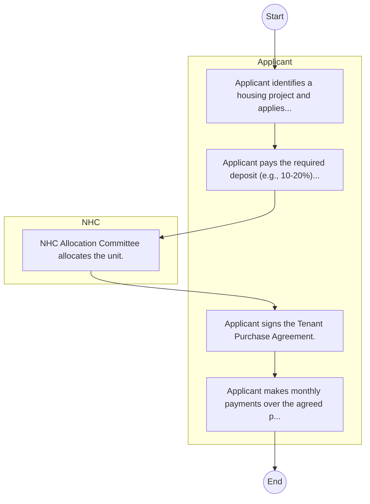
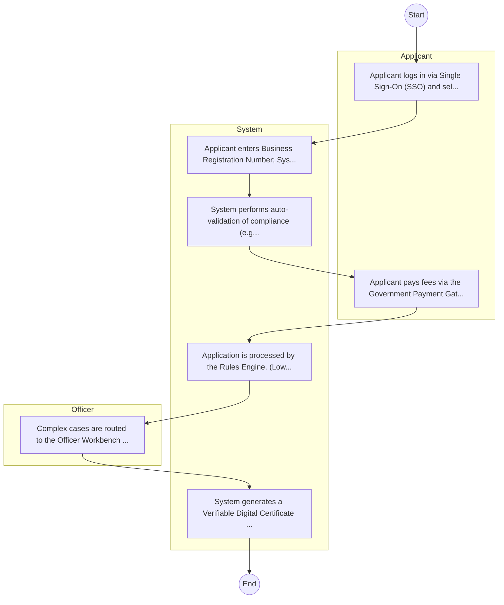

# National Housing Corporation – Service Delivery

## Cover Page
- **Ministry/Department/Agency (MDA):** National Housing Corporation
- **Process Name:** Service Delivery
- **Document Version:** 1.0
- **Date:** 2026-02-14
- **Classification:** Official

---

## Executive Summary
The National Housing Corporation (NHC) plays a principal role in the implementation of the Kenyan Government's Housing Policies and Programmes. Established as a state corporation, its primary mandate is to promote, develop, and provide affordable housing solutions for all income groups across Kenya. NHC aims to stimulate the building industry, encourage and assist housing research, and facilitate increased access to decent and affordable housing, thereby contributing significantly to national development and improving living standards.

---

## Service Mandate & Legal Basis
### Statutory Mandate
To promote low-cost housing development across Kenya; to stimulate the building industry by encouraging local production and use of building materials and technologies; to encourage and assist housing research and development; to serve as the government's main agency for channeling public funds for low-cost housing to Local Authorities and County Governments; to provide technical assistance to Local Authorities and County Governments for the design and implementation of their housing schemes; to assist citizens and Local Authorities in constructing affordable housing through various schemes including Tenant Purchase, Outright Sale, Rural and Peri-Urban Housing Loans, and Rental Housing; to undertake direct construction of housing in areas where Local Authorities are unable or unwilling to do so; to promote appropriate and innovative building technologies, such as the manufacturing of EPS panels; and to provide housing loans to eligible individuals and organizations.

### Legal Context
- Established by an Act of Parliament (National Housing Act, Cap 117), NHC plays a principal role in implementing the Kenyan Government's Housing Policies and Programmes. It operates under the Ministry of Lands, Public Works, Housing and Urban Development (or the relevant government ministry responsible for housing) and is guided by national housing acts and policies, including those aimed at achieving affordable housing as part of the Big Four Agenda.

---

## 1. AS-IS Process Flowchart (BPMN 2.0)
*Current State visualization.*

---

## Process Overview
### Service Category
- G2B (Government to Business)

### Scope
- **In Scope:** End-to-end processing within National Housing Corporation.

### Triggers
- Submission of application/request by Applicant.

### End States
- **Successful:** Loan Disbursement / Service Delivery, Statement of Account, Contract / Agreement, Receipt / Invoice

---

## Stakeholders
| Stakeholder | Role | Responsibilities |
|---|---|---|
| NHC | Process Actor | Performs actions as defined in steps. |
| Applicant | Process Actor | Performs actions as defined in steps. |

---

## Inputs & Outputs
- **Inputs:** Loan/Service Application Form, Business Proposal / Plan, Financial Statements / Bank Records, Collateral / Security Documents
- **Outputs:** Loan Disbursement / Service Delivery, Statement of Account, Contract / Agreement, Receipt / Invoice

---

## Detailed Process (AS-IS)
| Step | Role | Action | Tool | Notes |
|---|---|---|---|---|
| 1 | Applicant | Applicant identifies a housing project and applies. | Manual | |
| 2 | Applicant | Applicant pays the required deposit (e.g., 10-20%). | Manual | |
| 3 | NHC | NHC Allocation Committee allocates the unit. | Manual | |
| 4 | Applicant | Applicant signs the Tenant Purchase Agreement. | Manual | |
| 5 | Applicant | Applicant makes monthly payments over the agreed period. | Manual | |

---

## Pain Points & Opportunities
### Pain Points
- Lengthy credit appraisal processes.
- Manual debt collection and reconciliation.
- High paperwork for loan processing.
- Lack of 360-degree customer view.

### Opportunities
- Integration with IPRS/BRS via Service Bus.
- Adoption of Government Payment Gateway.
- Implementation of Automated Rules Engine.
- Issuance of Digital Verifiable Credentials.

---

## 2. TO-BE Process Flowchart (BPMN 2.0)
*Future State visualization (Optimized with Service Bus & Registries).*

## Future State Process (TO-BE)
### Narrative
The To-Be process leverages the Government Service Bus to integrate with BRS (Business Registry) and the Payment Gateway. Manual data entry and document uploads are replaced by real-time API validations, enabling a paperless, cashless, and presence-less service experience.

### Optimized Steps (Digital)
| Step | Actor | Action | System |
|---|---|---|---|
| 1 | Applicant | Applicant logs in via Single Sign-On (SSO) and selects the service. | Citizen Portal / SSO |
| 2 | System | Applicant enters Business Registration Number; System auto-populates details from BRS (Business Registry) via the Service Bus. | Service Bus / Registry API |
| 3 | System | System performs auto-validation of compliance (e.g., KRA Tax Status) via Inter-Agency APIs. | Service Bus / Compliance Engine |
| 4 | Applicant | Applicant pays fees via the Government Payment Gateway; System auto-receipts. | Payment Gateway |
| 5 | System | Application is processed by the Rules Engine. (Low-risk cases are Auto-Approved). | Workflow Engine |
| 6 | Officer | Complex cases are routed to the Officer Workbench for digital review and approval. | Officer Workbench |
| 7 | System | System generates a Verifiable Digital Certificate (QR Code) and notifies the applicant. | Output Generator |

---

## References & Evidence
The information in this document was derived from the following official sources:

- [https://www.nhckenya.go.ke/](https://www.nhckenya.go.ke/)
- [https://abdas.org/](https://abdas.org/)
- [https://devex.com/](https://devex.com/)
