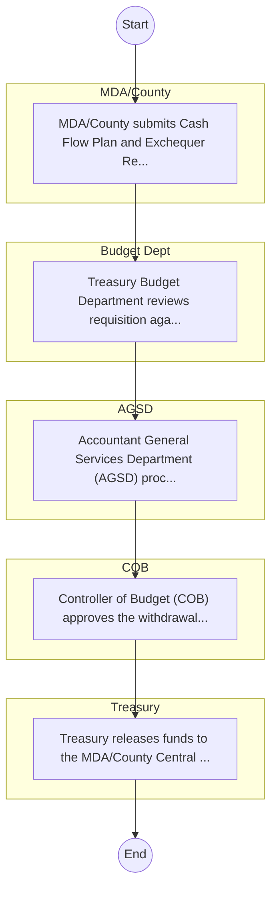
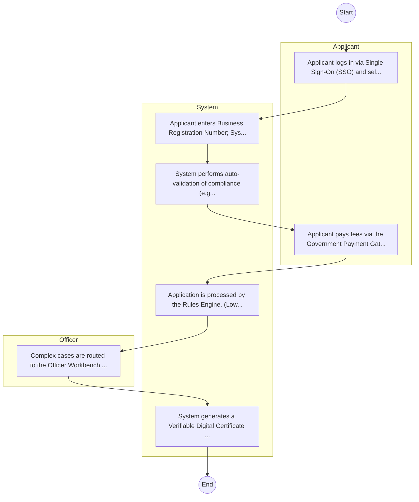

# National Treasury and Economic Planning, The – Service Delivery

## Cover Page
- **Ministry/Department/Agency (MDA):** National Treasury and Economic Planning, The
- **Process Name:** Service Delivery
- **Document Version:** 1.0
- **Date:** 2026-02-14
- **Classification:** Official

---

## Executive Summary
Represents 'Public Administration and International Relations' cluster for balanced coverage; entity type: Ministry. Included as Tier 3 for light‑touch desk review/survey.

---

## Service Mandate & Legal Basis
### Statutory Mandate
Represents 'Public Administration and International Relations' cluster for balanced coverage; entity type: Ministry. Included as Tier 3 for light‑touch desk review/survey.

### Legal Context
- The National Treasury and Economic Planning, The Act (Inferred).

---

## 1. AS-IS Process Flowchart (BPMN 2.0)
*Current State visualization.*

---

## Process Overview
### Service Category
- G2C/G2B

### Scope
- **In Scope:** End-to-end processing within National Treasury and Economic Planning, The.

### Triggers
- Submission of application/request by MDA/County.

### End States
- **Successful:** Loan Disbursement / Service Delivery, Statement of Account, Contract / Agreement, Receipt / Invoice

---

## Stakeholders
| Stakeholder | Role | Responsibilities |
|---|---|---|
| Treasury | Process Actor | Performs actions as defined in steps. |
| COB | Process Actor | Performs actions as defined in steps. |
| AGSD | Process Actor | Performs actions as defined in steps. |
| MDA/County | Process Actor | Performs actions as defined in steps. |
| Budget Dept | Process Actor | Performs actions as defined in steps. |

---

## Inputs & Outputs
- **Inputs:** Loan/Service Application Form, Business Proposal / Plan, Financial Statements / Bank Records, Collateral / Security Documents
- **Outputs:** Loan Disbursement / Service Delivery, Statement of Account, Contract / Agreement, Receipt / Invoice

---

## Detailed Process (AS-IS)
| Step | Role | Action | Tool | Notes |
|---|---|---|---|---|
| 1 | MDA/County | MDA/County submits Cash Flow Plan and Exchequer Requisition to Treasury. | Manual | |
| 2 | Budget Dept | Treasury Budget Department reviews requisition against approved estimates. | Manual | |
| 3 | AGSD | Accountant General Services Department (AGSD) processes the payment voucher. | Manual | |
| 4 | COB | Controller of Budget (COB) approves the withdrawal. | Manual | |
| 5 | Treasury | Treasury releases funds to the MDA/County Central Bank account via IFMIS. | Manual | |

---

## Pain Points & Opportunities
### Pain Points
- Lengthy credit appraisal processes.
- Manual debt collection and reconciliation.
- High paperwork for loan processing.
- Lack of 360-degree customer view.

### Opportunities
- Integration with IPRS/BRS via Service Bus.
- Adoption of Government Payment Gateway.
- Implementation of Automated Rules Engine.
- Issuance of Digital Verifiable Credentials.

---

## 2. TO-BE Process Flowchart (BPMN 2.0)
*Future State visualization (Optimized with Service Bus & Registries).*

## Future State Process (TO-BE)
### Narrative
The To-Be process leverages the Government Service Bus to integrate with BRS (Business Registry) and the Payment Gateway. Manual data entry and document uploads are replaced by real-time API validations, enabling a paperless, cashless, and presence-less service experience.

### Optimized Steps (Digital)
| Step | Actor | Action | System |
|---|---|---|---|
| 1 | Applicant | Applicant logs in via Single Sign-On (SSO) and selects the service. | Citizen Portal / SSO |
| 2 | System | Applicant enters Business Registration Number; System auto-populates details from BRS (Business Registry) via the Service Bus. | Service Bus / Registry API |
| 3 | System | System performs auto-validation of compliance (e.g., KRA Tax Status) via Inter-Agency APIs. | Service Bus / Compliance Engine |
| 4 | Applicant | Applicant pays fees via the Government Payment Gateway; System auto-receipts. | Payment Gateway |
| 5 | System | Application is processed by the Rules Engine. (Low-risk cases are Auto-Approved). | Workflow Engine |
| 6 | Officer | Complex cases are routed to the Officer Workbench for digital review and approval. | Officer Workbench |
| 7 | System | System generates a Verifiable Digital Certificate (QR Code) and notifies the applicant. | Output Generator |

---

## References & Evidence
The information in this document was derived from the following official sources:

- Official Mandate and Service Charter (Inferred from Statutory Acts).
