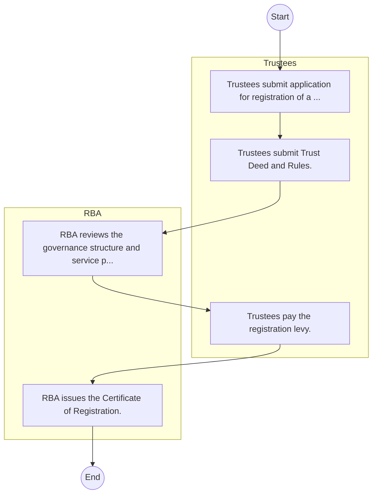
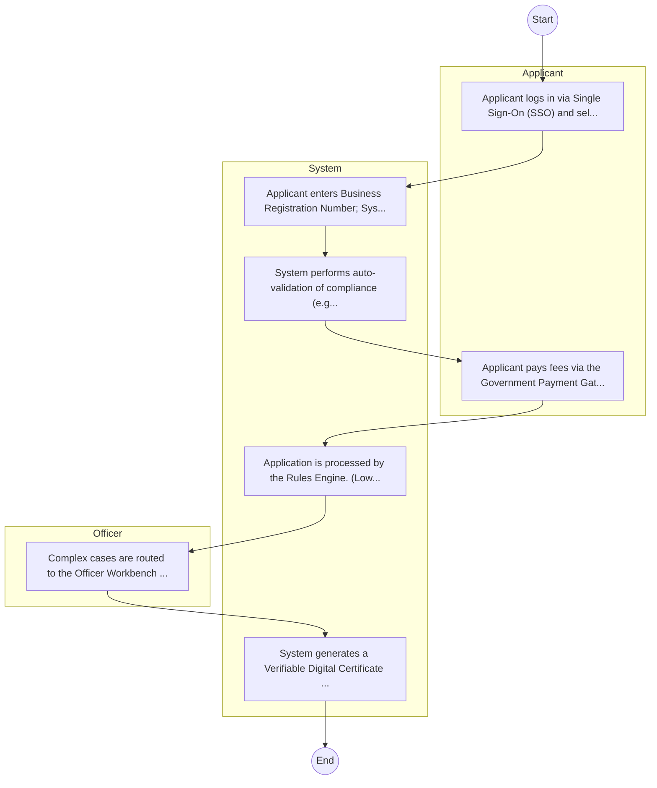

# Retirement Benefits Authority – Service Delivery

## Cover Page
- **Ministry/Department/Agency (MDA):** Retirement Benefits Authority
- **Process Name:** Service Delivery
- **Document Version:** 1.0
- **Date:** 2026-02-14
- **Classification:** Official

---

## Executive Summary
The Retirement Benefits Authority (RBA) in Kenya is a regulatory body established under the Retirement Benefits Act of 1997, operating under the National Treasury. Its primary mandate encompasses the regulation, supervision, protection, and promotion of the retirement benefits sector in Kenya. RBA plays a crucial role in ensuring the security of members' savings, fostering the growth and development of the sector, and promoting public understanding and confidence in retirement planning and benefits.

---

## Service Mandate & Legal Basis
### Statutory Mandate
To regulate and supervise the establishment and management of all retirement benefits schemes in Kenya, including licensing and registering schemes, trustees, fund managers, and administrators, and setting investment guidelines; to protect the interests of members and sponsors of retirement benefits schemes by safeguarding their savings and rights, providing a platform for resolving complaints and disputes, and enforcing penalties for non-compliance; to promote the growth and development of the retirement benefits sector through public awareness campaigns, education programs on retirement planning and financial literacy, and supporting reforms and innovations within the industry; and to advise the government on matters related to retirement benefits and implement government policies concerning the sector.

### Legal Context
- Established under the Retirement Benefits Act of 1997, which provides the comprehensive legal and regulatory framework for the retirement benefits sector in Kenya. RBA operates under the oversight of the National Treasury and is crucial for implementing government policies aimed at expanding social protection, ensuring financial stability and integrity of retirement schemes, and protecting the welfare of current and future retirees. Its work aligns with national financial sector development strategies.

---

## 1. AS-IS Process Flowchart (BPMN 2.0)
*Current State visualization.*

---

## Process Overview
### Service Category
- G2B (Government to Business)

### Scope
- **In Scope:** End-to-end processing within Retirement Benefits Authority.

### Triggers
- Submission of application/request by Trustees.

### End States
- **Successful:** License / Permit / Certificate, Compliance Inspection Report, Official Receipt, Gazette Notice

---

## Stakeholders
| Stakeholder | Role | Responsibilities |
|---|---|---|
| Trustees | Process Actor | Performs actions as defined in steps. |
| RBA | Process Actor | Performs actions as defined in steps. |

---

## Inputs & Outputs
- **Inputs:** Application Form (License/Permit), Compliance Documents (Tax Compliance, CR12), Technical Reports / Site Plans, Proof of Payment
- **Outputs:** License / Permit / Certificate, Compliance Inspection Report, Official Receipt, Gazette Notice

---

## Detailed Process (AS-IS)
| Step | Role | Action | Tool | Notes |
|---|---|---|---|---|
| 1 | Trustees | Trustees submit application for registration of a scheme. | Manual | |
| 2 | Trustees | Trustees submit Trust Deed and Rules. | Manual | |
| 3 | RBA | RBA reviews the governance structure and service provider contracts. | Manual | |
| 4 | Trustees | Trustees pay the registration levy. | Manual | |
| 5 | RBA | RBA issues the Certificate of Registration. | Manual | |

---

## Pain Points & Opportunities
### Pain Points
- Manual document verification takes time.
- High cost and time for physical inspections.
- Risk of counterfeit licenses/certificates.
- Lack of real-time monitoring of licensees.

### Opportunities
- Integration with IPRS/BRS via Service Bus.
- Adoption of Government Payment Gateway.
- Implementation of Automated Rules Engine.
- Issuance of Digital Verifiable Credentials.

---

## 2. TO-BE Process Flowchart (BPMN 2.0)
*Future State visualization (Optimized with Service Bus & Registries).*

## Future State Process (TO-BE)
### Narrative
The To-Be process leverages the Government Service Bus to integrate with BRS (Business Registry) and the Payment Gateway. Manual data entry and document uploads are replaced by real-time API validations, enabling a paperless, cashless, and presence-less service experience.

### Optimized Steps (Digital)
| Step | Actor | Action | System |
|---|---|---|---|
| 1 | Applicant | Applicant logs in via Single Sign-On (SSO) and selects the service. | Citizen Portal / SSO |
| 2 | System | Applicant enters Business Registration Number; System auto-populates details from BRS (Business Registry) via the Service Bus. | Service Bus / Registry API |
| 3 | System | System performs auto-validation of compliance (e.g., KRA Tax Status) via Inter-Agency APIs. | Service Bus / Compliance Engine |
| 4 | Applicant | Applicant pays fees via the Government Payment Gateway; System auto-receipts. | Payment Gateway |
| 5 | System | Application is processed by the Rules Engine. (Low-risk cases are Auto-Approved). | Workflow Engine |
| 6 | Officer | Complex cases are routed to the Officer Workbench for digital review and approval. | Officer Workbench |
| 7 | System | System generates a Verifiable Digital Certificate (QR Code) and notifies the applicant. | Output Generator |

---

## References & Evidence
The information in this document was derived from the following official sources:

- [https://www.rba.go.ke/](https://www.rba.go.ke/)
- [https://uonbi.ac.ke/](https://uonbi.ac.ke/)
- [https://chweya.com/](https://chweya.com/)
- [https://businessradar.co.ke/](https://businessradar.co.ke/)
- [https://majira.co.ke/](https://majira.co.ke/)
- [https://divani.co.ke/](https://divani.co.ke/)
- [https://thesharpdaily.com/](https://thesharpdaily.com/)
