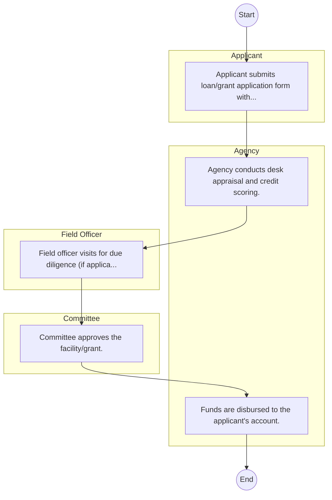
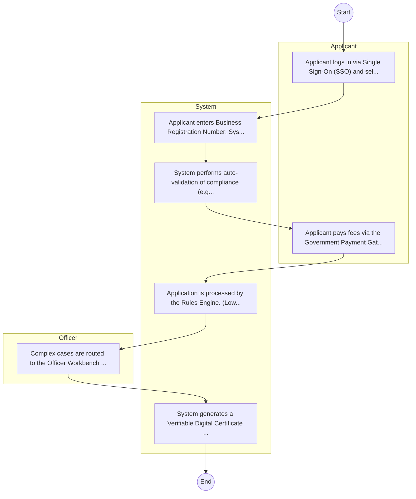

# STATE DEPARTMENT FOR PUBLIC SERVICE AND HUMAN CAPITAL – Service Delivery

## Cover Page
- **Ministry/Department/Agency (MDA):** STATE DEPARTMENT FOR PUBLIC SERVICE AND HUMAN CAPITAL
- **Process Name:** Service Delivery
- **Document Version:** 1.0
- **Date:** 2026-02-14
- **Classification:** Official

---

## Executive Summary
The State Department for Technical and Vocational Education and Training (TVET) in Kenya coordinates national skills training and fosters an effectively harmonized TVET system. Its goal is to produce a skilled human resource base with the necessary attitudes and values to contribute to the growth and prosperity of various economic sectors.

---

## Service Mandate & Legal Basis
### Statutory Mandate
To develop and implement policies and strategies for technical and vocational skills training, oversee the provision and quality of TVET programs, manage TVET institutions, enhance access and relevance, and foster strong linkages with industry to meet labor market needs.

### Legal Context
- Mandate primarily derived from The TVET Act 2013. Operates within a regulatory framework that includes the TVET Authority (TVETA) and the TVET Curriculum Development, Assessment and Certification Council (TVET CDACC).

---

## 1. AS-IS Process Flowchart (BPMN 2.0)
*Current State visualization.*

---

## Process Overview
### Service Category
- G2C/G2B

### Scope
- **In Scope:** End-to-end processing within STATE DEPARTMENT FOR PUBLIC SERVICE AND HUMAN CAPITAL.

### Triggers
- Submission of application/request by Applicant.

### End States
- **Successful:** Policy Guidelines / Circulars, Official Response Letters, Cabinet Resolutions, Public Service Reports

---

## Stakeholders
| Stakeholder | Role | Responsibilities |
|---|---|---|
| Committee | Process Actor | Performs actions as defined in steps. |
| Applicant | Process Actor | Performs actions as defined in steps. |
| Field Officer | Process Actor | Performs actions as defined in steps. |
| Agency | Process Actor | Performs actions as defined in steps. |

---

## Inputs & Outputs
- **Inputs:** Public Inquiries / Petitions, Policy Proposals / Memos, Inter-agency Correspondence, Cabinet Memos
- **Outputs:** Policy Guidelines / Circulars, Official Response Letters, Cabinet Resolutions, Public Service Reports

---

## Detailed Process (AS-IS)
| Step | Role | Action | Tool | Notes |
|---|---|---|---|---|
| 1 | Applicant | Applicant submits loan/grant application form with business proposal. | Manual | |
| 2 | Agency | Agency conducts desk appraisal and credit scoring. | Manual | |
| 3 | Field Officer | Field officer visits for due diligence (if applicable). | Manual | |
| 4 | Committee | Committee approves the facility/grant. | Manual | |
| 5 | Agency | Funds are disbursed to the applicant's account. | Manual | |

---

## Pain Points & Opportunities
### Pain Points
- Slow movement of physical files (Bureaucracy).
- Loss of institutional memory (Manual registries).
- Difficulty in tracking correspondence status.
- Siloed operations between departments.

### Opportunities
- Integration with IPRS/BRS via Service Bus.
- Adoption of Government Payment Gateway.
- Implementation of Automated Rules Engine.
- Issuance of Digital Verifiable Credentials.

---

## 2. TO-BE Process Flowchart (BPMN 2.0)
*Future State visualization (Optimized with Service Bus & Registries).*

## Future State Process (TO-BE)
### Narrative
The To-Be process leverages the Government Service Bus to integrate with BRS (Business Registry) and the Payment Gateway. Manual data entry and document uploads are replaced by real-time API validations, enabling a paperless, cashless, and presence-less service experience.

### Optimized Steps (Digital)
| Step | Actor | Action | System |
|---|---|---|---|
| 1 | Applicant | Applicant logs in via Single Sign-On (SSO) and selects the service. | Citizen Portal / SSO |
| 2 | System | Applicant enters Business Registration Number; System auto-populates details from BRS (Business Registry) via the Service Bus. | Service Bus / Registry API |
| 3 | System | System performs auto-validation of compliance (e.g., KRA Tax Status) via Inter-Agency APIs. | Service Bus / Compliance Engine |
| 4 | Applicant | Applicant pays fees via the Government Payment Gateway; System auto-receipts. | Payment Gateway |
| 5 | System | Application is processed by the Rules Engine. (Low-risk cases are Auto-Approved). | Workflow Engine |
| 6 | Officer | Complex cases are routed to the Officer Workbench for digital review and approval. | Officer Workbench |
| 7 | System | System generates a Verifiable Digital Certificate (QR Code) and notifies the applicant. | Output Generator |

---

## References & Evidence
The information in this document was derived from the following official sources:

- [https://devolution.go.ke/](https://devolution.go.ke/)
- [https://tveta.go.ke/](https://tveta.go.ke/)
- [https://tvetcdacc.go.ke/](https://tvetcdacc.go.ke/)
