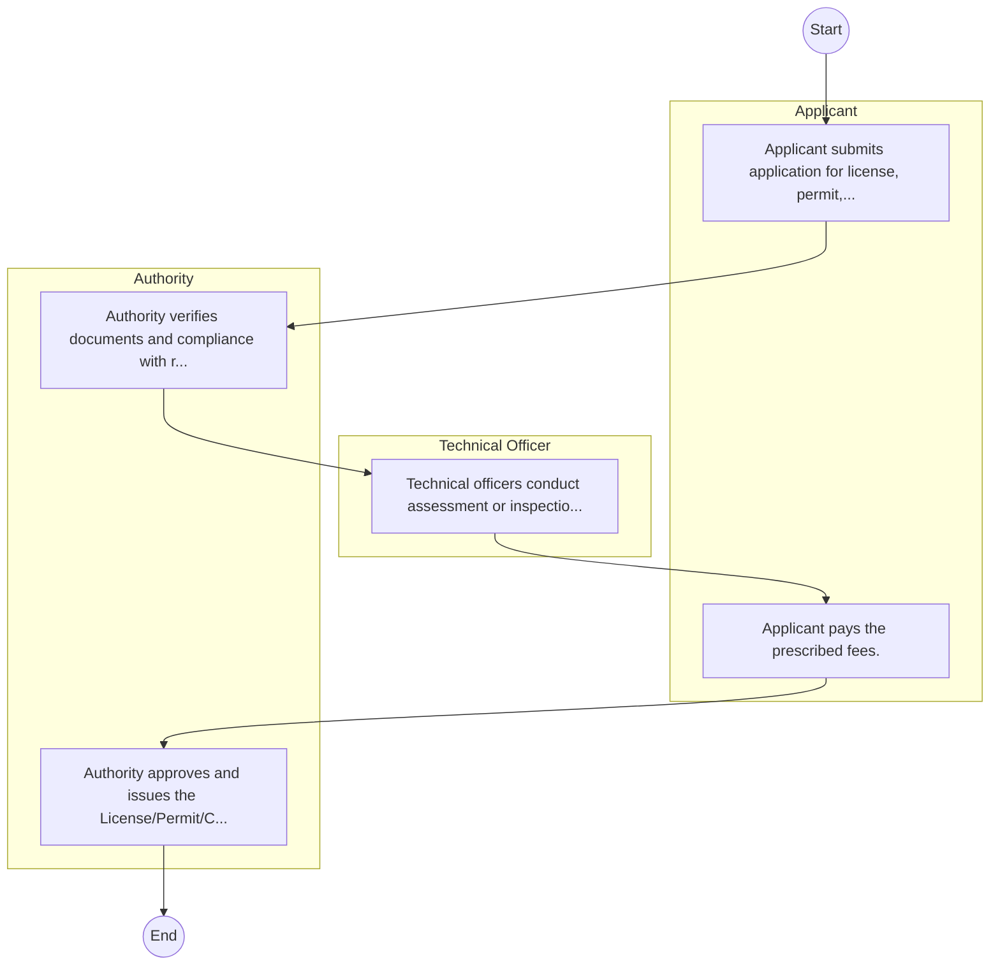
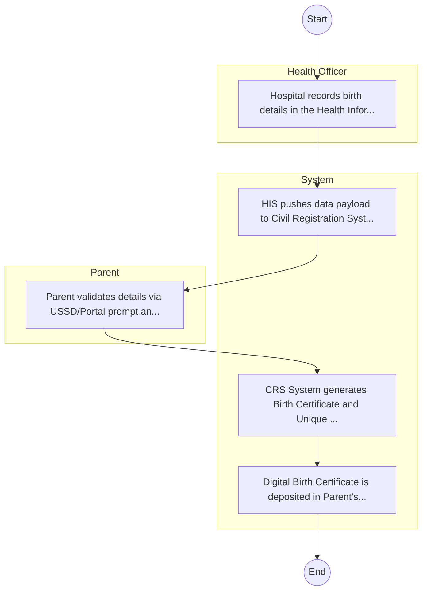

# ·       CIVIL REGISTRATION SERVICES (CRS) – Service Delivery

## Cover Page
- **Ministry/Department/Agency (MDA):** ·       CIVIL REGISTRATION SERVICES (CRS)
- **Process Name:** Service Delivery
- **Document Version:** 1.0
- **Date:** 2026-02-14
- **Classification:** Official
- **Status:** High Priority (POC List)

---

## Executive Summary
The Public Service Commission (PSC) of Kenya is an independent constitutional commission responsible for effective human resource management in the public service. Its mandate includes promoting merit-based recruitment, upholding ethics, ensuring accountability, and fostering efficiency in government operations.

---

## Service Mandate & Legal Basis
### Statutory Mandate
To manage human resources in the public service by establishing/abolishing offices, appointing/disciplining public officers, promoting constitutional values, and evaluating personnel practices to ensure an efficient, ethical, and accountable public service.

### Legal Context
- Established under Article 233(1) of the Constitution of Kenya. Its functions and powers are outlined in Article 234 of the Constitution of Kenya, including promoting values and principles specified in Articles 10 and 232.

---

## 1. AS-IS Process Flowchart (BPMN 2.0)
*Current State visualization.*

---

## Process Overview
### Service Category
- G2C (Government to Citizen)

### Scope
- **In Scope:** End-to-end processing within ·       CIVIL REGISTRATION SERVICES (CRS).

### Triggers
- Submission of application/request by Applicant.

### End States
- **Successful:** License / Permit / Certificate, Compliance Inspection Report, Official Receipt, Gazette Notice

---

## Stakeholders
| Stakeholder | Role | Responsibilities |
|---|---|---|
| Authority | Process Actor | Performs actions as defined in steps. |
| Applicant | Process Actor | Performs actions as defined in steps. |
| Technical Officer | Process Actor | Performs actions as defined in steps. |

---

## Inputs & Outputs
- **Inputs:** Application Form (License/Permit), Compliance Documents (Tax Compliance, CR12), Technical Reports / Site Plans, Proof of Payment
- **Outputs:** License / Permit / Certificate, Compliance Inspection Report, Official Receipt, Gazette Notice

---

## Detailed Process (AS-IS)
| Step | Role | Action | Tool | Notes |
|---|---|---|---|---|
| 1 | Applicant | Applicant submits application for license, permit, or service. | Manual | |
| 2 | Authority | Authority verifies documents and compliance with regulations. | Manual | |
| 3 | Technical Officer | Technical officers conduct assessment or inspection. | Manual | |
| 4 | Applicant | Applicant pays the prescribed fees. | Manual | |
| 5 | Authority | Authority approves and issues the License/Permit/Certificate. | Manual | |

---

## Pain Points & Opportunities
### Pain Points
- Manual document verification takes time.
- High cost and time for physical inspections.
- Risk of counterfeit licenses/certificates.
- Lack of real-time monitoring of licensees.

### Opportunities
- Integration with Government Service Bus.
- Real-time API validation with Authoritative Registries.
- Automated Rules Engine for decision making.
- Adoption of 'Once-Only' data principle.

---

## 2. TO-BE Process Flowchart (BPMN 2.0)
*Future State visualization (Optimized with Service Bus & Registries).*

## Future State Process (TO-BE)
### Narrative
The To-Be process moves verification to the point of birth. Health facilities push notification data directly to CRS via the Service Bus, triggering auto-generation of the Birth Certificate and unique identifier (Maisha Namba).

### Optimized Steps (Digital)
| Step | Actor | Action | System |
|---|---|---|---|
| 1 | Health Officer | Hospital records birth details in the Health Information System (HIS). | HIS |
| 2 | System | HIS pushes data payload to Civil Registration System (CRS) via Service Bus. | Service Bus |
| 3 | Parent | Parent validates details via USSD/Portal prompt and confirms name. | Citizen Portal |
| 4 | System | CRS System generates Birth Certificate and Unique Personal Identifier (UPI). | CRS Registry |
| 5 | System | Digital Birth Certificate is deposited in Parent's Digital Wallet. | Digital Wallet |

---

## References & Evidence
The information in this document was derived from the following official sources:

- [https://en.wikipedia.org/wiki/Public_Service_Commission_of_Kenya](https://en.wikipedia.org/wiki/Public_Service_Commission_of_Kenya)
- [https://www.klrc.go.ke/](https://www.klrc.go.ke/)
