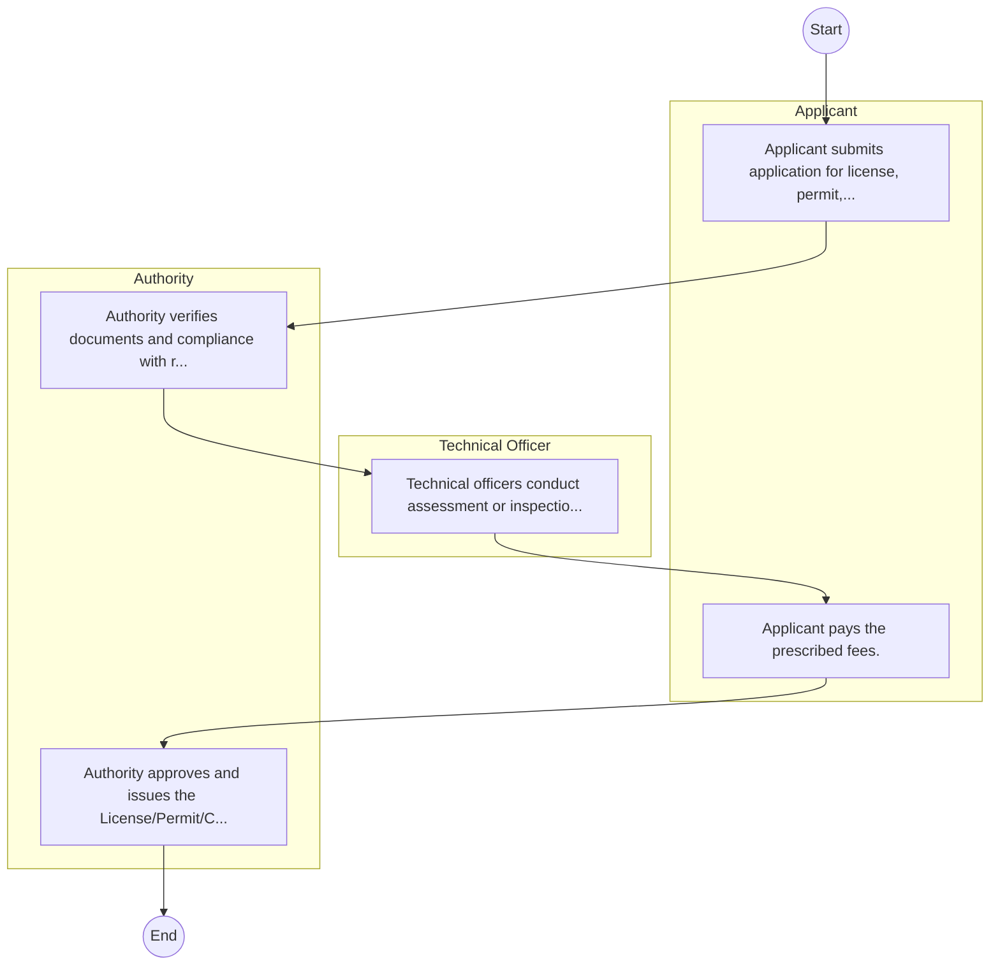
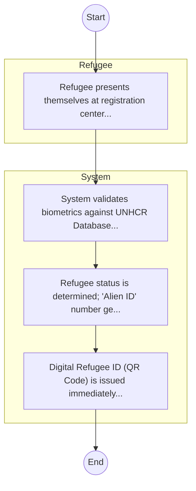

# ·       REFUGEE SERVICES – Service Delivery

## Cover Page
- **Ministry/Department/Agency (MDA):** ·       REFUGEE SERVICES
- **Process Name:** Service Delivery
- **Document Version:** 1.0
- **Date:** 2026-02-14
- **Classification:** Official
- **Status:** High Priority (POC List)

---

## Executive Summary
(INFERRED) The Cabinet Office in Kenya serves as the administrative and coordination hub supporting the Cabinet in its executive functions. It facilitates policy implementation, governmental oversight, and ensures the smooth operation of the government's highest decision-making body.

---

## Service Mandate & Legal Basis
### Statutory Mandate
(INFERRED) To facilitate the decision-making processes of the Cabinet, ensure the coordinated implementation of government policies and programs across ministries, and provide administrative and logistical support to the President, Deputy President, and Cabinet Secretaries in their executive duties.

### Legal Context
- The role and functions are derived from the Constitution of Kenya (Article 152 for the Cabinet, Article 153 for Cabinet Secretaries) and relevant executive orders outlining the structure and responsibilities of the Executive. (INFERRED: While no single Act explicitly defines 'Cabinet Office' as a separate entity, its functions are integral to constitutional governance.)

---

## 1. AS-IS Process Flowchart (BPMN 2.0)
*Current State visualization.*

---

## Process Overview
### Service Category
- G2C/G2B

### Scope
- **In Scope:** End-to-end processing within ·       REFUGEE SERVICES.

### Triggers
- Submission of application/request by Applicant.

### End States
- **Successful:** License / Permit / Certificate, Compliance Inspection Report, Official Receipt, Gazette Notice

---

## Stakeholders
| Stakeholder | Role | Responsibilities |
|---|---|---|
| Authority | Process Actor | Performs actions as defined in steps. |
| Applicant | Process Actor | Performs actions as defined in steps. |
| Technical Officer | Process Actor | Performs actions as defined in steps. |

---

## Inputs & Outputs
- **Inputs:** Application Form (License/Permit), Compliance Documents (Tax Compliance, CR12), Technical Reports / Site Plans, Proof of Payment
- **Outputs:** License / Permit / Certificate, Compliance Inspection Report, Official Receipt, Gazette Notice

---

## Detailed Process (AS-IS)
| Step | Role | Action | Tool | Notes |
|---|---|---|---|---|
| 1 | Applicant | Applicant submits application for license, permit, or service. | Manual | |
| 2 | Authority | Authority verifies documents and compliance with regulations. | Manual | |
| 3 | Technical Officer | Technical officers conduct assessment or inspection. | Manual | |
| 4 | Applicant | Applicant pays the prescribed fees. | Manual | |
| 5 | Authority | Authority approves and issues the License/Permit/Certificate. | Manual | |

---

## Pain Points & Opportunities
### Pain Points
- Manual document verification takes time.
- High cost and time for physical inspections.
- Risk of counterfeit licenses/certificates.
- Lack of real-time monitoring of licensees.

### Opportunities
- Integration with Government Service Bus.
- Real-time API validation with Authoritative Registries.
- Automated Rules Engine for decision making.
- Adoption of 'Once-Only' data principle.

---

## 2. TO-BE Process Flowchart (BPMN 2.0)
*Future State visualization (Optimized with Service Bus & Registries).*

## Future State Process (TO-BE)
### Narrative
The To-Be process creates a unified 'Refugee Digital Identity' by synchronizing UNHCR data with the National Population Register via the Service Bus, ensuring refugees can access services like banking and mobile SIMs.

### Optimized Steps (Digital)
| Step | Actor | Action | System |
|---|---|---|---|
| 1 | Refugee | Refugee presents themselves at registration center; Biometrics captured. | Biometric Kit |
| 2 | System | System validates biometrics against UNHCR Database and IPRS (to prevent double registration). | Service Bus / ABIS |
| 3 | System | Refugee status is determined; 'Alien ID' number generated automatically. | IPRS |
| 4 | System | Digital Refugee ID (QR Code) is issued immediately to the applicant. | Digital Wallet |

---

## References & Evidence
The information in this document was derived from the following official sources:

- [https://en.wikipedia.org/wiki/Cabinet_of_Kenya](https://en.wikipedia.org/wiki/Cabinet_of_Kenya)
- [https://katibainstitute.org/](https://katibainstitute.org/)
- [https://devolution.go.ke/](https://devolution.go.ke/)
- [https://treasury.go.ke/](https://treasury.go.ke/)
