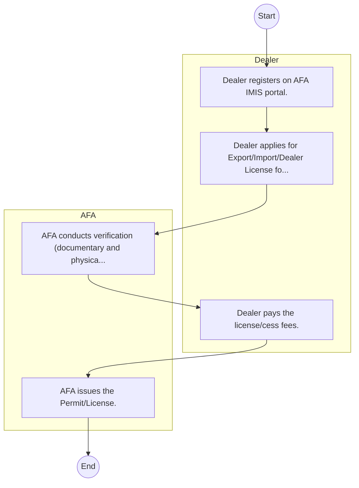

# Agriculture and Food Authority – Service Delivery

## Cover Page
- **Ministry/Department/Agency (MDA):** Agriculture and Food Authority
- **Process Name:** Service Delivery
- **Document Version:** 1.0
- **Date:** 2026-02-14
- **Classification:** Official

---

## Executive Summary
The Anti-Counterfeit Authority (ACA) Kenya is a State Corporation established under the Anti-Counterfeit Act 2008. Its primary mandate is to protect intellectual property rights and consumer rights by actively combating trade in counterfeit goods, raising public awareness, and coordinating with other organizations involved in anti-counterfeiting efforts in Kenya.

---

## Process Flowchart (BPMN 2.0 - Mermaid)
*Guidance: This diagram visualizes the process flow across different actors (Swimlanes).*

---

## Process Overview
### Process Name
Service Delivery

### Service Category
- G2B (Government to Business)

### Scope
- **In Scope:** End-to-end processing within Agriculture and Food Authority.

### Triggers
- Submission of application/request by Dealer.

### End States
- **Successful:** License / Permit / Certificate, Compliance Inspection Report, Official Receipt, Gazette Notice

---

## Stakeholders
| Stakeholder | Role | Responsibilities |
|---|---|---|
| AFA | Process Actor | Performs actions as defined in steps. |
| Dealer | Process Actor | Performs actions as defined in steps. |

---

## Inputs & Outputs
- **Inputs:** Application Form (License/Permit), Compliance Documents (Tax Compliance, CR12), Technical Reports / Site Plans, Proof of Payment
- **Outputs:** License / Permit / Certificate, Compliance Inspection Report, Official Receipt, Gazette Notice

---

## Detailed Process (AS-IS)
| Step | Role | Action | Tool | Notes |
|---|---|---|---|---|
| 1 | Dealer | Dealer registers on AFA IMIS portal. | Digital | |
| 2 | Dealer | Dealer applies for Export/Import/Dealer License for specific crop (e.g., Coffee, Tea, Horticulture). | Manual | |
| 3 | AFA | AFA conducts verification (documentary and physical if needed). | Manual | |
| 4 | Dealer | Dealer pays the license/cess fees. | Manual | |
| 5 | AFA | AFA issues the Permit/License. | Manual | |

---

## Pain Points & Opportunities
### Pain Points
- Manual document verification takes time.
- High cost and time for physical inspections.
- Risk of counterfeit licenses/certificates.
- Lack of real-time monitoring of licensees.

### Opportunities
- Online Licensing Management System (LMS).
- Integration with IPRS and BRS for auto-verification.
- Mobile field inspection apps with GIS.
- QR-coded verifiable certificates.

---

## KPIs
| KPI | Baseline | Target |
|---|---|---|
| Turnaround Time | 30 Days | 5 Days |
| CSAT | 50% | 90% |
