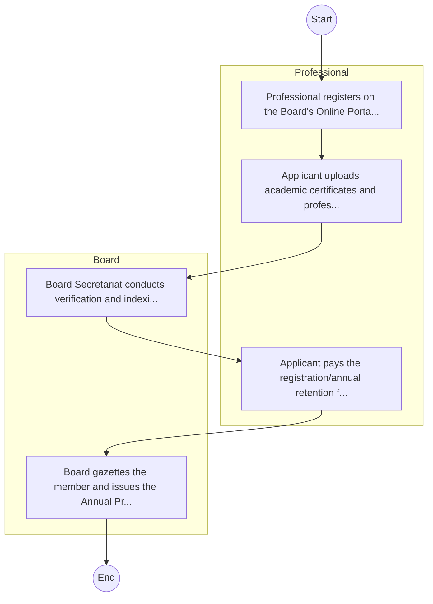

# Building Surveyors Registration Board – Service Delivery

## Cover Page
- **Ministry/Department/Agency (MDA):** Building Surveyors Registration Board
- **Process Name:** Service Delivery
- **Document Version:** 1.0
- **Date:** 2026-02-14
- **Classification:** Official

---

## Executive Summary
The Building Surveyors Registration Board is a regulatory body established under the Building Surveyors Act No. 19 of 2018 in Kenya. Its primary mandate is to promote the practice of building surveying in compliance with universally accepted norms and values, and to regulate the registration, licensing, and professional conduct of building surveyors. The Board ensures high standards for the built environment, safeguards public interest in the quality and safety of buildings, and contributes to the integrity of the construction sector in Kenya.

---

## Process Flowchart (BPMN 2.0 - Mermaid)
*Guidance: This diagram visualizes the process flow across different actors (Swimlanes).*

---

## Process Overview
### Process Name
Service Delivery

### Service Category
- G2C (Government to Citizen)

### Scope
- **In Scope:** End-to-end processing within Building Surveyors Registration Board.

### Triggers
- Submission of application/request by Professional.

### End States
- **Successful:** License / Permit / Certificate, Compliance Inspection Report, Official Receipt, Gazette Notice

---

## Stakeholders
| Stakeholder | Role | Responsibilities |
|---|---|---|
| Professional | Process Actor | Performs actions as defined in steps. |
| Board | Process Actor | Performs actions as defined in steps. |

---

## Inputs & Outputs
- **Inputs:** Application Form (License/Permit), Compliance Documents (Tax Compliance, CR12), Technical Reports / Site Plans, Proof of Payment
- **Outputs:** License / Permit / Certificate, Compliance Inspection Report, Official Receipt, Gazette Notice

---

## Detailed Process (AS-IS)
| Step | Role | Action | Tool | Notes |
|---|---|---|---|---|
| 1 | Professional | Professional registers on the Board's Online Portal. | Digital | |
| 2 | Professional | Applicant uploads academic certificates and professional testimonials. | Manual | |
| 3 | Board | Board Secretariat conducts verification and indexing. | Manual | |
| 4 | Professional | Applicant pays the registration/annual retention fee. | Manual | |
| 5 | Board | Board gazettes the member and issues the Annual Practicing Certificate. | Manual | |

---

## Pain Points & Opportunities
### Pain Points
- Manual document verification takes time.
- High cost and time for physical inspections.
- Risk of counterfeit licenses/certificates.
- Lack of real-time monitoring of licensees.

### Opportunities
- Online Licensing Management System (LMS).
- Integration with IPRS and BRS for auto-verification.
- Mobile field inspection apps with GIS.
- QR-coded verifiable certificates.

---

## KPIs
| KPI | Baseline | Target |
|---|---|---|
| Turnaround Time | 30 Days | 5 Days |
| CSAT | 50% | 90% |
