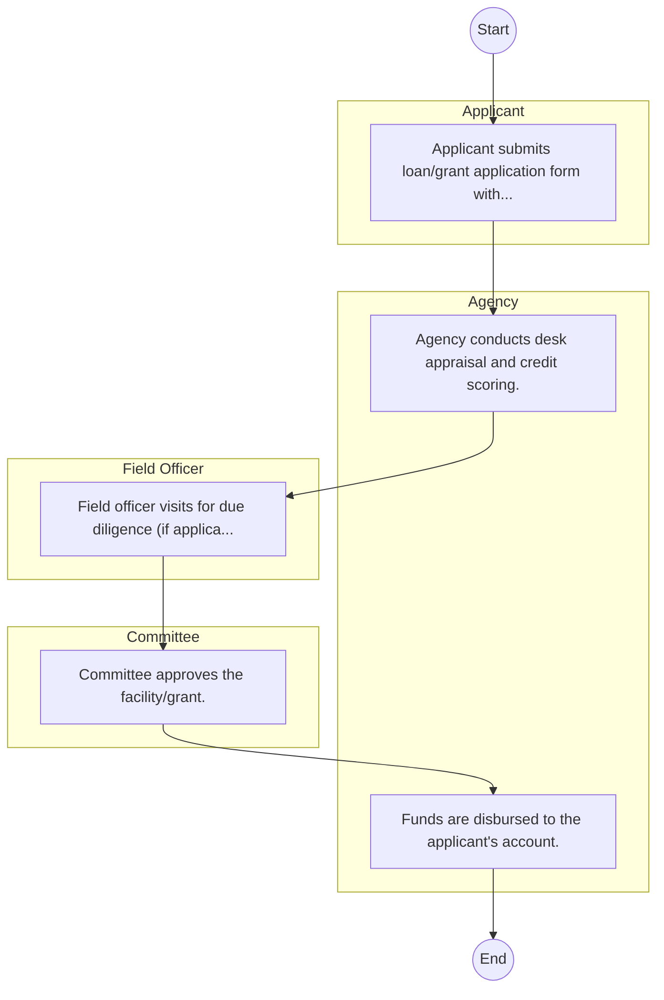

# CBL Bancassurance Intermediary Limited( subsidiary of consolidated Bank) – Service Delivery

## Cover Page
- **Ministry/Department/Agency (MDA):** CBL Bancassurance Intermediary Limited( subsidiary of consolidated Bank)
- **Process Name:** Service Delivery
- **Document Version:** 1.0
- **Date:** 2026-02-14
- **Classification:** Official

---

## Executive Summary
CBL Bancassurance Intermediary Limited, a subsidiary of Consolidated Bank of Kenya, operates within the Kenyan financial landscape. Its primary mandate is to distribute a wide array of insurance products through the bank's extensive channels, acting as a crucial intermediary between insurance companies (underwriters) and the bank's diverse clientele. The company aims to provide convenient and accessible insurance services, drive significant business growth and profitability for the Consolidated Bank Group, and offer professional insurance advisory services across various categories, thereby enhancing customer value and financial inclusion.

---

## Process Flowchart (BPMN 2.0 - Mermaid)
*Guidance: This diagram visualizes the process flow across different actors (Swimlanes).*

---

## Process Overview
### Process Name
Service Delivery

### Service Category
- G2C/G2B

### Scope
- **In Scope:** End-to-end processing within CBL Bancassurance Intermediary Limited( subsidiary of consolidated Bank).

### Triggers
- Submission of application/request by Applicant.

### End States
- **Successful:** Loan Disbursement / Service Delivery, Statement of Account, Contract / Agreement, Receipt / Invoice

---

## Stakeholders
| Stakeholder | Role | Responsibilities |
|---|---|---|
| Field Officer | Process Actor | Performs actions as defined in steps. |
| Committee | Process Actor | Performs actions as defined in steps. |
| Agency | Process Actor | Performs actions as defined in steps. |
| Applicant | Process Actor | Performs actions as defined in steps. |

---

## Inputs & Outputs
- **Inputs:** Loan/Service Application Form, Business Proposal / Plan, Financial Statements / Bank Records, Collateral / Security Documents
- **Outputs:** Loan Disbursement / Service Delivery, Statement of Account, Contract / Agreement, Receipt / Invoice

---

## Detailed Process (AS-IS)
| Step | Role | Action | Tool | Notes |
|---|---|---|---|---|
| 1 | Applicant | Applicant submits loan/grant application form with business proposal. | Manual | |
| 2 | Agency | Agency conducts desk appraisal and credit scoring. | Manual | |
| 3 | Field Officer | Field officer visits for due diligence (if applicable). | Manual | |
| 4 | Committee | Committee approves the facility/grant. | Manual | |
| 5 | Agency | Funds are disbursed to the applicant's account. | Manual | |

---

## Pain Points & Opportunities
### Pain Points
- Lengthy credit appraisal processes.
- Manual debt collection and reconciliation.
- High paperwork for loan processing.
- Lack of 360-degree customer view.

### Opportunities
- Automated Credit Scoring and Appraisal.
- Mobile-based loan application and repayment.
- Customer Relationship Management (CRM) systems.
- Data analytics for risk management.

---

## KPIs
| KPI | Baseline | Target |
|---|---|---|
| Turnaround Time | 30 Days | 5 Days |
| CSAT | 50% | 90% |
