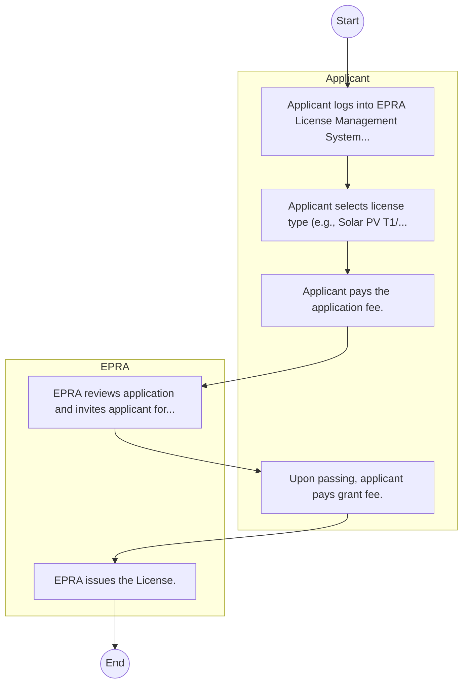

# Energy and Petroleum Regulatory Authority – Service Delivery

## Cover Page
- **Ministry/Department/Agency (MDA):** Energy and Petroleum Regulatory Authority
- **Process Name:** Service Delivery
- **Document Version:** 1.0
- **Date:** 2026-02-14
- **Classification:** Official

---

## Executive Summary
The Energy and Petroleum Regulatory Authority (EPRA) is a statutory body in Kenya, established under the Energy Act of 2019. It is mandated to regulate the energy and petroleum sectors, encompassing electricity, renewable energy, petroleum (upstream, midstream, and downstream), and coal, with the objective of ensuring fair pricing, efficiency, quality, and sustainability within these vital sectors.

---

## Process Flowchart (BPMN 2.0 - Mermaid)
*Guidance: This diagram visualizes the process flow across different actors (Swimlanes).*

---

## Process Overview
### Process Name
Service Delivery

### Service Category
- G2B (Government to Business)

### Scope
- **In Scope:** End-to-end processing within Energy and Petroleum Regulatory Authority.

### Triggers
- Submission of application/request by Applicant.

### End States
- **Successful:** License / Permit / Certificate, Compliance Inspection Report, Official Receipt, Gazette Notice

---

## Stakeholders
| Stakeholder | Role | Responsibilities |
|---|---|---|
| EPRA | Process Actor | Performs actions as defined in steps. |
| Applicant | Process Actor | Performs actions as defined in steps. |

---

## Inputs & Outputs
- **Inputs:** Application Form (License/Permit), Compliance Documents (Tax Compliance, CR12), Technical Reports / Site Plans, Proof of Payment
- **Outputs:** License / Permit / Certificate, Compliance Inspection Report, Official Receipt, Gazette Notice

---

## Detailed Process (AS-IS)
| Step | Role | Action | Tool | Notes |
|---|---|---|---|---|
| 1 | Applicant | Applicant logs into EPRA License Management System. | Manual | |
| 2 | Applicant | Applicant selects license type (e.g., Solar PV T1/T2) and uploads academic certs. | Manual | |
| 3 | Applicant | Applicant pays the application fee. | Manual | |
| 4 | EPRA | EPRA reviews application and invites applicant for interview/exam. | Manual | |
| 5 | Applicant | Upon passing, applicant pays grant fee. | Manual | |
| 6 | EPRA | EPRA issues the License. | Manual | |

---

## Pain Points & Opportunities
### Pain Points
- Manual document verification takes time.
- High cost and time for physical inspections.
- Risk of counterfeit licenses/certificates.
- Lack of real-time monitoring of licensees.

### Opportunities
- Online Licensing Management System (LMS).
- Integration with IPRS and BRS for auto-verification.
- Mobile field inspection apps with GIS.
- QR-coded verifiable certificates.

---

## KPIs
| KPI | Baseline | Target |
|---|---|---|
| Turnaround Time | 30 Days | 5 Days |
| CSAT | 50% | 90% |
