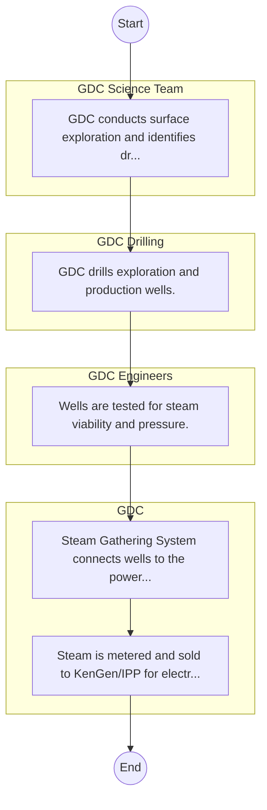

# Geothermal Development Company (GDC) – Service Delivery

## Cover Page
- **Ministry/Department/Agency (MDA):** Geothermal Development Company (GDC)
- **Process Name:** Service Delivery
- **Document Version:** 1.0
- **Date:** 2026-02-14
- **Classification:** Official

---

## Executive Summary
Represents 'Energy Infrastructure and ICT' cluster for balanced coverage; entity type: Agency. Included as Tier 3 for light‑touch desk review/survey.

---

## Process Flowchart (BPMN 2.0 - Mermaid)
*Guidance: This diagram visualizes the process flow across different actors (Swimlanes).*

---

## Process Overview
### Process Name
Service Delivery

### Service Category
- G2B (Government to Business)

### Scope
- **In Scope:** End-to-end processing within Geothermal Development Company (GDC).

### Triggers
- Submission of application/request by GDC Science Team.

### End States
- **Successful:** Loan Disbursement / Service Delivery, Statement of Account, Contract / Agreement, Receipt / Invoice

---

## Stakeholders
| Stakeholder | Role | Responsibilities |
|---|---|---|
| GDC Engineers | Process Actor | Performs actions as defined in steps. |
| GDC Drilling | Process Actor | Performs actions as defined in steps. |
| GDC Science Team | Process Actor | Performs actions as defined in steps. |
| GDC | Process Actor | Performs actions as defined in steps. |

---

## Inputs & Outputs
- **Inputs:** Loan/Service Application Form, Business Proposal / Plan, Financial Statements / Bank Records, Collateral / Security Documents
- **Outputs:** Loan Disbursement / Service Delivery, Statement of Account, Contract / Agreement, Receipt / Invoice

---

## Detailed Process (AS-IS)
| Step | Role | Action | Tool | Notes |
|---|---|---|---|---|
| 1 | GDC Science Team | GDC conducts surface exploration and identifies drilling sites. | Manual | |
| 2 | GDC Drilling | GDC drills exploration and production wells. | Manual | |
| 3 | GDC Engineers | Wells are tested for steam viability and pressure. | Manual | |
| 4 | GDC | Steam Gathering System connects wells to the power plant. | Manual | |
| 5 | GDC | Steam is metered and sold to KenGen/IPP for electricity generation. | Manual | |

---

## Pain Points & Opportunities
### Pain Points
- Lengthy credit appraisal processes.
- Manual debt collection and reconciliation.
- High paperwork for loan processing.
- Lack of 360-degree customer view.

### Opportunities
- Automated Credit Scoring and Appraisal.
- Mobile-based loan application and repayment.
- Customer Relationship Management (CRM) systems.
- Data analytics for risk management.

---

## KPIs
| KPI | Baseline | Target |
|---|---|---|
| Turnaround Time | 30 Days | 5 Days |
| CSAT | 50% | 90% |
