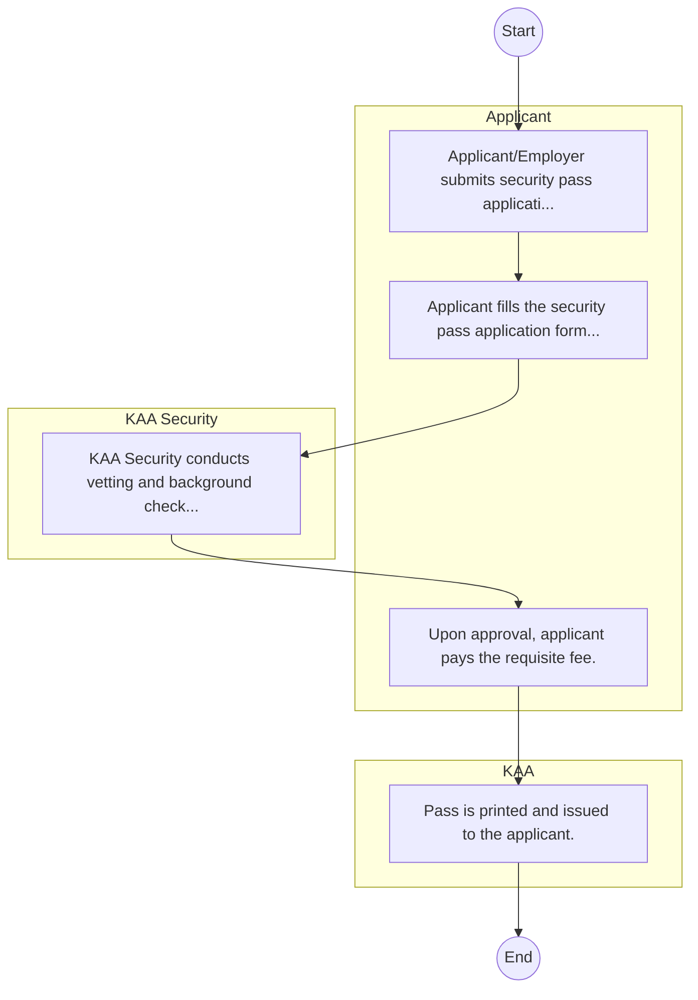

# Kenya Airports Authority – Service Delivery

## Cover Page
- **Ministry/Department/Agency (MDA):** Kenya Airports Authority
- **Process Name:** Service Delivery
- **Document Version:** 1.0
- **Date:** 2026-02-14
- **Classification:** Official

---

## Executive Summary
The Kenya Airports Authority (KAA) is an autonomous government-owned enterprise established in 1991 under the KAA Act, Chapter 395 of the Laws of Kenya. Its primary mandate is to provide facilitative infrastructure for aviation services, administering, controlling, and managing aerodromes, and undertaking the development and maintenance of airports and airstrips throughout Kenya.

---

## Process Flowchart (BPMN 2.0 - Mermaid)
*Guidance: This diagram visualizes the process flow across different actors (Swimlanes).*

---

## Process Overview
### Process Name
Service Delivery

### Service Category
- G2B (Government to Business)

### Scope
- **In Scope:** End-to-end processing within Kenya Airports Authority.

### Triggers
- Submission of application/request by Applicant.

### End States
- **Successful:** License / Permit / Certificate, Compliance Inspection Report, Official Receipt, Gazette Notice

---

## Stakeholders
| Stakeholder | Role | Responsibilities |
|---|---|---|
| KAA | Process Actor | Performs actions as defined in steps. |
| KAA Security | Process Actor | Performs actions as defined in steps. |
| Applicant | Process Actor | Performs actions as defined in steps. |

---

## Inputs & Outputs
- **Inputs:** Application Form (License/Permit), Compliance Documents (Tax Compliance, CR12), Technical Reports / Site Plans, Proof of Payment
- **Outputs:** License / Permit / Certificate, Compliance Inspection Report, Official Receipt, Gazette Notice

---

## Detailed Process (AS-IS)
| Step | Role | Action | Tool | Notes |
|---|---|---|---|---|
| 1 | Applicant | Applicant/Employer submits security pass application letter to Airport Manager. | Manual | |
| 2 | Applicant | Applicant fills the security pass application form and attaches ID/Good Conduct Cert. | Manual | |
| 3 | KAA Security | KAA Security conducts vetting and background checks. | Manual | |
| 4 | Applicant | Upon approval, applicant pays the requisite fee. | Manual | |
| 5 | KAA | Pass is printed and issued to the applicant. | Manual | |

---

## Pain Points & Opportunities
### Pain Points
- Manual document verification takes time.
- High cost and time for physical inspections.
- Risk of counterfeit licenses/certificates.
- Lack of real-time monitoring of licensees.

### Opportunities
- Online Licensing Management System (LMS).
- Integration with IPRS and BRS for auto-verification.
- Mobile field inspection apps with GIS.
- QR-coded verifiable certificates.

---

## KPIs
| KPI | Baseline | Target |
|---|---|---|
| Turnaround Time | 30 Days | 5 Days |
| CSAT | 50% | 90% |
