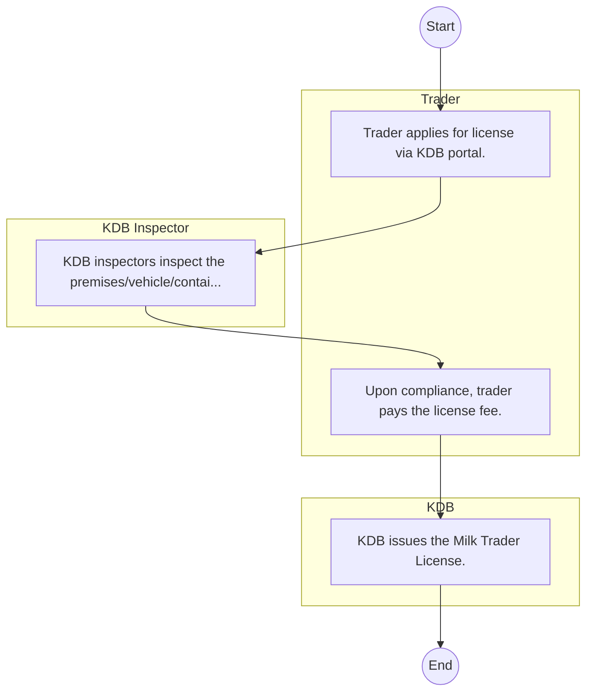

# Kenya Dairy Board – Service Delivery

## Cover Page
- **Ministry/Department/Agency (MDA):** Kenya Dairy Board
- **Process Name:** Service Delivery
- **Document Version:** 1.0
- **Date:** 2026-02-14
- **Classification:** Official

---

## Executive Summary
The Kenya Dairy Board (KDB) is a parastatal operating under the Ministry of Agriculture, Livestock, Fisheries, and Cooperatives (State Department of Livestock). Its primary mandate is to regulate and promote the dairy sector in Kenya, ensuring the quality and safety of milk and milk products for consumers, and fostering sustainable growth and development within the industry.

---

## Process Flowchart (BPMN 2.0 - Mermaid)
*Guidance: This diagram visualizes the process flow across different actors (Swimlanes).*

---

## Process Overview
### Process Name
Service Delivery

### Service Category
- G2B (Government to Business)

### Scope
- **In Scope:** End-to-end processing within Kenya Dairy Board.

### Triggers
- Submission of application/request by Trader.

### End States
- **Successful:** License / Permit / Certificate, Compliance Inspection Report, Official Receipt, Gazette Notice

---

## Stakeholders
| Stakeholder | Role | Responsibilities |
|---|---|---|
| KDB Inspector | Process Actor | Performs actions as defined in steps. |
| Trader | Process Actor | Performs actions as defined in steps. |
| KDB | Process Actor | Performs actions as defined in steps. |

---

## Inputs & Outputs
- **Inputs:** Application Form (License/Permit), Compliance Documents (Tax Compliance, CR12), Technical Reports / Site Plans, Proof of Payment
- **Outputs:** License / Permit / Certificate, Compliance Inspection Report, Official Receipt, Gazette Notice

---

## Detailed Process (AS-IS)
| Step | Role | Action | Tool | Notes |
|---|---|---|---|---|
| 1 | Trader | Trader applies for license via KDB portal. | Digital | |
| 2 | KDB Inspector | KDB inspectors inspect the premises/vehicle/containers. | Manual | |
| 3 | Trader | Upon compliance, trader pays the license fee. | Manual | |
| 4 | KDB | KDB issues the Milk Trader License. | Manual | |

---

## Pain Points & Opportunities
### Pain Points
- Manual document verification takes time.
- High cost and time for physical inspections.
- Risk of counterfeit licenses/certificates.
- Lack of real-time monitoring of licensees.

### Opportunities
- Online Licensing Management System (LMS).
- Integration with IPRS and BRS for auto-verification.
- Mobile field inspection apps with GIS.
- QR-coded verifiable certificates.

---

## KPIs
| KPI | Baseline | Target |
|---|---|---|
| Turnaround Time | 30 Days | 5 Days |
| CSAT | 50% | 90% |
