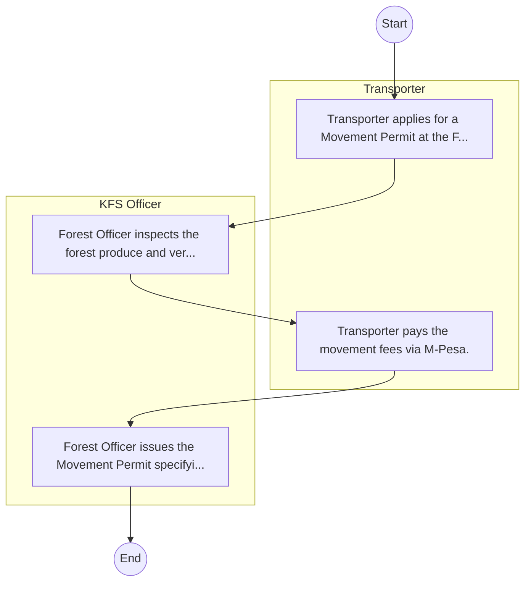

# Kenya Forest Service – Service Delivery

## Cover Page
- **Ministry/Department/Agency (MDA):** Kenya Forest Service
- **Process Name:** Service Delivery
- **Document Version:** 1.0
- **Date:** 2026-02-14
- **Classification:** Official

---

## Executive Summary
The Kenya Forest Service (KFS) is a state corporation established under the Forests Act of 2005 and formalized by the Forest Conservation and Management Act of 2016. Its mandate is to provide for the development and sustainable management, including conservation and rational utilization, of all forest resources for the socio-economic development of Kenya and for environmental benefits such as water catchment protection and carbon sequestration.

---

## Process Flowchart (BPMN 2.0 - Mermaid)
*Guidance: This diagram visualizes the process flow across different actors (Swimlanes).*

---

## Process Overview
### Process Name
Service Delivery

### Service Category
- G2C/G2B

### Scope
- **In Scope:** End-to-end processing within Kenya Forest Service.

### Triggers
- Submission of application/request by Transporter.

### End States
- **Successful:** License / Permit / Certificate, Compliance Inspection Report, Official Receipt, Gazette Notice

---

## Stakeholders
| Stakeholder | Role | Responsibilities |
|---|---|---|
| Transporter | Process Actor | Performs actions as defined in steps. |
| KFS Officer | Process Actor | Performs actions as defined in steps. |

---

## Inputs & Outputs
- **Inputs:** Application Form (License/Permit), Compliance Documents (Tax Compliance, CR12), Technical Reports / Site Plans, Proof of Payment
- **Outputs:** License / Permit / Certificate, Compliance Inspection Report, Official Receipt, Gazette Notice

---

## Detailed Process (AS-IS)
| Step | Role | Action | Tool | Notes |
|---|---|---|---|---|
| 1 | Transporter | Transporter applies for a Movement Permit at the Forest Station. | Manual | |
| 2 | KFS Officer | Forest Officer inspects the forest produce and verifies origin. | Manual | |
| 3 | Transporter | Transporter pays the movement fees via M-Pesa. | Manual | |
| 4 | KFS Officer | Forest Officer issues the Movement Permit specifying route and validity. | Manual | |

---

## Pain Points & Opportunities
### Pain Points
- Manual document verification takes time.
- High cost and time for physical inspections.
- Risk of counterfeit licenses/certificates.
- Lack of real-time monitoring of licensees.

### Opportunities
- Online Licensing Management System (LMS).
- Integration with IPRS and BRS for auto-verification.
- Mobile field inspection apps with GIS.
- QR-coded verifiable certificates.

---

## KPIs
| KPI | Baseline | Target |
|---|---|---|
| Turnaround Time | 30 Days | 5 Days |
| CSAT | 50% | 90% |
