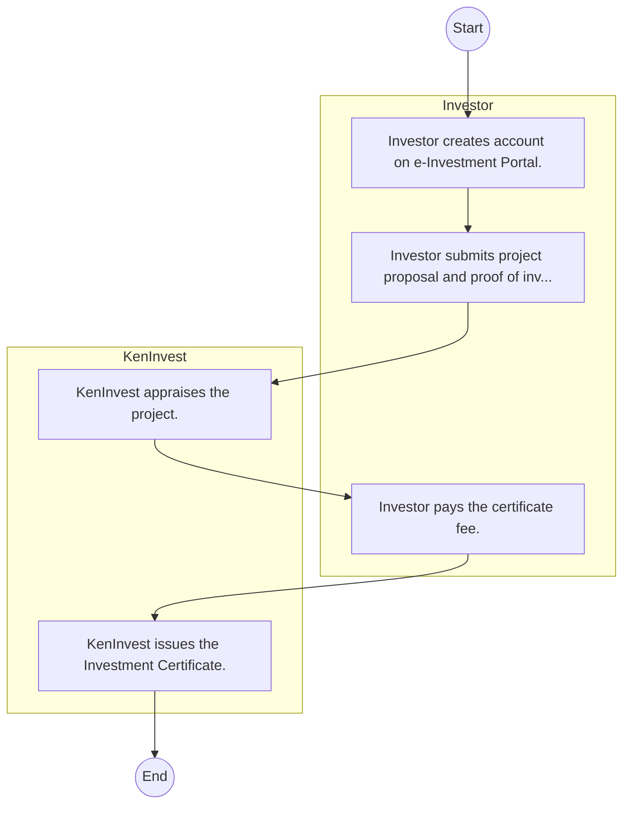

# Kenya Investment Authority – Service Delivery

## Cover Page
- **Ministry/Department/Agency (MDA):** Kenya Investment Authority
- **Process Name:** Service Delivery
- **Document Version:** 1.0
- **Date:** 2026-02-14
- **Classification:** Official

---

## Executive Summary
The Kenya Investment Authority (KenInvest) is a statutory body established under the Investment Promotion Act No. 6 of 2004. Its core mandate is to promote and facilitate both local and foreign investments in Kenya, acting as a one-stop center for investors, thereby improving the investment climate, fostering economic growth, and contributing to job creation and national development.

---

## Process Flowchart (BPMN 2.0 - Mermaid)
*Guidance: This diagram visualizes the process flow across different actors (Swimlanes).*

---

## Process Overview
### Process Name
Service Delivery

### Service Category
- G2B (Government to Business)

### Scope
- **In Scope:** End-to-end processing within Kenya Investment Authority.

### Triggers
- Submission of application/request by Investor.

### End States
- **Successful:** License / Permit / Certificate, Compliance Inspection Report, Official Receipt, Gazette Notice

---

## Stakeholders
| Stakeholder | Role | Responsibilities |
|---|---|---|
| Investor | Process Actor | Performs actions as defined in steps. |
| KenInvest | Process Actor | Performs actions as defined in steps. |

---

## Inputs & Outputs
- **Inputs:** Application Form (License/Permit), Compliance Documents (Tax Compliance, CR12), Technical Reports / Site Plans, Proof of Payment
- **Outputs:** License / Permit / Certificate, Compliance Inspection Report, Official Receipt, Gazette Notice

---

## Detailed Process (AS-IS)
| Step | Role | Action | Tool | Notes |
|---|---|---|---|---|
| 1 | Investor | Investor creates account on e-Investment Portal. | Digital | |
| 2 | Investor | Investor submits project proposal and proof of investment (min $100k for foreign, KES 1M for local). | Manual | |
| 3 | KenInvest | KenInvest appraises the project. | Manual | |
| 4 | Investor | Investor pays the certificate fee. | Manual | |
| 5 | KenInvest | KenInvest issues the Investment Certificate. | Manual | |

---

## Pain Points & Opportunities
### Pain Points
- Manual document verification takes time.
- High cost and time for physical inspections.
- Risk of counterfeit licenses/certificates.
- Lack of real-time monitoring of licensees.

### Opportunities
- Online Licensing Management System (LMS).
- Integration with IPRS and BRS for auto-verification.
- Mobile field inspection apps with GIS.
- QR-coded verifiable certificates.

---

## KPIs
| KPI | Baseline | Target |
|---|---|---|
| Turnaround Time | 30 Days | 5 Days |
| CSAT | 50% | 90% |
