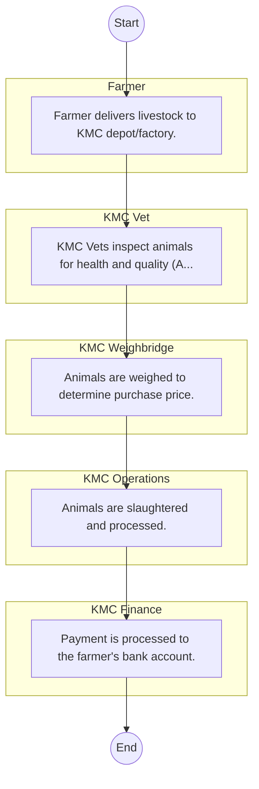

# Kenya Meat Commission – Service Delivery

## Cover Page
- **Ministry/Department/Agency (MDA):** Kenya Meat Commission
- **Process Name:** Service Delivery
- **Document Version:** 1.0
- **Date:** 2026-02-14
- **Classification:** Official

---

## Executive Summary
The Kenya Meat Commission (KMC) is a state-owned enterprise established in 1950 under the Kenya Meat Commission Act. Its primary mandate is to provide a ready and reliable market for livestock farmers and to process and supply high-quality meat and meat products to consumers both domestically and for export. KMC aims to enhance Kenya's meat industry through efficient operations, quality assurance, and value addition, contributing significantly to national food security and economic development.

---

## Process Flowchart (BPMN 2.0 - Mermaid)
*Guidance: This diagram visualizes the process flow across different actors (Swimlanes).*

---

## Process Overview
### Process Name
Service Delivery

### Service Category
- G2B (Government to Business)

### Scope
- **In Scope:** End-to-end processing within Kenya Meat Commission.

### Triggers
- Submission of application/request by Farmer.

### End States
- **Successful:** License / Permit / Certificate, Compliance Inspection Report, Official Receipt, Gazette Notice

---

## Stakeholders
| Stakeholder | Role | Responsibilities |
|---|---|---|
| KMC Finance | Process Actor | Performs actions as defined in steps. |
| KMC Vet | Process Actor | Performs actions as defined in steps. |
| KMC Operations | Process Actor | Performs actions as defined in steps. |
| Farmer | Process Actor | Performs actions as defined in steps. |
| KMC Weighbridge | Process Actor | Performs actions as defined in steps. |

---

## Inputs & Outputs
- **Inputs:** Application Form (License/Permit), Compliance Documents (Tax Compliance, CR12), Technical Reports / Site Plans, Proof of Payment
- **Outputs:** License / Permit / Certificate, Compliance Inspection Report, Official Receipt, Gazette Notice

---

## Detailed Process (AS-IS)
| Step | Role | Action | Tool | Notes |
|---|---|---|---|---|
| 1 | Farmer | Farmer delivers livestock to KMC depot/factory. | Manual | |
| 2 | KMC Vet | KMC Vets inspect animals for health and quality (Ante-mortem). | Manual | |
| 3 | KMC Weighbridge | Animals are weighed to determine purchase price. | Manual | |
| 4 | KMC Operations | Animals are slaughtered and processed. | Manual | |
| 5 | KMC Finance | Payment is processed to the farmer's bank account. | Manual | |

---

## Pain Points & Opportunities
### Pain Points
- Manual document verification takes time.
- High cost and time for physical inspections.
- Risk of counterfeit licenses/certificates.
- Lack of real-time monitoring of licensees.

### Opportunities
- Online Licensing Management System (LMS).
- Integration with IPRS and BRS for auto-verification.
- Mobile field inspection apps with GIS.
- QR-coded verifiable certificates.

---

## KPIs
| KPI | Baseline | Target |
|---|---|---|
| Turnaround Time | 30 Days | 5 Days |
| CSAT | 50% | 90% |
