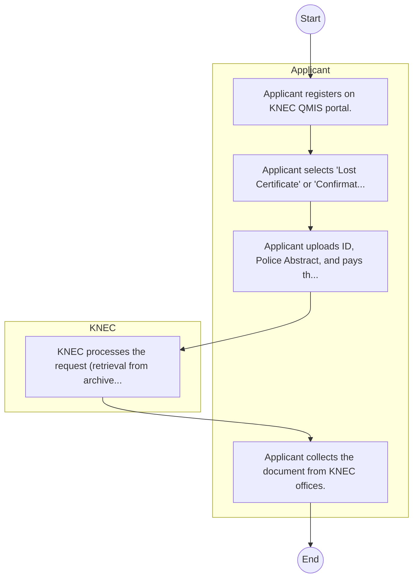

# Kenya National Examinations Council – Service Delivery

## Cover Page
- **Ministry/Department/Agency (MDA):** Kenya National Examinations Council
- **Process Name:** Service Delivery
- **Document Version:** 1.0
- **Date:** 2026-02-14
- **Classification:** Official

---

## Executive Summary
The Kenya National Examinations Council (KNEC) is a statutory body mandated by Section 10 of the KNEC Act No. 29 of 2012. Its core responsibility is to set and maintain examination standards, and to develop and conduct public academic, technical, and other national examinations at basic and tertiary levels within Kenya. KNEC also awards certificates or diplomas to successful candidates, thereby playing a critical role in evaluating educational achievement and facilitating progression in education and employment.

---

## Process Flowchart (BPMN 2.0 - Mermaid)
*Guidance: This diagram visualizes the process flow across different actors (Swimlanes).*

---

## Process Overview
### Process Name
Service Delivery

### Service Category
- G2C/G2B

### Scope
- **In Scope:** End-to-end processing within Kenya National Examinations Council.

### Triggers
- Submission of application/request by Applicant.

### End States
- **Successful:** License / Permit / Certificate, Compliance Inspection Report, Official Receipt, Gazette Notice

---

## Stakeholders
| Stakeholder | Role | Responsibilities |
|---|---|---|
| KNEC | Process Actor | Performs actions as defined in steps. |
| Applicant | Process Actor | Performs actions as defined in steps. |

---

## Inputs & Outputs
- **Inputs:** Application Form (License/Permit), Compliance Documents (Tax Compliance, CR12), Technical Reports / Site Plans, Proof of Payment
- **Outputs:** License / Permit / Certificate, Compliance Inspection Report, Official Receipt, Gazette Notice

---

## Detailed Process (AS-IS)
| Step | Role | Action | Tool | Notes |
|---|---|---|---|---|
| 1 | Applicant | Applicant registers on KNEC QMIS portal. | Digital | |
| 2 | Applicant | Applicant selects 'Lost Certificate' or 'Confirmation' service. | Manual | |
| 3 | Applicant | Applicant uploads ID, Police Abstract, and pays the fee. | Manual | |
| 4 | KNEC | KNEC processes the request (retrieval from archives). | Manual | |
| 5 | Applicant | Applicant collects the document from KNEC offices. | Manual | |

---

## Pain Points & Opportunities
### Pain Points
- Manual document verification takes time.
- High cost and time for physical inspections.
- Risk of counterfeit licenses/certificates.
- Lack of real-time monitoring of licensees.

### Opportunities
- Online Licensing Management System (LMS).
- Integration with IPRS and BRS for auto-verification.
- Mobile field inspection apps with GIS.
- QR-coded verifiable certificates.

---

## KPIs
| KPI | Baseline | Target |
|---|---|---|
| Turnaround Time | 30 Days | 5 Days |
| CSAT | 50% | 90% |
