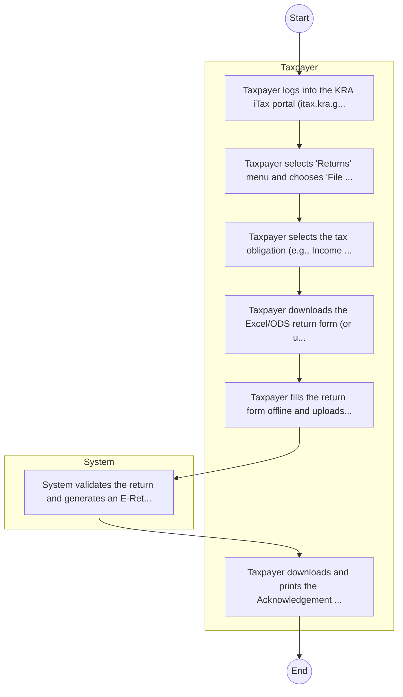

# Kenya Revenue Authority – Tax Return Filing

## Cover Page
- **Ministry/Department/Agency (MDA):** Kenya Revenue Authority
- **Process Name:** Tax Return Filing
- **Document Version:** 1.0
- **Date:** 2026-02-14
- **Classification:** Official

---

## Executive Summary
The Kenya Revenue Authority (KRA) is the principal government agency responsible for the assessment, collection, and accounting of all government revenues. Established on July 1, 1995, by an Act of Parliament (Chapter 469 of the laws of Kenya), KRA advises the government on tax policy, enforces compliance with tax and customs laws, and facilitates trade, utilizing digital platforms like iTax for taxpayer services.

---

## Process Flowchart (BPMN 2.0 - Mermaid)
*Guidance: This diagram visualizes the process flow across different actors (Swimlanes).*

---

## Process Overview
### Process Name
Tax Return Filing

### Service Category
- G2B (Government to Business)

### Scope
- **In Scope:** End-to-end processing within Kenya Revenue Authority.

### Triggers
- Submission of application/request by Taxpayer.

### End States
- **Successful:** Tax Compliance Certificate, Assessment Order, Release Order

---

## Stakeholders
| Stakeholder | Role | Responsibilities |
|---|---|---|
| System | Process Actor | Performs actions as defined in steps. |
| Taxpayer | Process Actor | Performs actions as defined in steps. |

---

## Inputs & Outputs
- **Inputs:** Tax Return Form, Bank Statements, Import Entry Declaration
- **Outputs:** Tax Compliance Certificate, Assessment Order, Release Order

---

## Detailed Process (AS-IS)
| Step | Role | Action | Tool | Notes |
|---|---|---|---|---|
| 1 | Taxpayer | Taxpayer logs into the KRA iTax portal (itax.kra.go.ke) using PIN and password. | Digital | |
| 2 | Taxpayer | Taxpayer selects 'Returns' menu and chooses 'File Return' or 'File Nil Return'. | Manual | |
| 3 | Taxpayer | Taxpayer selects the tax obligation (e.g., Income Tax Resident) and period. | Manual | |
| 4 | Taxpayer | Taxpayer downloads the Excel/ODS return form (or uses the web-based form for simple returns). | Manual | |
| 5 | Taxpayer | Taxpayer fills the return form offline and uploads the generated ZIP file back to the portal. | Digital | |
| 6 | System | System validates the return and generates an E-Return Acknowledgement Receipt. | Manual | |
| 7 | Taxpayer | Taxpayer downloads and prints the Acknowledgement Receipt. | Manual | |

---

## Pain Points & Opportunities
### Pain Points
- Tax evasion
- Complex filing process
- System downtime

### Opportunities
- Data warehousing/Analytics
- Real-time VAT monitoring (TIMS)
- AI for fraud detection

---

## KPIs
| KPI | Baseline | Target |
|---|---|---|
| Turnaround Time | 30 Days | 5 Days |
| CSAT | 50% | 90% |
