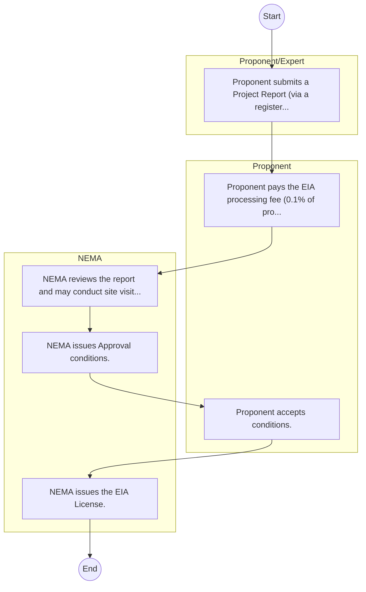

# National Environment Management Authority – Service Delivery

## Cover Page
- **Ministry/Department/Agency (MDA):** National Environment Management Authority
- **Process Name:** Service Delivery
- **Document Version:** 1.0
- **Date:** 2026-02-14
- **Classification:** Official

---

## Executive Summary
The National Environment Management Authority (NEMA) is the principal agency in Kenya responsible for coordinating, monitoring, regulating, and supervising all environmental management activities. Established under specific environmental legislation, NEMA aims to ensure a clean, healthy, productive, and sustainable environment for all Kenyans by promoting sound environmental practices, integrating environmental considerations into national development policies, plans, programs, and projects, and enforcing compliance with environmental laws and regulations.

---

## Process Flowchart (BPMN 2.0 - Mermaid)
*Guidance: This diagram visualizes the process flow across different actors (Swimlanes).*

---

## Process Overview
### Process Name
Service Delivery

### Service Category
- G2B (Government to Business)

### Scope
- **In Scope:** End-to-end processing within National Environment Management Authority.

### Triggers
- Submission of application/request by Proponent/Expert.

### End States
- **Successful:** License / Permit / Certificate, Compliance Inspection Report, Official Receipt, Gazette Notice

---

## Stakeholders
| Stakeholder | Role | Responsibilities |
|---|---|---|
| NEMA | Process Actor | Performs actions as defined in steps. |
| Proponent/Expert | Process Actor | Performs actions as defined in steps. |
| Proponent | Process Actor | Performs actions as defined in steps. |

---

## Inputs & Outputs
- **Inputs:** Application Form (License/Permit), Compliance Documents (Tax Compliance, CR12), Technical Reports / Site Plans, Proof of Payment
- **Outputs:** License / Permit / Certificate, Compliance Inspection Report, Official Receipt, Gazette Notice

---

## Detailed Process (AS-IS)
| Step | Role | Action | Tool | Notes |
|---|---|---|---|---|
| 1 | Proponent/Expert | Proponent submits a Project Report (via a registered expert) to NEMA. | Manual | |
| 2 | Proponent | Proponent pays the EIA processing fee (0.1% of project cost). | Manual | |
| 3 | NEMA | NEMA reviews the report and may conduct site visits or public participation. | Manual | |
| 4 | NEMA | NEMA issues Approval conditions. | Manual | |
| 5 | Proponent | Proponent accepts conditions. | Manual | |
| 6 | NEMA | NEMA issues the EIA License. | Manual | |

---

## Pain Points & Opportunities
### Pain Points
- Manual document verification takes time.
- High cost and time for physical inspections.
- Risk of counterfeit licenses/certificates.
- Lack of real-time monitoring of licensees.

### Opportunities
- Online Licensing Management System (LMS).
- Integration with IPRS and BRS for auto-verification.
- Mobile field inspection apps with GIS.
- QR-coded verifiable certificates.

---

## KPIs
| KPI | Baseline | Target |
|---|---|---|
| Turnaround Time | 30 Days | 5 Days |
| CSAT | 50% | 90% |
