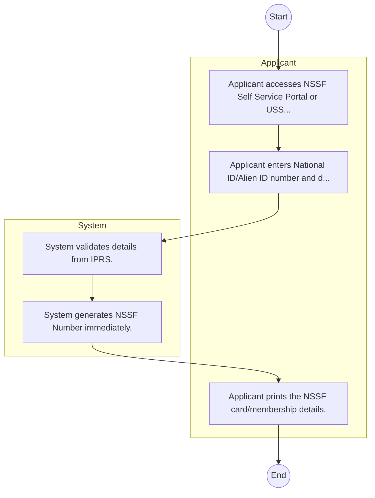

# National Social Security Fund – Service Delivery

## Cover Page
- **Ministry/Department/Agency (MDA):** National Social Security Fund
- **Process Name:** Service Delivery
- **Document Version:** 1.0
- **Date:** 2026-02-14
- **Classification:** Official

---

## Executive Summary
The National Social Security Fund (NSSF) is a statutory public institution in Kenya mandated to provide social security protection to all workers, encompassing both the formal and informal sectors. Established initially as a Provident Fund in 1965, NSSF transitioned into a Pension Scheme in 2014 following the enactment of the NSSF Act, No. 45 of 2013. Its core purpose is to guarantee basic compensation in cases of permanent disability, provide assistance to needy dependents in the event of death, and offer a monthly life pension upon retirement. Beyond these direct benefits, NSSF also mobilizes domestic savings, aids in poverty reduction, fosters financial inclusion, and helps decrease the national dependency ratio.

---

## Process Flowchart (BPMN 2.0 - Mermaid)
*Guidance: This diagram visualizes the process flow across different actors (Swimlanes).*

---

## Process Overview
### Process Name
Service Delivery

### Service Category
- G2C/G2B

### Scope
- **In Scope:** End-to-end processing within National Social Security Fund.

### Triggers
- Submission of application/request by Applicant.

### End States
- **Successful:** Loan Disbursement / Service Delivery, Statement of Account, Contract / Agreement, Receipt / Invoice

---

## Stakeholders
| Stakeholder | Role | Responsibilities |
|---|---|---|
| System | Process Actor | Performs actions as defined in steps. |
| Applicant | Process Actor | Performs actions as defined in steps. |

---

## Inputs & Outputs
- **Inputs:** Loan/Service Application Form, Business Proposal / Plan, Financial Statements / Bank Records, Collateral / Security Documents
- **Outputs:** Loan Disbursement / Service Delivery, Statement of Account, Contract / Agreement, Receipt / Invoice

---

## Detailed Process (AS-IS)
| Step | Role | Action | Tool | Notes |
|---|---|---|---|---|
| 1 | Applicant | Applicant accesses NSSF Self Service Portal or USSD. | Digital | |
| 2 | Applicant | Applicant enters National ID/Alien ID number and details. | Manual | |
| 3 | System | System validates details from IPRS. | Manual | |
| 4 | System | System generates NSSF Number immediately. | Manual | |
| 5 | Applicant | Applicant prints the NSSF card/membership details. | Manual | |

---

## Pain Points & Opportunities
### Pain Points
- Lengthy credit appraisal processes.
- Manual debt collection and reconciliation.
- High paperwork for loan processing.
- Lack of 360-degree customer view.

### Opportunities
- Automated Credit Scoring and Appraisal.
- Mobile-based loan application and repayment.
- Customer Relationship Management (CRM) systems.
- Data analytics for risk management.

---

## KPIs
| KPI | Baseline | Target |
|---|---|---|
| Turnaround Time | 30 Days | 5 Days |
| CSAT | 50% | 90% |
