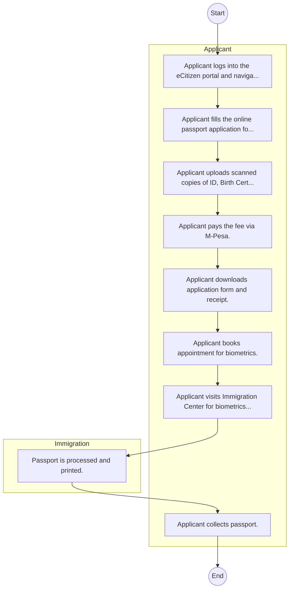

# STATE DEPARTMENT FOR IMMIGRATION AND CITIZEN SERVICES – Passport Application

## Cover Page
- **Ministry/Department/Agency (MDA):** STATE DEPARTMENT FOR IMMIGRATION AND CITIZEN SERVICES
- **Process Name:** Passport Application
- **Document Version:** 1.0
- **Date:** 2026-02-14
- **Classification:** Official

---

## Executive Summary
The State Department for Immigration and Citizen Services in Kenya controls and regulates the entry, exit, and residency of individuals, manages citizenship, and provides related services. It is responsible for issuing passports and other travel documents, as well as maintaining population registers for citizens and foreign nationals.

---

## Process Flowchart (BPMN 2.0 - Mermaid)
*Guidance: This diagram visualizes the process flow across different actors (Swimlanes).*

---

## Process Overview
### Process Name
Passport Application

### Service Category
- G2C (Government to Citizen)

### Scope
- **In Scope:** End-to-end processing within STATE DEPARTMENT FOR IMMIGRATION AND CITIZEN SERVICES.

### Triggers
- Submission of application/request by Applicant.

### End States
- **Successful:** e-Passport, Visa, Work Permit

---

## Stakeholders
| Stakeholder | Role | Responsibilities |
|---|---|---|
| Immigration | Process Actor | Performs actions as defined in steps. |
| Applicant | Process Actor | Performs actions as defined in steps. |

---

## Inputs & Outputs
- **Inputs:** Old Passport/ID, Birth Certificate, Biometrics (Fingerprints, Face)
- **Outputs:** e-Passport, Visa, Work Permit

---

## Detailed Process (AS-IS)
| Step | Role | Action | Tool | Notes |
|---|---|---|---|---|
| 1 | Applicant | Applicant logs into the eCitizen portal and navigates to Immigration Services. | Digital | |
| 2 | Applicant | Applicant fills the online passport application form. | Manual | |
| 3 | Applicant | Applicant uploads scanned copies of ID, Birth Certificate, etc. | Manual | |
| 4 | Applicant | Applicant pays the fee via M-Pesa. | Manual | |
| 5 | Applicant | Applicant downloads application form and receipt. | Manual | |
| 6 | Applicant | Applicant books appointment for biometrics. | Manual | |
| 7 | Applicant | Applicant visits Immigration Center for biometrics. | Manual | |
| 8 | Immigration | Passport is processed and printed. | Manual | |
| 9 | Applicant | Applicant collects passport. | Manual | |

---

## Pain Points & Opportunities
### Pain Points
- Crowding at Nyayo House
- Delay in printing
- Manual file retrieval

### Opportunities
- Facial recognition gates
- Decentralized printing
- Home delivery

---

## KPIs
| KPI | Baseline | Target |
|---|---|---|
| Turnaround Time | 30 Days | 5 Days |
| CSAT | 50% | 90% |
