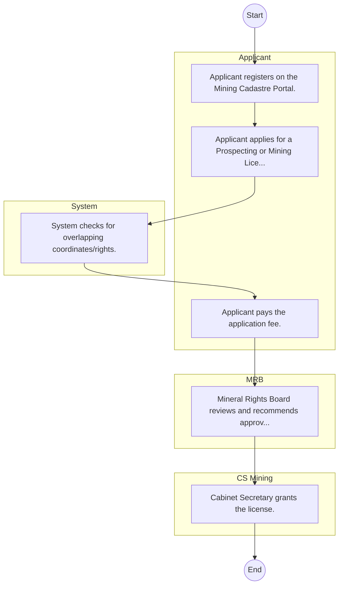

# STATE DEPARTMENT FOR MINING – Service Delivery

## Cover Page
- **Ministry/Department/Agency (MDA):** STATE DEPARTMENT FOR MINING
- **Process Name:** Service Delivery
- **Document Version:** 1.0
- **Date:** 2026-02-14
- **Classification:** Official

---

## Executive Summary
The Energy and Petroleum Regulatory Authority (EPRA) is an independent regulatory body in Kenya, responsible for the technical and economic regulation of the electricity, petroleum, and renewable energy subsectors. It aims to ensure safe, efficient, and sustainable energy operations, protect consumer rights, and promote energy efficiency and renewable energy adoption.

---

## Process Flowchart (BPMN 2.0 - Mermaid)
*Guidance: This diagram visualizes the process flow across different actors (Swimlanes).*

---

## Process Overview
### Process Name
Service Delivery

### Service Category
- G2C/G2B

### Scope
- **In Scope:** End-to-end processing within STATE DEPARTMENT FOR MINING.

### Triggers
- Submission of application/request by Applicant.

### End States
- **Successful:** Policy Guidelines / Circulars, Official Response Letters, Cabinet Resolutions, Public Service Reports

---

## Stakeholders
| Stakeholder | Role | Responsibilities |
|---|---|---|
| System | Process Actor | Performs actions as defined in steps. |
| MRB | Process Actor | Performs actions as defined in steps. |
| CS Mining | Process Actor | Performs actions as defined in steps. |
| Applicant | Process Actor | Performs actions as defined in steps. |

---

## Inputs & Outputs
- **Inputs:** Public Inquiries / Petitions, Policy Proposals / Memos, Inter-agency Correspondence, Cabinet Memos
- **Outputs:** Policy Guidelines / Circulars, Official Response Letters, Cabinet Resolutions, Public Service Reports

---

## Detailed Process (AS-IS)
| Step | Role | Action | Tool | Notes |
|---|---|---|---|---|
| 1 | Applicant | Applicant registers on the Mining Cadastre Portal. | Digital | |
| 2 | Applicant | Applicant applies for a Prospecting or Mining License. | Manual | |
| 3 | System | System checks for overlapping coordinates/rights. | Manual | |
| 4 | Applicant | Applicant pays the application fee. | Manual | |
| 5 | MRB | Mineral Rights Board reviews and recommends approval. | Manual | |
| 6 | CS Mining | Cabinet Secretary grants the license. | Manual | |

---

## Pain Points & Opportunities
### Pain Points
- Slow movement of physical files (Bureaucracy).
- Loss of institutional memory (Manual registries).
- Difficulty in tracking correspondence status.
- Siloed operations between departments.

### Opportunities
- Electronic Document and Records Management System (EDRMS).
- Digital dashboard for project monitoring.
- Unified communication and collaboration platforms.
- Knowledge Management Systems.

---

## KPIs
| KPI | Baseline | Target |
|---|---|---|
| Turnaround Time | 30 Days | 5 Days |
| CSAT | 50% | 90% |
